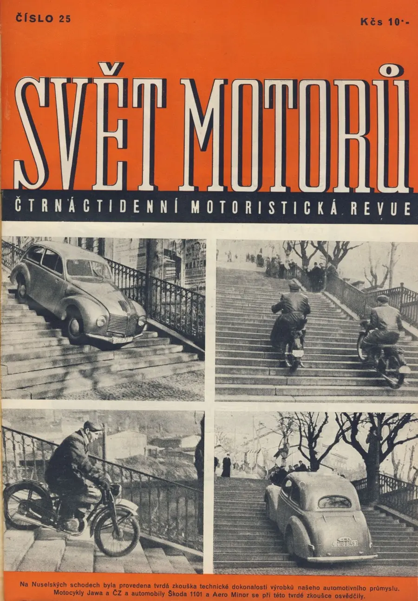

V časopise Svět motorů psali o testu aut a motorek na nuselských schodech. 


 
Jak jsem se dostal do Prahy, musel jsem se jít na ty schody podívat na vlastní oči. Každý schod je dost široký a ne moc vysoký, teď jenom dodělat svoji ČZ125T, přijel na ní 310km do Prahy a vyfotit se s ní na nuselských schodech - budiž to plán na léto 2011. 
 


