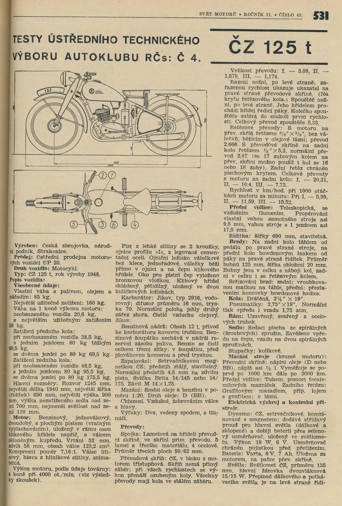
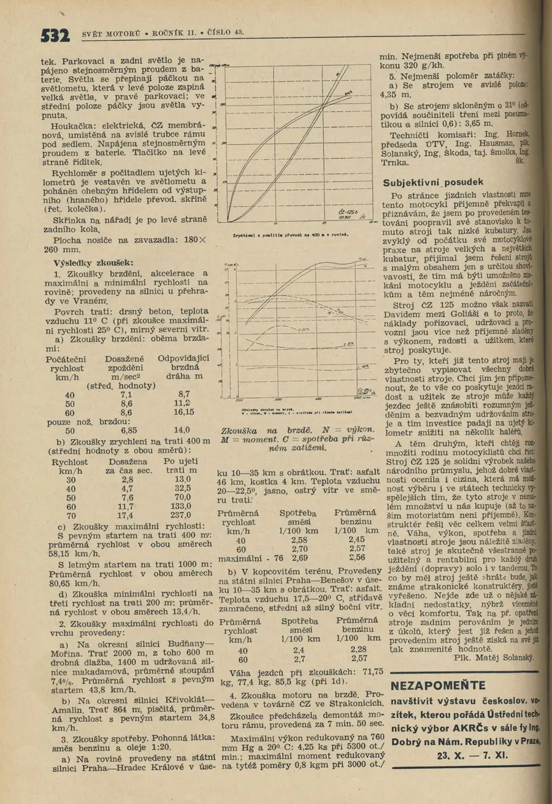



<object class="BLOG_video_class" contentid="d5abd57f3d3a2c66" height="266" id="BLOG_video-d5abd57f3d3a2c66" width="320"></object>
ČZ 125T r.v. 1949, nálezový stav. Nosič z Jawy, chybí sedlo, výfuky a řadící páka (tisícihran je sjetý do hladka). Nádrž uvnitř jako nová a je neuvěřitelné, že stačilo vyčistit sítko, karburátor a vyměnit svíčku a na druhé šlápnutí naskočila. 
 
Vše o zetkách [<a href="http://www.motomagazin.cz/index.php?action=cz125t&amp;menu=14&amp;pos=cz125tuvod">motomagazin</a>] 
 
Test této motorky včetně průběhu kroutícího momentu z časopisu svět motorů 1948 a nepřeberné množství dalších infomací z webu [<a href="http://michalovyzetky.cz/">michalovyzetky</a>] 

