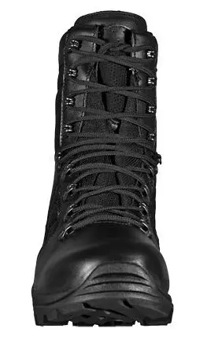
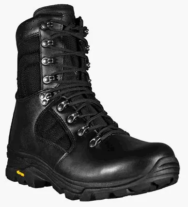
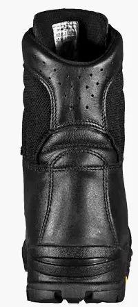

<a href="https://blogger.googleusercontent.com/img/b/R29vZ2xl/AVvXsEh8LNnHqXxSkB9KT6hv-XQphTWDY9hXkeUneE979uCT8QKcbcNCRgY5TaqT2Pa1sCmWHO-F4E1DdkPn5LIqjY9cb7uZY6ugjEURvimwP8lqQ_i7fAcKsx0hqbbhuAQOyD1qhclt6VEdPO8/s1600/prabos.webp" imageanchor="1" style="margin-left: 1em; margin-right: 1em;"> </a>

 

 
Výrobek firmy Prabos.cz[<a href="http://www.prabos.cz/" target="_blank">1</a>] ze Slavičína. 
 
Svršek: hydrofobní hovězinová useň + textil Cordura 
Podešev: lehčená EVAC-Pryž 
Podšívka: membrána GORE-TEX® Rock light 
Použití / popis: k celoročnímu užívání při výkonu služby uniformovaných složek 
Norma: EN ISO 20347 WR HI CI E FO SRC 
Velikost: 36-48 
 
<i>přidáno 25.8.2011:</i> 
<i>Boty slouží, voděodolnost dobrá. Na údržbu používám pouze doporučený krém se včelím voskem od Prabosu - hydrofóbní krém na vojenskou obuv[<a href="https://www.google.cz/search?hl=cs&amp;safe=off&amp;q=hydrofobni+krem+na+vojenskou+obuv&amp;bav=on.2,or.r_gc.r_pw.r_cp.r_qf.&amp;bvm=bv.41248874,d.Yms&amp;biw=1294&amp;bih=756&amp;um=1&amp;ie=UTF-8&amp;tbm=isch&amp;source=og&amp;sa=N&amp;tab=wi&amp;ei=kC_5UKT3Do_EsgaFv4GwCw#um=1&amp;hl=cs&amp;safe=off&amp;tbo=d&amp;tbm=isch&amp;sa=1&amp;q=hydrofobni+krem+na+vojenskou+obuv+prabos&amp;oq=hydrofobni+krem+na+vojenskou+obuv+prabos&amp;gs_l=img.3...2765.4790.0.4833.11.10.0.0.0.0.270.1114.4j2j3.9.0...0.0...1c.1.d7axfHs3mO4&amp;bav=on.2,or.r_gc.r_pw.r_cp.r_qf.&amp;bvm=bv.41248874,d.Yms&amp;fp=67d3eb70ae261cf2&amp;biw=1294&amp;bih=756" target="_blank">2</a>].&nbsp;</i> 



<i>přidáno 29.7.2012:</i> 
<i>Po delší jízdě v pořádném dešti boty promoknou (cca 300km v průtrži a bouřkách) na BWM 650 Dakar, kde na nohy cáká od předního kola všechno.</i> 
<i> </i>
<i>přidáno 20.12.2012:</i> 
<i>Po téměř dvou letech používání boty pořád slouží. Netrhají se, používám je jako zimní boty do města, boty na motorku, na turistiku (jednou). Výrobce píše, že je to celoroční obuv a má pravdu. Na zimní vycházku &nbsp;do přírody bych je nedoporučil, protože v nich docela zebe - člověk potřebuje ponožky plus pořádné tlusté pletené „sibiřky“ a pak je to ok.</i> 
<i>Na jaro plánuju boty znovu naimpregnovat. Píše se, že suché boty se mají naimpregnovat a poté nakrémovat.</i> 
<i> </i>
