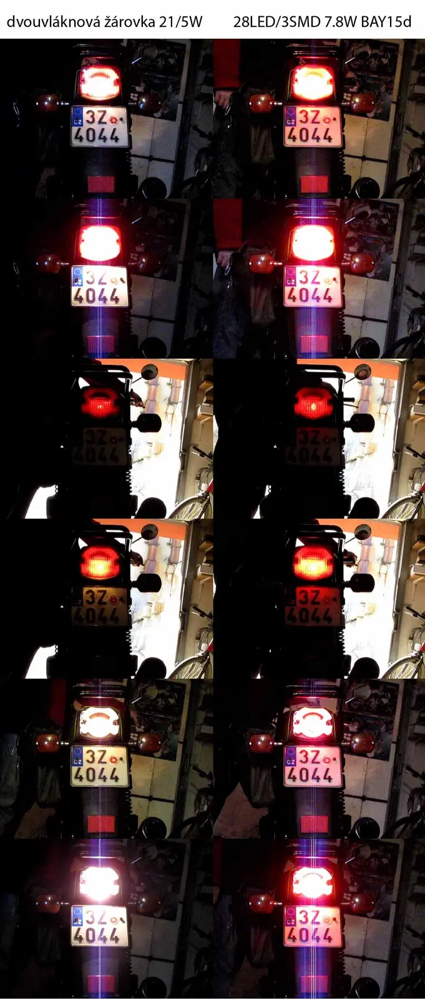


Pořídil jsem do zadního světla místo dvouvláknové žárovky náhradu z 28 tříčipových SMD LED [<a href="http://www.google.cz/webhp?hl=cs&amp;tab=ww#sclient=psy&amp;hl=cs&amp;site=webhp&amp;source=hp&amp;q=95143red&amp;aq=f&amp;aqi=&amp;aql=&amp;oq=&amp;pbx=1&amp;fp=2538b666619c9505">95143red</a>]. Spotřeba max 7.8W. Zajímalo mě, jaký bude rozdíl oproti klasické žárovce 21/5W. Údajně to má mít mnohem vyšší svítivost a životnost 50 000 hodin. Svítí to pěkně, ale zas tak óbrovský rozdíl to není, ale viditelný určitě je. 
<table class="tr-caption-container" style="margin-left: auto; margin-right: auto; text-align: center;"><tbody>
<tr><td style="text-align: center;"></td></tr>
<tr><td class="tr-caption" style="text-align: center;">srovnání klasické žárovky a LED</td></tr>
</tbody></table>