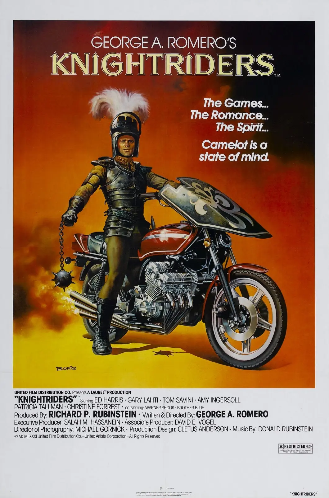

[<a href="http://www.motocykl-praha.cz/">Motocykl 2011 Praha</a>] 
Moc povedená akce. Pravda, "ranní" vstávání ve tři dorovnala až teleportační cesta busem. Na Zvonařce přistoupil Karlos a byli jsme kompletní - Saša, FFF, Karlos a Tyf. Podle ČMN céčkem na konečnou Letňany = zastávka metra uprostřed pole, jak nás poučil Karlos - pole bylo zorané, oseté a vypadalo jako ráj pro skautíky lačné sběru odpadků. 
 
Jsme na místě. Ludí jak much již půl hodiny před otevíračkou. V deset otevřeli, dav se vřítil dovnitř a hrnul se neznámo kam a my jsme hned odbočili do klidné, zatím prázné kavárny a začali ranní kávou. 
&nbsp;Na výstavišti na Letňanech byli nové motorky, doplňky, stánky Suzuki, BMW, Honda, KTM, Yuki, Aprilia a víc nevím. Na většinu motorek se dalo sednout, tak jsme si s Ťufíkem osedlali Suzuki V-Strom, Kawasaki Z1000 a doslova vylezli na Hondu Goldwing. 

&nbsp; &nbsp; &nbsp;&nbsp;&nbsp;

V-Strom se spolujezdcem pohodlně počítá, [<a href="https://sites.google.com/view/tyfotoza/">Z1000 se ve dvou dá</a>], ale spolujezdec má uzounké tvrdé sezení. Na Z1000 mě překvapil pohodný téměř vzpřímený posez řidiče díky širokým a vysokým řídítkům - musím přehodnotit a omluvit se, vždy jsem předpokládal u streetfightu sportovní posez. 

 
Ve stánku [<a href="http://www.supermoto.cz/">Supermoto</a>] měli veterány z přelomu let sedmdesátých a osmdesátých - šestiválce [<a href="https://sites.google.com/view/tyfotoza/">Kawasaki Z1300</a>] a Honda CBX1000 (sedlaná hlavním hrdinou filmu [<a href="http://www.imdb.com/title/tt0082622/">Rytíři/Knightriders</a>]). Koutočové brzdy vpředu i vzadu, u Hondy nádherné kotouče z plného materiálu. 
 
Stánků s doplňky a oblečením je zde nepočítaně. U Nerve.cz si FFF koupil [<a href="http://www.nerve.cz/zbozi/3643/Kalhoty-na-motorku-NERVE-Easy-Going.htm">textilní cordurové kalhoty</a>] s vysokým pasem. Černé. Jak jinak. Kolenní chránič mají integrovaný. Ťuf si vybral pláštěnku, dělenou na nepromok bundu dlouhou a nepromok kalhoty. 
Karlos si zkusil [<a href="http://www.nerve.cz/zbozi/3650/Boty-na-motorku-MG-RaceTech3-Red-moto-boty.htm">silniční boty</a>] a prý mu sedly naprosto skvěle a měl v nich pevnou nohu i kotník. [<a href="/posts/2011/02/boty-na-moto/">Moje zkušenost</a>] je jiná, ale na mé nekonfekční kachní nohy nepadne každý futrál. 
Lou Fanánek odpoledne začínal své [<a href="http://cestovani.idnes.cz/fananek-noid-a-dalsi-projizdeji-marockym-peklem-frw-/igsvet.asp?c=A100625_123435_igsvet_hig">povídání o cestě do Maroka</a>] v rámci stránku [<a href="http://www.motovypravy.cz/">motovypravy.cz</a>] a my jsme odcházeli. 
 
Prošli jsme všechny dvě haly a pořád nám chybějí airbrushe, custom stroje a vůbec spousta věcí, na které jsme se těšili a o kterých se v časopise Motocykl a v ČMN psalo. 
A již víme, že na Letňanech je sice výstava Motocykl 2011, ale na výstavišti v Holešovicích je další souběžná akce, kde jsou custom biky, airbrush pezentace, body painting... Přesunuli jsme se ho Holešovic a tady nás čekali čtyři haly - Sašenku jedna - její vysněné aibrushe a stejně zdobené stavby - a tam taky strávila většinu času. Čtyři haly pro nás ostatní byly - ATV do kterých nevidíme, u jaguára tam v rámci prezentace zevlil strýc [<a href="http://cs.wikipedia.org/wiki/Robert_Rosenberg">Rosenberg</a>] s kérků v obličeji, pak výstavní hala skoro nejlepší s novým Ducati Monsterem, spoustou dalších Ducati a novým strojem Ducati Diavel. 

<object class="BLOGGER-youtube-video" classid="clsid:D27CDB6E-AE6D-11cf-96B8-444553540000" codebase="http://download.macromedia.com/pub/shockwave/cabs/flash/swflash.cab#version=6,0,40,0" data-thumbnail-src="http://i.ytimg.com/vi/lb6I2SL5ePI/0.webp" height="266" width="320"><param name="movie" value="http://www.youtube.com/v/lb6I2SL5ePI?f=user_uploads&c=google-webdrive-0&app=youtube_gdata" /><param name="bgcolor" value="#FFFFFF" /><embed width="320" height="266" src="http://www.youtube.com/v/lb6I2SL5ePI?f=user_uploads&c=google-webdrive-0&app=youtube_gdata" type="application/x-shockwave-flash"></embed></object>

 
Dál expozice pokračovala MV Agusta se svým Brutale a F4 CC - pojmenované romanticky po majiteli fabriky Claudiu Castiglionovi - a pak konečně prezentace nádherné, skvělé, nedostupné a ještě krásnější české původní FGR Midalu, mrůůůů. Přečtěte si víc o [<a href="http://www.motofgr.com/aktualityv6/">FGR 2500 V6</a>], stojí to za to. 
 

<a href="https://sites.google.com/view/tyfotoza/">&nbsp; &nbsp; &nbsp;</a>

Hned vedle Midalu byl Ducati café bar, tak jsme dali kávu, FFF od slečny s paintbrushem místo horního dílu spodního prádla vylákal šest plakátů FGR Midalu - třikrát celé moto se spoře oděnou lazebnicí z líce a daleko zajímavějším rubem s osmi fotkami nového stroje. A třikrát plakát jenom s motorem, dvaapůl litrový šestiválec do V, jestli si to správně pamatuju. 
Lehce po druhé hodině odpolední a pak ještě jednou přesně ve tři FGR asi na minutu nebo dvě nastartovali - ďábelský řev a podle FFF šel z volnoběhu do maxima bez znatelného pohybu ruky na plynu. FFF měl odvahu a díval se. My s Karlosem jsme jenom poslouchali. Karlos to skvělě shrnul - tohle je motorka pro toho, kdo má rád silné stroje a má peníze, to je motorka co se parkuje v obýváku a jednou za týden nebo měsíc, když je slunečno, ji vezmeš na projížďku. 
[<a href="http://www.youtube.com/watch?v=Qen-gg1NW98">oficiální videoprezentace</a>] 
 
Od stánku Midalu se prošlo kolem amerických Victory do jiného světa drsných custom staveb, chopperů, Harley Davidson a Route 66. Saša obhlížela airbrushe, my jsme dlouho obdivovali stavbu Biomastrubátor, stála hned vedle jiného übernaleštěného chromovaného customu, a díky tomu se ještě víc zvýraznila barva přední vidlice a trojhranných výfukových svodů v uvěřitelné barvě litiny. 

<a href="https://blogger.googleusercontent.com/img/b/R29vZ2xl/AVvXsEjQKu2Qi8V-sbd3YzZY0uSatIT2tKSQJVjfCvQ-k5z0SMiqGNnzFIDmeJmVGZ2v4mto0D2pF92GTSeu1504Sw1S6iRFdglW5YNJZvSfHTaFgiTicxYi8msdwVw6zpt3BfCsLJyJbLXFMNY/s1600/Buell+XB+12S.webp" imageanchor="1" style="margin-left: 1em; margin-right: 1em;">&nbsp;</a>

dvakrát tatáž motorka Buell XB 12S - před a po přestavbě&nbsp;

 
Staveb bylo k vidění nepočítaně, některé jenom úchylné, jiné naprosto promyšlené a taky přestavby povedené jako [<a href="https://sites.google.com/view/tyfotoza/">Hayabusa</a>] v kabátě, který jí sluší víc než ten, co má od přirození. Za zmínku určitě stojí úsměvné, ale dokonalé přestavby [<a href="https://sites.google.com/view/tyfotoza/">ČZ125T</a>] a [<a href="https://sites.google.com/view/tyfotoza/">Jawy 23</a>], co nám odtlačili před nosem. 
Pokračovali jsme ven přes dvůr, kolem jezírka a domácích zabijačkových specialit přecházíme do haly Dakaru a mototrialu, prezentace značky trialových speciálů [<a href="http://www.gasgasmoto.cz/">Gas Gas</a>]. 

<object class="BLOGGER-youtube-video" classid="clsid:D27CDB6E-AE6D-11cf-96B8-444553540000" codebase="http://download.macromedia.com/pub/shockwave/cabs/flash/swflash.cab#version=6,0,40,0" data-thumbnail-src="http://i.ytimg.com/vi/FCDdmTdtuLA/0.webp" height="266" width="320"><param name="movie" value="http://www.youtube.com/v/FCDdmTdtuLA?f=user_uploads&c=google-webdrive-0&app=youtube_gdata" /><param name="bgcolor" value="#FFFFFF" /><embed width="320" height="266" src="http://www.youtube.com/v/FCDdmTdtuLA?f=user_uploads&c=google-webdrive-0&app=youtube_gdata" type="application/x-shockwave-flash"></embed></object>

Stihli jsme ukázky mototrialu, Karlos potěšil oko jedním ze dvou opravdovým caferacerů, který jsme za celý den potkali, já jsem obhlížel vysokou  [<a href="https://sites.google.com/view/tyfotoza/">Yamaha Terene</a>] a FFF endura rozsekaná od pouštních písků. 

<a href="https://sites.google.com/view/tyfotoza/">&nbsp;</a> &nbsp; &nbsp;

A to bylo asi tak všechno. Skvěle strávený páteční den, FFF by jej jinak prožil pilným studiem a my ostatní neméněpilnou prací. Z Holešovic pak už jen přímo domů, busem. A právě z autobusu uherskohradišťského ČSAD, za zvuku Neuropatologa od Debustrolu (ve sluchátkách), někde na D1, dopisuji tyto řádky. 
 
Moc dobrý výlet a ještě lepší nápad jak se naladit na letošní sezónu! 
 
[<a href="https://sites.google.com/view/tyfotoza/">všechny fotky</a>] 
[<a href="https://sites.google.com/view/tyfotoza/">detaily airbrush</a>] pro Sašenku