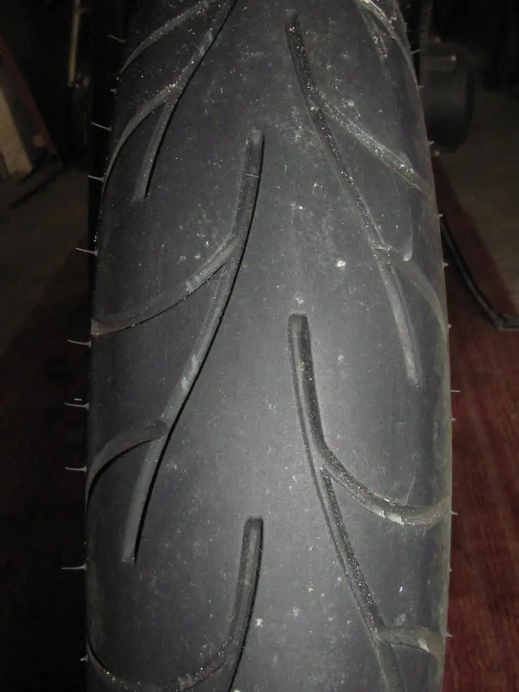
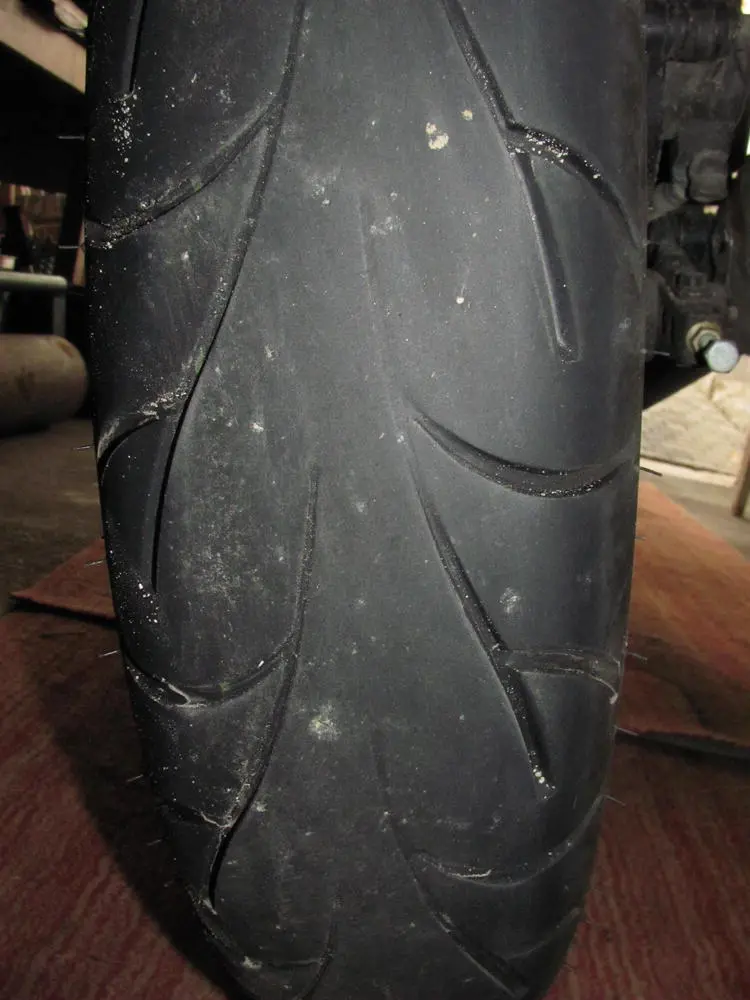

<table class="tr-caption-container" style="margin-left: auto; margin-right: auto; text-align: center;"><tbody>
<tr><td style="text-align: center;"></td></tr>
<tr><td class="tr-caption" style="text-align: center;">přední pneu 
Continental Go! 3.25 (100/80) 19" 
po 8000 km super stav</td></tr>
</tbody></table><table class="tr-caption-container" style="margin-left: auto; margin-right: auto; text-align: center;"><tbody>
<tr><td style="text-align: center;"></td></tr>
<tr><td class="tr-caption" style="text-align: center;">zadní pneu 
Continental Go! 120/90 18" 
po 8000km sjetá</td></tr>
</tbody></table>
 

