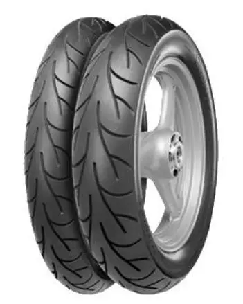
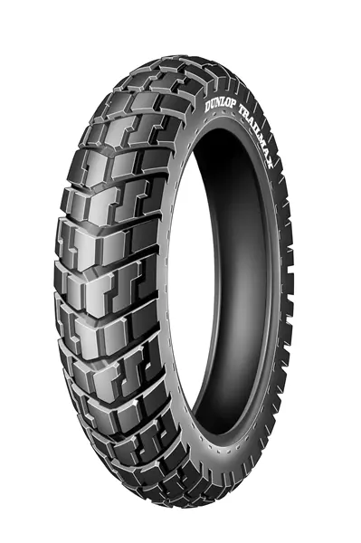
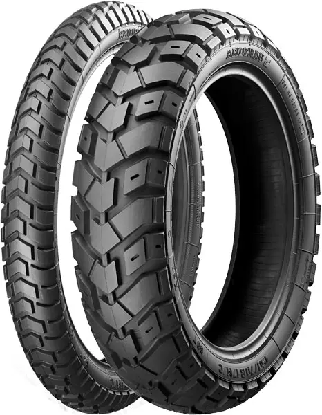
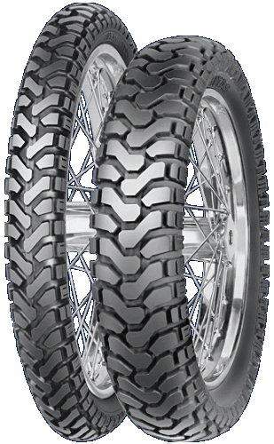

<table class="tr-caption-container" style="margin-left: auto; margin-right: auto; text-align: center;"><tbody>
<tr><td style="text-align: center;"></td></tr>
<tr><td class="tr-caption" style="text-align: center;">Continental Go!</td></tr>
</tbody></table>Aktuálně má kawa obuté silniční pneu Continental Go! Najeto 8tis. km. Na přední pneu není znát opotřebení, zadní je sjetá na kontrolní body. Na silniční pneu je to slušný průměr. 
<i>Všude v Evropě platí, že vzorek na motopneu musí mít hloubku nejméně 1.6mm na 3/4 povrchu pneumatiky. U nás v ČR musí být hloubka vzorku nejméně 1.6mm na celém povrchu (reálně to dělá asi 1/3 až 1/5 kilometrového nájezdu dolů). Inu, podpora obchodu.</i> 
Další zadní pneu bude pro silniční enduro (80% asfalt, 20% lehký terén), nějaká s delším dojezdem. Ještě si někde před přezutím musím zkusit vygumovat kolečko. Moje první. 
<table class="tr-caption-container" style="margin-left: auto; margin-right: auto; text-align: center;"><tbody>
<tr><td style="text-align: center;"></td></tr>
<tr><td class="tr-caption" style="text-align: center;">nástupce pro zadní pneu Dunlop Trailmax</td></tr>
</tbody></table>My ajťáci jsme techniku bez klávesnice jelita, takže u pneu 120/90 18" TL znamená 120mm šířka, výška/profil 90% z těch 120mm a ráfek je 18". TT je tubetype, TL je tubeless. Další čísla jsou rychlostní indexy, ale ty jsou vždycky 180km/h a vyšší, takže netřeba řešit. 
<i>Podle TP má kawa zadní pneu 4.00 18" tj. 120/90 nebo 120/80 , přední pneu 3.25 je 100/80 19" (100/90 by se nevešla pod přední blatník). Když výrobce udává pro pneu pouze šířku v palcích, tak je akceptovatelná výška/profil 80-100%.&nbsp; Toto zjištění pro mě bylo objevné.</i> 
Zadní pneu v tomto rozměru na cestovní endura jsou bez problémů k dispozici od spousty výrobců, žel přední pneu v tomto rozměru jsem s hrubším enduro vzorkem našel pouze u firmy Mitas, ideálně dezén E-07. 
Předpokládám, že Continental Go! vpředu přežije i celou Dunlop Trailmax vzadu a pak vyměním obě pneu za Mitas. 
<table class="tr-caption-container" style="margin-left: auto; margin-right: auto; text-align: center;"><tbody>
<tr><td style="text-align: center;"></td></tr>
<tr><td class="tr-caption" style="text-align: center;">Heidenau K60 Scout</td></tr>
</tbody></table>

Pneu Heidenau K60 Scout byl první favorit na zadní pneu, dočetl jsem v recenzích a testech, že má reálný dojezd 15tis. kilometrů. Ale tady informaci, že tato guma je docela tvrdá a za mokra moc nedrží a má tendenci klouzat. Proto výše uvedený Dunlop Trailmax, který má držet na suchu i mokru. K60 má oproti Trailmaxu jen lepší samočistící schopnost, ale nepředpokládám delší projížďky v blátivém terénu 
<table class="tr-caption-container" style="margin-left: auto; margin-right: auto; text-align: center;"><tbody>
<tr><td style="text-align: center;"></td></tr>
<tr><td class="tr-caption" style="text-align: center;">inspirativní Mitas E-07, prý za sucha drží v zatáčkách až na stupačku a za mokra jsou skvělé</td></tr>
</tbody></table>[<a href="http://www.bridgestone-moto.cz/faq.php">vše o moto pneu</a>] základy 
poctivé testy motopneu na webu [<a href="http://www.hamletovygumy.net/index.php?page=testy-motopneu">hamletovygumy.cz</a>] 
 

