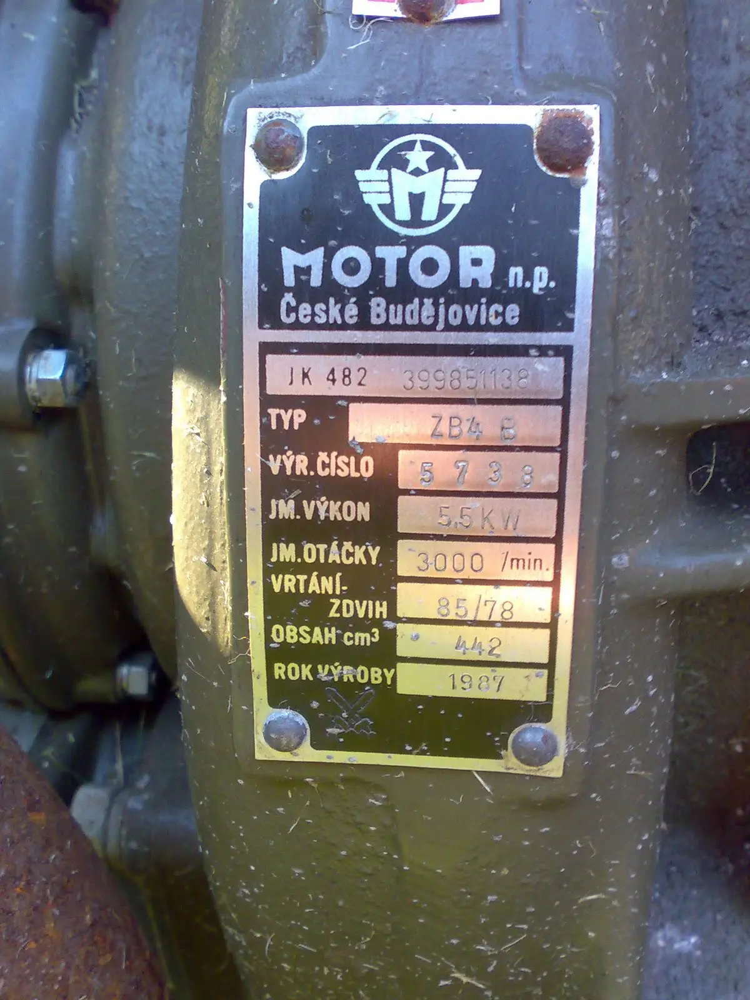

FFF byl tak hodný, že mně půjčil Rebela, tak jsem si mohl k Hynkovi vyjet na dvou kolech. Brodění zvládl Rebel na výbornou, ale enduro jízda ve stupačkách je neuskutečnitelná. 
Když jsem začal rozebírat kontaktní kladívkové zapalování, tak to chvílemi vypadalo, že to nedělám ani tak já, jako Abišaj, který si nedal ani chvilku oddechu a v nestřežené chvíli odnesl zapalovací svíčku neznámo kam. 
Zapalování je funkční, jiskru ale nedává ani na svíčce ani kabelem proti kostře. Vypadá to, že je magneto příliš slabé na jiskru. V plánu je připojit celé zapalování na autobaterii a nastartovat bez magneta, případně v budoucnosti magneto oživit.  



