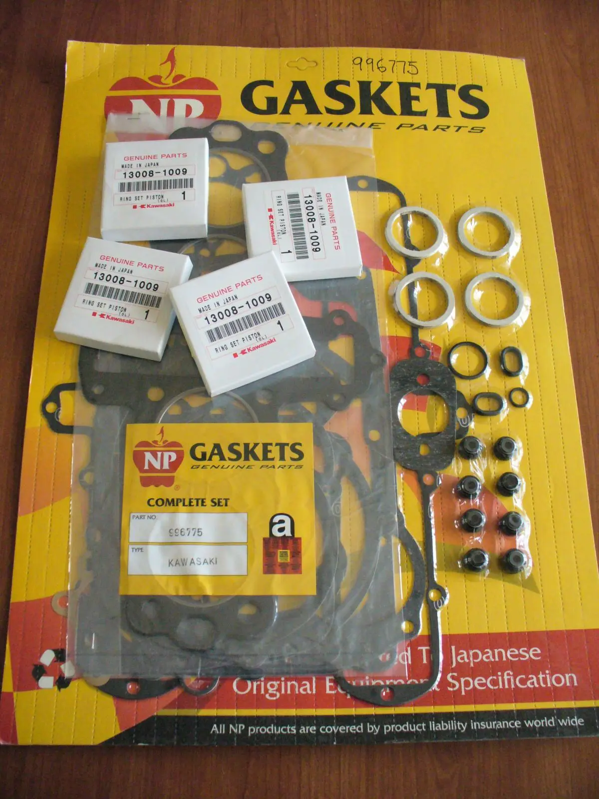
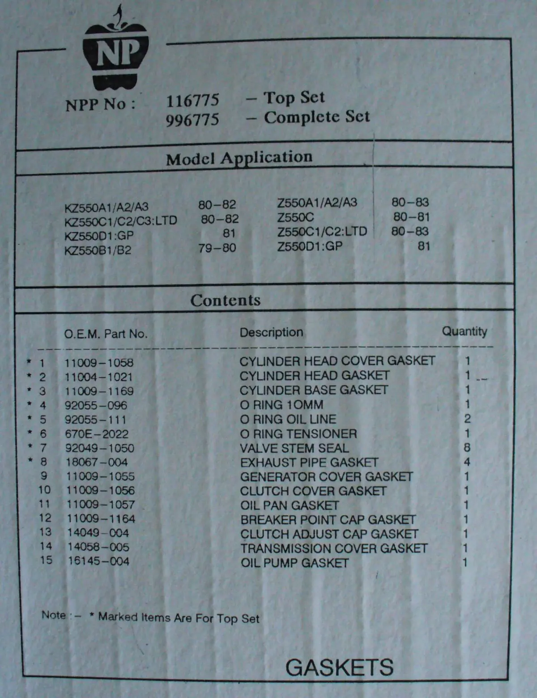

Pístní kroužky z USA, zdržení dvacet dní. Vyměřeno clo nula korun, vyměřeno DPH 20% z ceny a 180 korun manipulační poplatek České Poště. Fuj. DPH nevadí, poplatek nevadí, ale dvacet dní zdržení je moc.

Engine gasket kit za 73 liber z Británie a pístní kroužky za 4×39USD. Seznam těsnění je na obrázku. Chybí tam půlměsíce těsnění krytu ventilů číslo [<a href="http://www.powersportsplus.com/parts/search/Kawasaki/Motorcycle/1981/KZ550-D1+GPz/CYLINDER+HEAD/parts.html">92066</a>], stejný má [<a href="http://www.partsdepot.cz/index.php?curl=&amp;phase2=&amp;modelsearch_x=&amp;model=1082&amp;cat=Motorcycles&amp;year=1991&amp;mfg=Kawasaki&amp;section=68886&amp;fullgrid=">Zephyr 750 1991</a>].