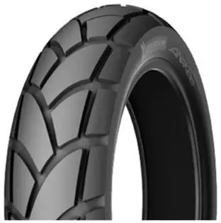

V-Strom má obuto Michelin Anakee 2, úplně nové. Má to být dvousložková vyztužená pneu, střed je dostatečně tvrdý, okraje měkké a přilnavé, má mít stejnou trakci na suchu i na mokru. 
Přední pneu 110/80R19, zadní pneu 150/70R17 
 
<i>přidáno 23. srpna 2011:</i> 
<i>aktuálně máme na V-Stromu na Michelin Anakee 2 najeto 10tis. kilometrů a na té gumě to není znát, jestli ano, tak jsme nanejvýš v polovině životnosti.</i> 
<i> 
</i> 
<i>přidání 20. října 2011:</i> 
<i>aktuálně má Anakee 2 najeto 14tis. kilometrů a pořád je dost vzorku</i> 
<i> 
</i> 
<i>přidáno 22. listopadu 2011:</i> 
<i>aktuálně na Anakee2 najeto 16tis. kilometrů, na přední pneu je nájezd vidět, už nemá tak pěkně oblý tvar a hrany kostek "lezou ven". Zadní je pořád pěkná. Měním za špunty Mitas E-10. Pneu má vzorek pořád v hloubce běžné nové silniční pneu - takže nejméně dva, možná i čtyři tisíce kilometrů by ještě pneu najely. Ale už teď to nejsou enduro gumy, ale silniční.</i> 
<table class="tr-caption-container" style="margin-left: auto; margin-right: auto; text-align: center;"><tbody>
<tr><td style="text-align: center;"></td></tr>
<tr><td class="tr-caption" style="text-align: center;">Michelin Anakee2 zadní po 16tis. km</td></tr>
</tbody></table><table class="tr-caption-container" style="margin-left: auto; margin-right: auto; text-align: center;"><tbody>
<tr><td style="text-align: center;"></td></tr>
<tr><td class="tr-caption" style="text-align: center;">Michelin Anakee2 přední po 16tis. km&nbsp;</td></tr>
</tbody></table><table class="tr-caption-container" style="margin-left: auto; margin-right: auto; text-align: center;"><tbody>
<tr><td style="text-align: center;"></td></tr>
<tr><td class="tr-caption" style="text-align: center;">Michelin Anakee2 sada po 16tis. km</td></tr>
</tbody></table><i> 
</i>