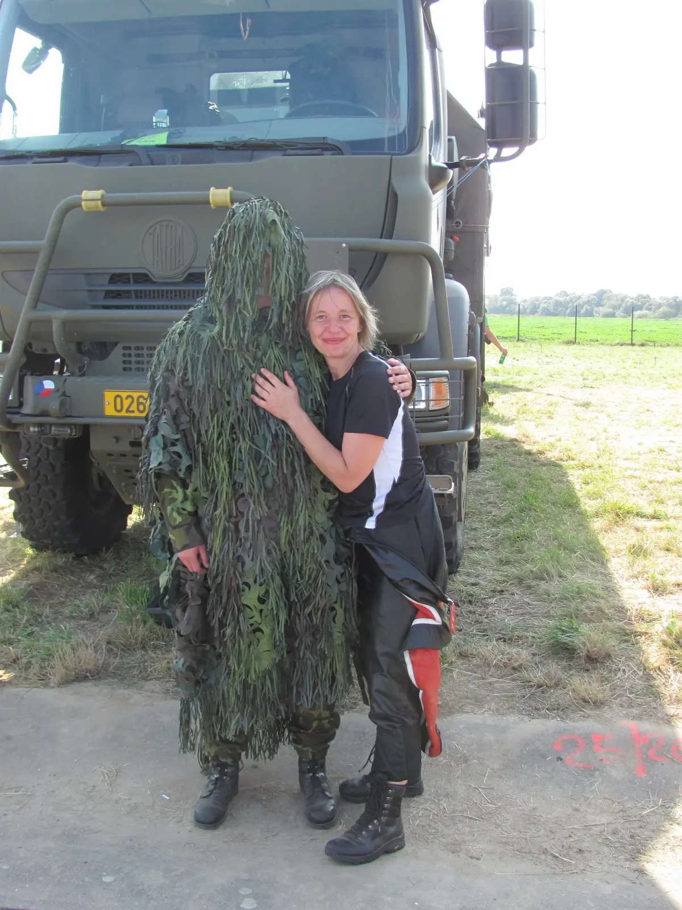
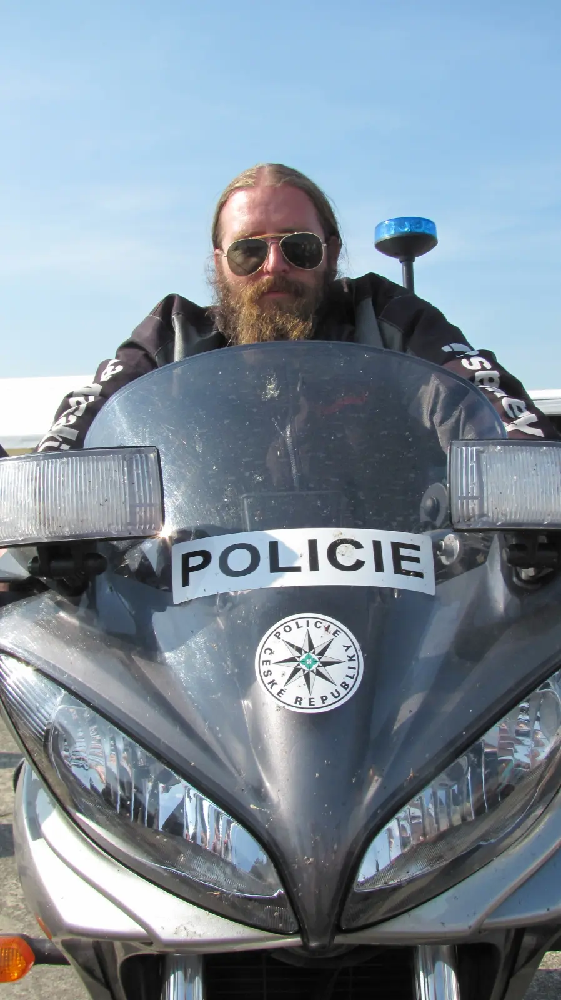

Velkolepá akce na letišti v Ostravě - letecká akrobacie, pozemní technika armády, záchranářů a policie, také nízké přelety stíhaček, či možnost sáhnout si na B52 nebo si potřást rukou s pilotem U.S. Air Force. Všude davy a davy návštěvníků. Jaké to bylo? Video zpráva z iDnes.cz [<a href="http://zpravy.idnes.cz/video-v-ostrave-padl-rekord-armadni-show-sledovalo-225-tisic-lidi-pso-/zpr_nato.aspx?c=A110925_080609_zpr_nato_inc">1</a>] a webové stránky akce [<a href="http://www.dny-nato.cz/">2</a>] hovoří za vše. My jsme využili jeden z posledních slunečních dnů letošní motocyklové, vyrazili časně ráno do Mošnova a spojili příjemně strávený den s podvečerní návštěvou Haj-jiho, který v neděli oslavil své čtyřicáté narozeniny. Blahopřejeme! 
 
[<a href="https://photos.app.goo.gl/3NppwUSx1bJGBmnj6">víc fotek</a>] 

<object class="BLOGGER-youtube-video" classid="clsid:D27CDB6E-AE6D-11cf-96B8-444553540000" codebase="http://download.macromedia.com/pub/shockwave/cabs/flash/swflash.cab#version=6,0,40,0" data-thumbnail-src="http://i.ytimg.com/vi/fPeP_6chGgs/0.webp" height="266" width="320"><param name="movie" value="http://www.youtube.com/v/fPeP_6chGgs?f=user_uploads&c=google-webdrive-0&app=youtube_gdata" /><param name="bgcolor" value="#FFFFFF" /><embed width="320" height="266"  src="http://www.youtube.com/v/fPeP_6chGgs?f=user_uploads&c=google-webdrive-0&app=youtube_gdata" type="application/x-shockwave-flash"></embed></object>

video z kompaktu Canon PowerShot, stříháno na Windows 
 

Profi prezentace Turkish Star na Youtube [<a href="http://www.youtube.com/watch?v=GeeHe63m9M0&amp;feature=related">1</a>]&nbsp;

