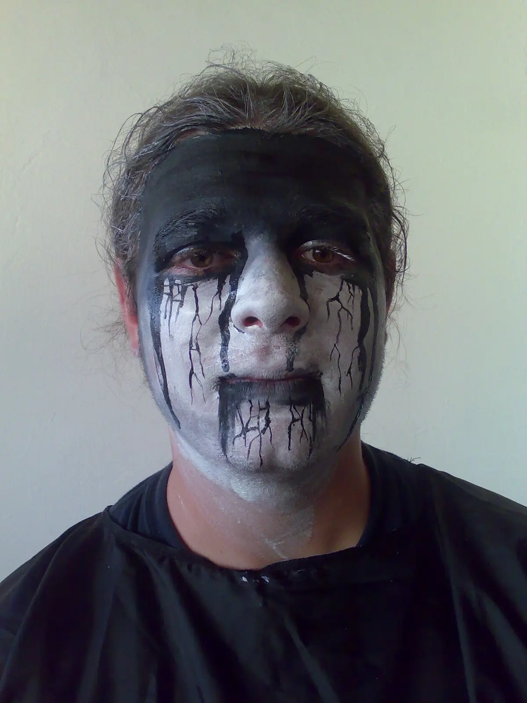
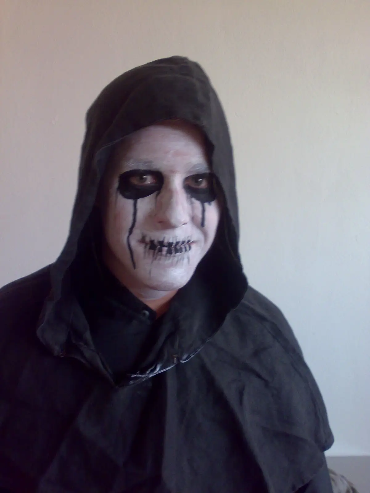
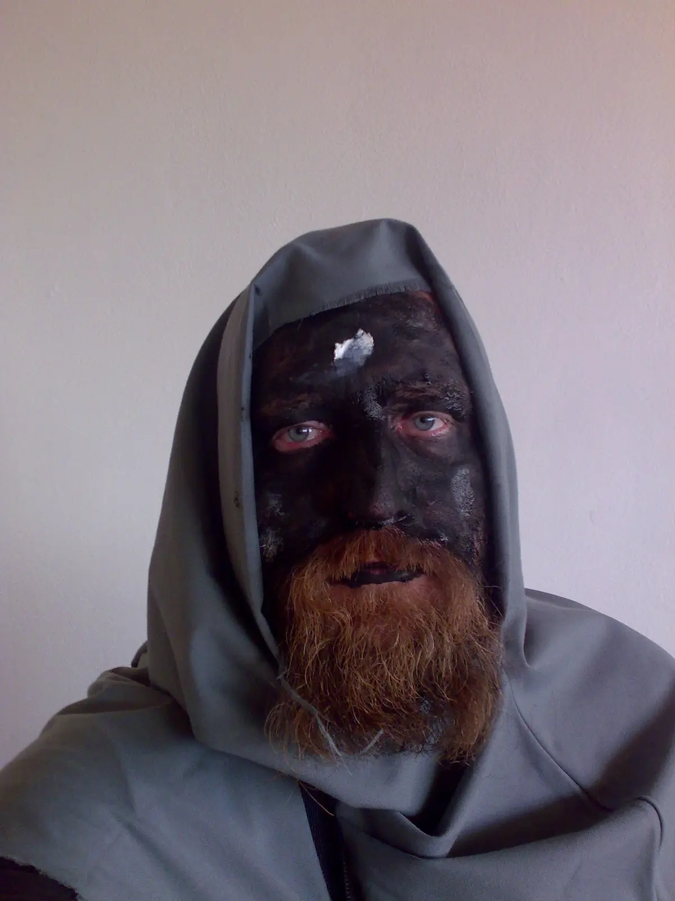
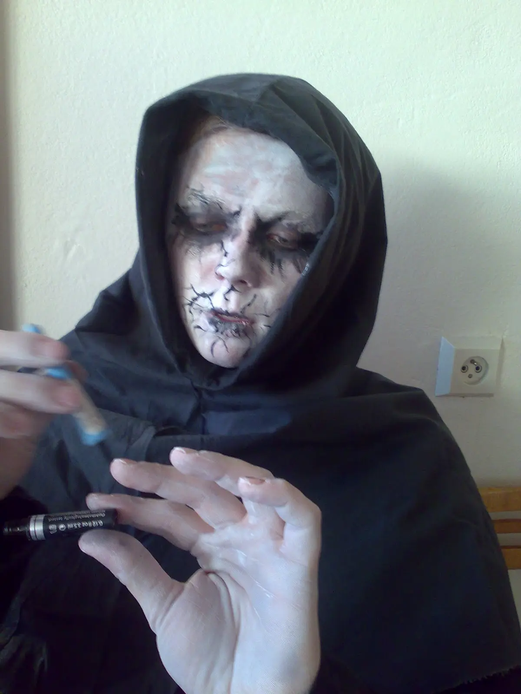



Den památek v Uherském Brodě není den ledajaký a u nás ve městě to opravdu žije, krom koncertů v Zahradě Panského domu, otevřeného židovského hřbitova a komentovaných prohlídek kostelů byla otevřená i radnice od podzemí po střechu. Nadzemí zabral starosta s místostarosty a sklepy nechali nám Los Pupkos a ŠKUB. My, vybaveni dýmostrojem, děsivou hudbou, nůší svíček a kvalitním týmem, jsme se nezalekli. Naopak, zalekli se nás, když před devátou hodinou ranní ruka umrlcova na kované klepadlo brány radnice&nbsp;sáhla.

 

Pokud jsme někomu naším malým strašidelným výstupem v podzemí radnice způsobili újmu, tak se tímto omlouváme s otázkou - Proč jste tam lezli? Já nebýt kostýmovaný, tak bych tam nešel - opravdu - všude tma, dým, puch a strach; potácející se zombie, visící pavouci, smrtící paprsky, jedovatý ozon, na krok vidět nebylo a k tomu stresující hudební kulisa. Proč? 
<table class="tr-caption-container" style="margin-left: auto; margin-right: auto; text-align: center;"><tbody>
<tr><td style="text-align: center;"></td></tr>
<tr><td class="tr-caption" style="text-align: center;">...přinášíme vám mír a lásku, máte ji na dveřích...</td></tr>
</tbody></table>

<table class="tr-caption-container" style="margin-left: auto; margin-right: auto; text-align: center;"><tbody>
<tr><td style="text-align: center;"></td></tr>
<tr><td class="tr-caption" style="text-align: center;">Strašidlo v kanceláři starosty, místnost je to pěkná, zvyknul bych si, ale je tady moc světla...</td></tr>
</tbody></table>
 

