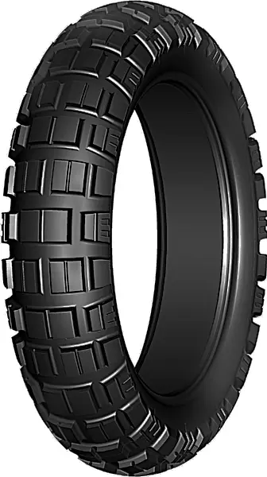
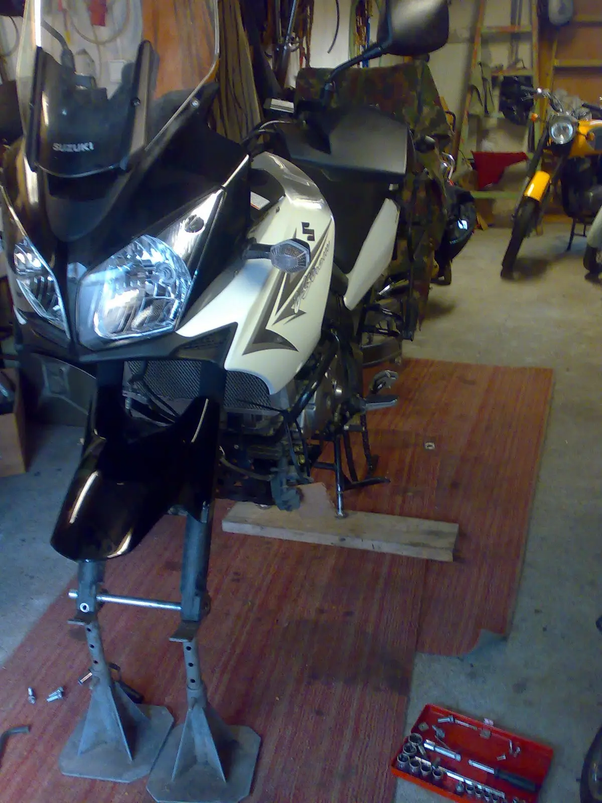
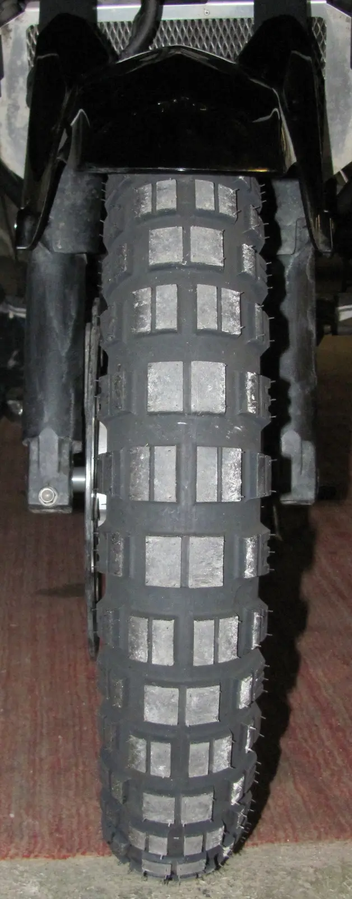
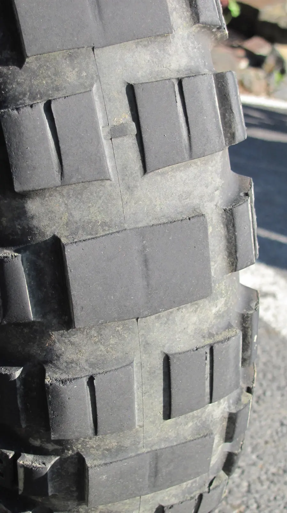
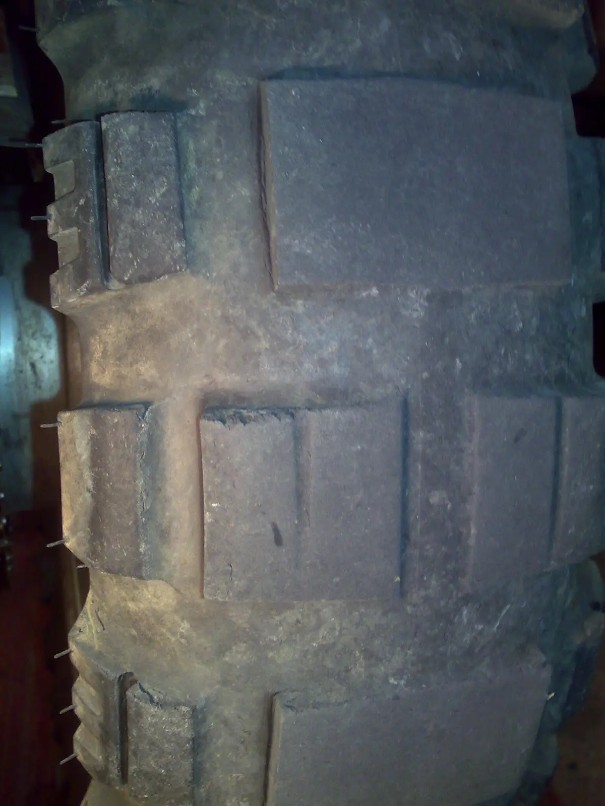
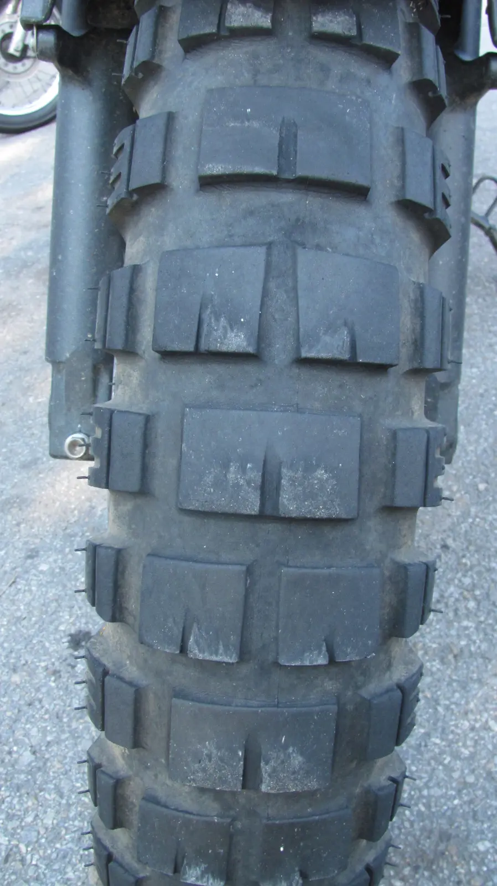

Mitas E-10



Stromu E-10 sluší

 

Recenze [<a href="http://cenduro.cz/articles.php?article_id=9">1</a>] se různí. Jedni chválí, jiní ne. Někdo uvádí kilometrový nájed 9tis. km, jinde jsem četl, že vydrží nejvíce 4tis. km. Není nad to zakusit si jinou pneu na vlastní kůži. Uvidíme, snad až na kůži nedojde. V roce 2010 snad ještě pneu testovali a měnili se výrobní směsi etc. Teď 2011 by měla být směs stabilizována na středně tvrdou s dobrým nájezdem. 
 
Prý se guma i trhá [<a href="http://www.bmwgs.cz/forum/viewthread.php?rowstart=560&amp;forum_id=19&amp;thread_id=4585&amp;pid=131165" target="_blank">2</a>] 
<i> 
</i> 
<i>přidáno 9. 5. 2012</i> 
<table class="tr-caption-container" style="margin-left: auto; margin-right: auto; text-align: center;"><tbody>
<tr><td style="text-align: center;"></td></tr>
<tr><td class="tr-caption" style="text-align: center;">Mitas E-10 zadní po 6000 km</td></tr>
</tbody></table>
plus 6tis. kilometrů, zbývají asi tři milimetru vzorku. Do terénu jedině s podhuštěnou pneu na 1.5bar, záběr mají aspoň boky. Předpokládám, že 2tis. ještě vydrží. 
 
<i>přidáno 6. 6. 2012</i> 
pneu mají najeto 7500 kilometrů a jsou na výměnu. Přední ještě něco vydrží. 
<table class="tr-caption-container" style="margin-left: auto; margin-right: auto; text-align: center;"><tbody>
<tr><td style="text-align: center;"></td></tr>
<tr><td class="tr-caption" style="text-align: center;">Mitas E-10 zadní po 7500 km</td></tr>
</tbody></table>
<table class="tr-caption-container" style="margin-left: auto; margin-right: auto; text-align: center;"><tbody>
<tr><td style="text-align: center;"></td></tr>
<tr><td class="tr-caption" style="text-align: center;">Mitas E-10 zadní po 7500 km</td></tr>
</tbody></table>
<i>přidáno 24.6.2012:</i> 
<table class="tr-caption-container" style="margin-left: auto; margin-right: auto; text-align: center;"><tbody>
<tr><td style="text-align: center;"></td></tr>
<tr><td class="tr-caption" style="text-align: center;">Mitas E-10 přední po 9500km</td></tr>
</tbody></table>
<table class="tr-caption-container" style="margin-left: auto; margin-right: auto; text-align: center;"><tbody>
<tr><td style="text-align: center;"></td></tr>
<tr><td class="tr-caption" style="text-align: center;">Mitas E-10 přední po 9500km</td></tr>
</tbody></table>

<i>přidáno později:</i>

<i>Zkušenost reálná je taková, že tato guma je opravdu silniční. V blátě to s ní moc nejde. Zajímavou volbou pro offroad je obout „céčkové pneu“[<a href="/posts/2012/10/v-strom-mitas-c-02-c-18/" target="_blank">3</a>]. Vypadá to, že kilometrový nájezd céčkových pneu a E-10 je srovnatelný - pozor - pokud řešíme použití pro offroad ježdění. Při normálním ježdění byla zadní pneu E-10 po 5000km sjetá a dál prakticky už jenom silniční a céčkové pneu na tom jsou podobně.</i>

<i> </i>

<i>V roce 2013 by měla být na trhu dvousměsová Mitas E-10, která by měla vyřešit problém měkké směsi ve střední části pneu.</i>

