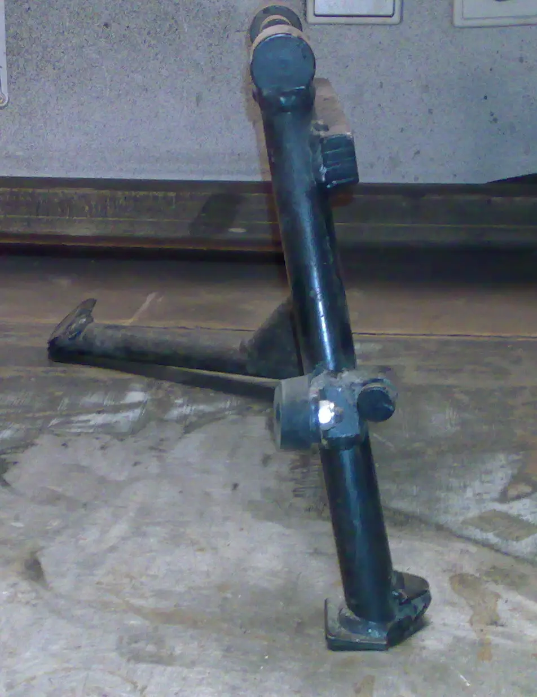

Po přepákování zadního tlumiče [<a href="/posts/2011/10/prepakovani-tlumice-kyvne-vidlice/">1</a>] a zvednutí celé motorky o 6cm, nedosáhl centrální stojan na zem a bylo potřeba ho prodloužit. Funguje to; teď jenom dobrousit sváry a obléct do slušivého černého komaxitu. 





<i> </i>

<i>přidáno 31. 5. 2012:</i>

<i>Po prodloužení předních vidlic bylo nutné znovu prodloužit centrální stojan, taktéž nadstavit o 60mm boční stojan. [<a href="/posts/2012/05/kdyz-strom-zakoreni/" target="_blank">2</a>]</i>

