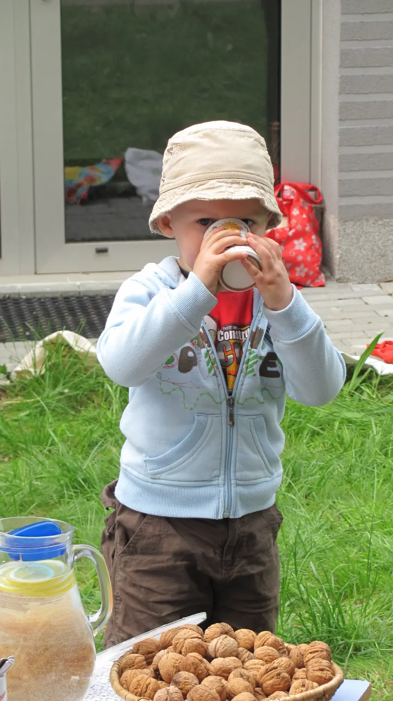

 
Akce Domu dětí UB [<a href="http://www.ddmub.cz/akce/vikend-pro-rodinu-ferova-snidane" target="_blank">1</a>], ranní až dopolední setkání na trávníku před ekocentrem Chrpa. Povídaní o problematice fairtrade [<a href="http://www.fairtrade.cz/" target="_blank">2</a>], čili férovou odměnou za odvedenou práci na pěstování nebo výrobě pro prvovýrobce; dále pak ochutnávka luxusních buchet, domácích chlebů, müsli, jogurtů a müsli, pak bio kávy a müsli a pravdou je, že já osobně pro samé müsli už neochutnal nic moc jiného. Teta Míša Domečková upekla takové müsli, že se přímo rozplývalo na jazyku a nelze ho doposud dostat z mysli. A to prý byl první recept, který google nabídne [<a href="http://www.varimezdrave.cz/recepty/musli" target="_blank">3</a>]. 
 
[<a href="https://photos.app.goo.gl/2gjzw7enrpWWS5d88" target="_blank">fotky</a>]