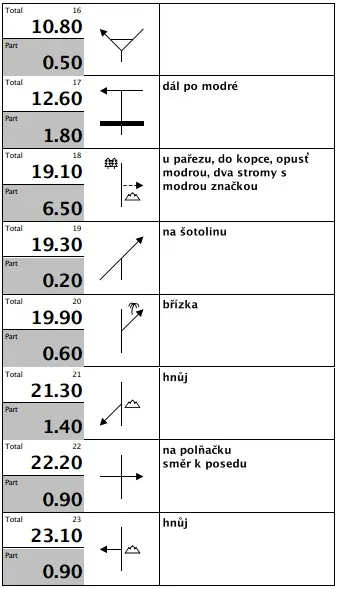
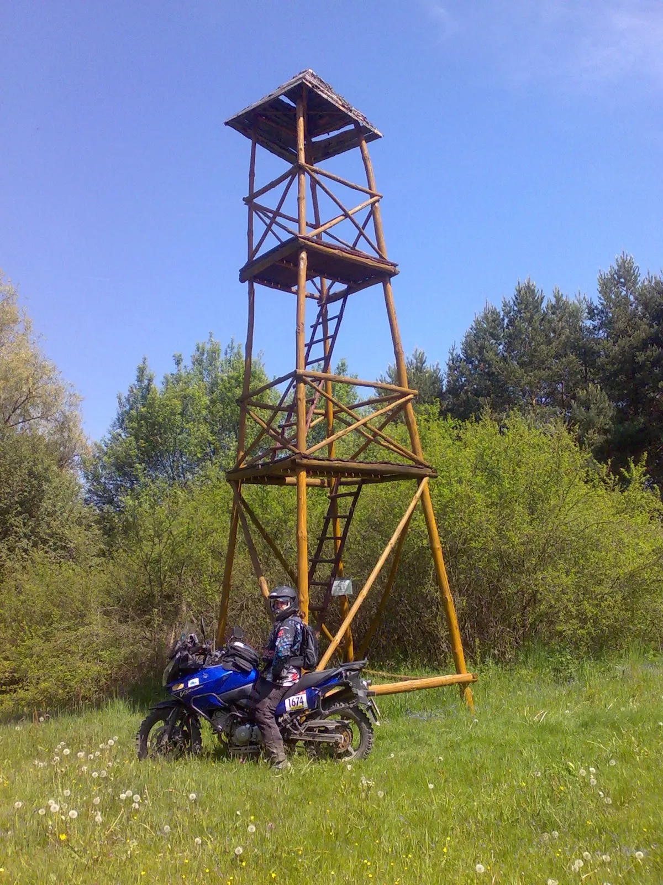
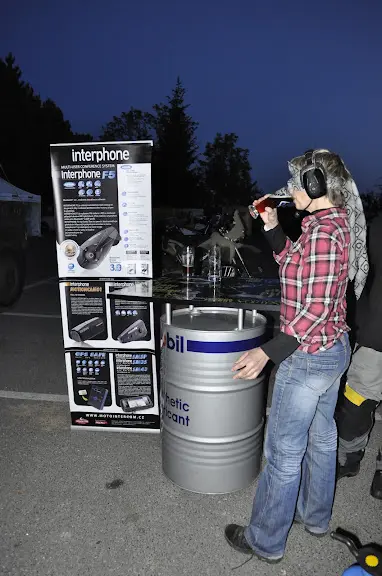



 
[<a href="http://www.sports-tracker.com/#/workout/tyfoza/6fpqiqghskpnkfoq" target="_blank">trasa</a>] [<a href="https://photos.app.goo.gl/EWu3Pd7gWahUi8Uq8" target="_blank">fotky</a>] [<a href="http://www.facebook.com/l.php?u=https%3A%2F%2Fpicasaweb.google.com%2F108553760910729317517%2FTouratechTravelEventCzech2012%3Fauthuser%3D0%26feat%3Ddirectlink&amp;h=5AQELK2AX" target="_blank">fotogalerie TT</a>] 
 
V pátek odpoledne jsme dorazili do BMW motoklubu White Blue[<a href="http://www.white-blue.cz/" target="_blank">1</a>] v Jílovém u Prahy. Zajištění akce profesionální. V pátek byla akce klidná, registrace, společenský večer, potkali jsme pár známých. Spali jsme u Míši, jen deset kilometrů z Jílového a bylo to velmi pohodlné, protože jsem měl řidičskou záminku k neúčasti na seznamovacích přípitcích. 
 
<table class="tr-caption-container" style="float: right; margin-left: 1em; text-align: right;"><tbody>
<tr><td style="text-align: center;"></td></tr>
<tr><td class="tr-caption" style="text-align: center;">náš roadbook</td></tr>
</tbody></table>
V sobotu sraz v devět ráno, vyzvedli jsme si startovní čísla - Sáša dostala číslo jedna a já třináctku. Celou trasu jsme jeli spolu s kolegou v VStrom klubu podle pravidla, že offroad by člověk nikdy neměl jet sám. Tak jsme na to byli tři. Začínalo se úvodním prologem, fáborkovanou cestou vyznačenou na motokrosové trati, aby si měli účastníci možnost vyzkoušet, zda se vůbec na offroad vyjížďku vydají nebo jestli se vrátí na základnu a vyzvednou si propozice k touringové jízdě po asfaltu. Vyjeli jsme v tandemu malý kousek a pak jsem si prolog projel sám a Sáša zůstala zrovna v cíli, protože jízda se spolujezdcem v lehkém terénu byla naše premiéra. Prolog se nejel na čas, měl jenom jasně vymezit obtížnost. 
<table class="tr-caption-container" style="float: left; margin-right: 1em; text-align: left;"><tbody>
<tr><td style="text-align: center;"></td></tr>
<tr><td class="tr-caption" style="text-align: center;">zdroj bmwgs.cz</td></tr>
</tbody></table>
Občas někdo položil stroj, jedna slečna na GS1200 jela naprosto bravurně všechny výjezdy, ale byly i nepříjemnosti, jako malý rybníček, kde kdos prý přebrzdil zatáčku ve sjezdu kolem něj a zcela utopil svoji KTMku. Určitě je namístě vyjádřit soustrast a ne tvrdit, že kačena patří do vody. Měl vodu po světlo. 
 
Jelo se podle roadbooku, viděli jsme to prvně, ale něco takového mají účastníci orientačních soutěží včetně slavného Dakaru. Po cestě jsme potkali Ivo Kaštana[<a href="http://www.ivokastan.cz/" target="_blank">2</a>], kterému Barvajs musel poradit kudy dál, aby mohl pokračovat. Já ho neznám, tak jsem ho ani nepoznal. Jel na svém soutěžním pitbike, ale někde po cestě potkal drát, na čtyřikrát propíchl gumu a nedojel. 
Asi patnáct kilometrů před cílem se mělo vjet do ohrady a pokračovat skrz ni - teď už v ní byly krávy, průjezd byl uzavřen ohradníkem. Tady údajně trasu v průběhu dne ukončili, ale to nám nikdo neřekl, takže jsme poctivě podle turistické mapy našli další bod a pokračovali až do cíle. 
Roadbook jsem viděl prvně, ti kdo jezdí často, mají roler[<a href="https://www.google.cz/search?q=roadbook+roller&amp;hl=cs&amp;safe=off&amp;pwst=1&amp;prmd=imvnsfd&amp;bav=on.2,or.r_gc.r_pw.r_cp.r_qf.,cf.osb&amp;biw=1228&amp;bih=814&amp;um=1&amp;ie=UTF-8&amp;tbm=isch&amp;source=og&amp;sa=N&amp;tab=wi&amp;ei=4Hu5T9D7JI-S8gPK5YijCg#um=1&amp;hl=cs&amp;safe=off&amp;tbm=isch&amp;sa=1&amp;q=roadbook+roller&amp;oq=roadbook+roller&amp;aq=f&amp;aqi=&amp;aql=&amp;gs_l=img.3...26713.26713.9.26939.1.1.0.0.0.0.118.118.0j1.1.0...0.0.8JbDCx3jIY4&amp;pbx=1&amp;bav=on.2,or.r_gc.r_pw.r_cp.r_qf.,cf.osb&amp;fp=90ffe0bcf5a9659b&amp;biw=1228&amp;bih=814" target="_blank">3</a>] a jenom si odvíjí nekonečný pásek s trasou. My ostatní jeli s devatenácti papíry „na večerníčka“ a někteří pokáráníhodní účastníci to vzali doslova a nepotřebné listy roadbooku zahazovali podél tratě. Barvajs zaslouží náš největší dík, protože chytil správnou stopu jako pes a neomylně nás vedl vstříc zážitkům. 
 
Údajně celou trasu projelo - ze zhruba padesáti účastníků - jenom deset strojů včetně nás. Zajeli jsme si alespoň padesát kilometrů. Barvajs ke konci brblal, že mu dochází benzín, tak jsem ho uklidnil, že má ještě určitě dost a že do cíle je to už jenom kousíček a taky že jo. Dojel do cíle, zajel na parkoviště, motor mu škytnul a zdechnul. Museli jsme mu s kanystrem zajel na pumpu. Ale dojel bez tankování. 
Nejlepší jezdci dojeli v časech kolem 3h30m a my za nimi měli jenom „malou“ ztrátu s časem 8h15m. Potěšilo nás, že úplně poslední tři KTMka dorazila až patnáct minut po nás - jak bloudili, tak nás za den nejmíň pětkrát předjeli, ale my je nikdy ani nedojeli. 
 
<table class="tr-caption-container" style="float: right; margin-left: 1em; text-align: right;"><tbody>
<tr><td style="text-align: center;"></td></tr>
<tr><td class="tr-caption" style="text-align: center;">V-Strom a Africa&nbsp;</td></tr>
</tbody></table>
Lehký offroad v tandemu byl docela zážitek a to určitě i pro spolujezdce. Nejeli jsme až zas tak svižně, po turistických značkách lesem jsme jenom místy dosáhli na čtyřicítku a mimo les jsme snad jen párkrát jeli šedesát. Výjezdy jsou se spolujezdcem skvělé, zadní kolo pěkně sedí a neodskakuje. Zkoušeli jsme jet oba ve stupačkách, ale nakonec jsme se snažili jen tak nadlehčovat přizvednutím v kolenou. Bylo to zábavné a veselé, protože náš drátový interkom fungoval dobře a dokonce se neodpojil, ani když jsem někde při otáčení do prudkého kopce Sášu ztratil, motorku jsem položil na místě a v nulové rychlosti, takže jsem věneček z TKC neobhájil. A to bylo jediné místo, kde jsme motorku zvedali. Pneu jsem upustil na 1,5kPa; a tak měla zadní už moc moc sjetá Mitas E-10 docela záběr, jenom na uježděné mokré trávě to bylo jako na ledě, tam by se špunty na středu hodily.&nbsp;Celý den jsme jeli podle dvou základních hesel: když to vypadá, že spadneš, zrychli. Když zpomalíš - spadneš. Brody jsme si moc užili, hned v prvním jsem si odšlápl, vody bylo po kolena, tak mně nateklo do kanad shora a když už všechno tak nějak uschlo, potkali jsme asi v polovině další brod, který jsem projel tak rychle, že mě vodní stěna slila ještě víc. Třeba se časem najdeme na nějaké fotce. 
 

Večer byl opět společenský, hrála bluesová kapela, moderoval Pavel Liška. Vyhlášení výsledků a byly i nějaké soutěže. Účastnili jsme se večer jedné, navigační. Kdy Sáša se zavázanýma očima, jedoucí na dětském odrážedle navigována mnou skrz bezdrátový Interphone, musela najít na parkovišti stůl, vypít jedno pivo, objet celé prakoviště plné motorek, vrátit se přes šest schodů a do cíle prokličkovat mezi stoly a sloupy na terase restaurace. Zajeli jsme to v čase 2m52s, ale na vítězný slovenský tým s časem 2m49s jsme&nbsp;nedosáhli. Sáša pila své první pivo v životě a moc jí to nešlo, takže ztratila cenné vteřiny a pak se musela hodinu léčit, než mohla zase běhat bez motání se. Před námi jel velmi velmi velmi svižně Pavel Liška, navigován svou slovenskou kolegyní, ale jel tak rychle, že ona smějící se nestíhala navigovat. Druhé místo bylo taky pěkné. Kameru jsme nevyhráli, ale máme voděodolný obal na smartphone na řídítka [<a href="http://www.profizona.cz/cellularline-interphone-drzak-na-kolo-motocykl-motorku-pouzdro-na-riditka-pro-mobilni-telefon" target="_blank">4</a>] a staré dobré Nokii E90 padne jako ulitý.

 
Akce dobrá moc, zajištění pořadatelské dokonalé a když nám večer vysvětlili, že najeli roadbook na BMWéčkách, kde mají místo kol 19" kola 21", tak jsme pochopili, proč se nám rozcházely tachometry už na prvních pěti kilometrech o tři sta metrů. 

 

Zajímavost zajímavá - vítězové touringové části (po asfaltu) si zajeli jen pět set metrů na tři sta padesát kilometrů dlouhé trase. Dokonalé.

Jízdu zručnosti mezi kužely na parkovišti, která byla volně otevřená každému, vyhrál rozvoz pizzy na skůtru. Nasbíral nejvíc bodů a byl suveréně svižnější a agilnější než mastodontí endura kolem.

 

V neděli jsme navštívili dva workshopy na téma Kamera na cestách a GPS navigace. Bylo to profesionální a informačně výživné a motivační. Opět jsem byl jediný, kdo si psal poznámky, chjo.

 

Oficiální zpráva a hlavně fotky z akce na FB profilu [<a href="http://www.facebook.com/touratech.cz" target="_blank">5</a>] a firemním blogu Touratechu [<a href="http://touratech-cz.blogspot.com/" target="_blank">6</a>]. 
Článek z Motodeníku [<a href="http://motodenik.cz/clanek/782-ohlednuti-za-adventure-days.html" target="_blank">7</a>]

