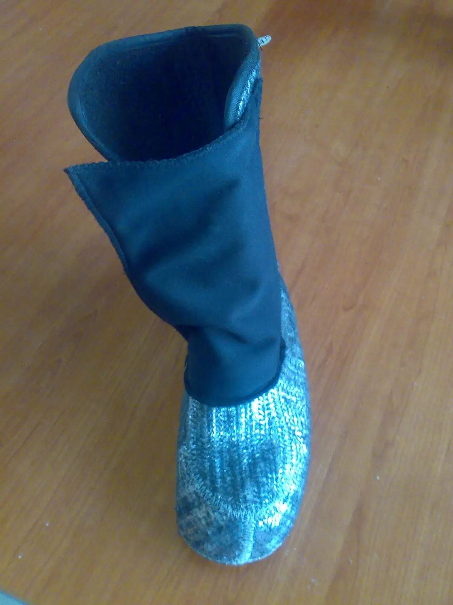



Pořízeno v eshopu ochrannepomuckycz.cz[<a href="http://www.ochrannepomuckycz.cz/obuv-poloholenova-zimni-cxs-akce-p-2318.html" target="_blank">1</a>]. Bota je to obrovská, při řízení ani řazení nevadí – nabízí variantu těchto šněrovacích bot a variantu klasických sněhulí. Předpokládal jsem, že šněrovací bota bude pevnější. Žel bota je v místě jazyka méně polstrovaná než všude jinde, takže je nezbytné botu sešněrovat úplně, aby do nich netáhlo. V tomto případě bych doporučil koupi raději těch sněhulí[<a href="http://www.ochrannepomuckycz.cz/obuv-pinnacles-extreme-40%C3%82%C2%B0c-p-2317.html" target="_blank">2</a>], jsou levnější a na motorku snad lepší. 
 
<i>přidáno 25.3. 2013:</i> 
Boty jsem otestoval mnohokrát a jsou pohodlné a velmi teplé. Mají ale jeden problém, bohužel. Vnitřní botička je řešená stejně jako u lyžařských bot, takže vpředu je mezera, kterou v horní části nártu táhne zima dovnitř. Musel jsem používat velmi tlustou pletenou ponožku, aby to nebylo cítit. 



Problém lze snadno vyřešit všitím nějakého materiálu, který neprofoukne. Teoreticky by stačil kus igelitu všitý mezi dvě látky nebo kus neoprenu. Kontaktoval jsem firmu Restless.cz[<a href="http://www.restless.cz/" target="_blank">3</a>] a požádal o zaslání materiálu, který neprofoukne, šijí z něho nákrčníky a dolní části motocyklových kukel. 



Materiál Sympatex windmaster fleece – shora něco jako tenký neopren, vespod teplý fleece a uprostřed membrána. Nakonec vyšlo na sešití dvojmo. 



Funguje to skvěle, neprofoukne. Otestováno při několikahodinové jízdě při 2°C. Hlavně bota udrží nohy v teple a není potřeba žádné aktivní elektrické vyhřívání. 

 

 
 