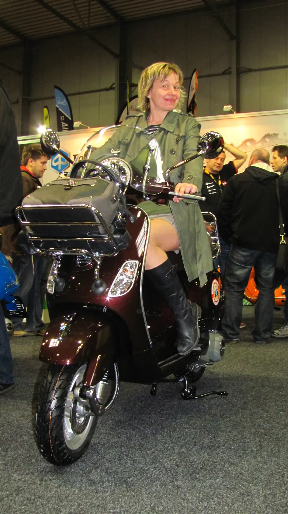
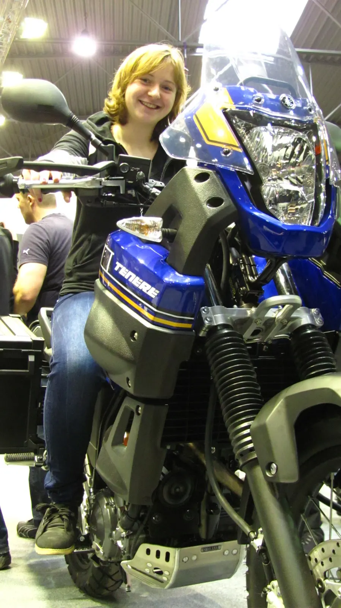

fotky [<a href="https://sites.google.com/view/tyfotoza/" target="_blank">Motosalon</a>] [<a href="https://sites.google.com/view/tyfotoza/" target="_blank">Motocykl</a>]

Letňany - Motosalon

Prázdné parkoviště, tři autobusy a dva motocykly, ostatní z roje návštěvníků přijeli hromadnou dopravou.

Všude je tu kromě motorek i nepřeberné množství skútrů.  Stánek Hondy obrovský a ještě větší. Suzuki i Kawasaki chybí. Yamaha je zde ve všech vydáních. Ptám se jejich hostesek, cože to mají na plakátě a holky říkají, že motorečku.

U Moto Guzzi zaujal V7 Stone[<a href="http://www.motorkari.cz/clanky/redakcni-testy/moto-guzzi/moto-guzzi-v7-stone-21699.html" target="_blank">1</a>], je prostě krásný. Život s ním bychom si dovedli představit.  Dvě firmy, které kromě motorky prodají vstupenku k životnímu stylu byly vedle sebe. Tentokrát sterilně čisté BMW zcela prohrálo se stylovým a nápaditým HD[<a href="http://www.motorkari.cz/clanky/moto-novinky/harley-davidson/motosalon-2013-harley-davidson-24266.html" target="_blank">2</a>] na plné čáře.

U Mitasu se spekuluje o tom, že bude konečně pneu C-02 v šířce 150mm. Konečně!.

Velký stánek KTM[<a href="http://www.motorkari.cz/clanky/moto-novinky/ktm/motosalon-2013-ktm-husaberg-24270.html" target="_blank">3</a>] ukázal všechny kubatury Duke i Adventure 1190 R[<a href="http://www.motorkari.cz/clanky/prvni-jizda/ktm/prvni-jizda-na-ktm-1190-adventure-23963.html" target="_blank">4</a>], na kterém zatím nikdo z dovozců nejel a zatím neví, jaký bude reálný rozdíl oproti 990R.

Časopis Motocykl nabízí samolepku pouze k zakoupenému časopisu; třetinu vizuální prezentace tvoří záběry z enduroškoly, kterou se teď členové redakce prokousávají.



Za rohem od Mitasu je stánek Rockaway.eu, letošní model jejich oblíbeného motooblečení se vpínací membránou a nová hlavně verze enduro kompletu[<a href="http://www.rockway-shop.eu/rockway/rockway-enduro-2013-komplet" target="_blank">5</a>], ze kterého jsem pořídil zatím alespoň kalhoty. Rozpínací větrání na stehnech vpředu i vzadu, zesílená kolena, široká nohavice, kam se vejde i pořádný kolenní chránič, kůže na vnitřní straně kolen a lýtek, aby to při jízdě ve stupačkách neklouzalo. Ještě budu muset někde otestovat, zda šijí i bundy na slony, abych se do bundy pohodlně vešel i s kompletními chrániči. Otestovat posaz na motorce jsem mohl na mašině testovacího jezdce Mitas. Ani se Joe moc nezlobil, se slovy - že to pak Pardálovi naúčtuje mně ke kalhotám ještě doporučil outdoorovou kameru, kterou teď testuje.

Je to kamera Actionpro SD21 Pro[<a href="http://www.cel-tec.cz/sportovni_kamera-actionpro_actionpro_sd21_pro-919283263-839952471-kamery-do-auta/" target="_blank">6</a>] a  moc ji pochválil. Mě osobně zaujala zatím více kamera Drift HD Ghost[<a href="http://www.driftczech.cz/Drift-HD-Ghost.html" target="_blank">7</a>]. Nezbude než najít srovnání záběrů v protisvětle a vybrat si. Rozdíl mezi těmito dvě kousky je v pár detailech. Ghost má hledáček na těle zprava. Actionpro má hledáček vzadu v ose objektivu. Dálkové ovládání Drift má výraznou barevnou signalizaci, co kamera dělá - nahrává, fotí, točí smyčku. SD21 má červenou LEDku, která by měla umět totéž. Joe říká, že by kameře, která má vodotěsné tělo jako Drift, nevěřil. K Actionpro je vodotěsný domeček v základu přibalen. Rozdíl je taktéž ve tvaru, Ghost je plochý, SD21 je kostička podobně jako GoPro.

U Hubíků i ČMN vás zváží do soutěže „hubněte s Hubíky.[<a href="http://www.psihubik.cz/" target="_blank">8</a>]“ Odolal jsem ze tří důvodů: 1. kalhoty jsem právě pořídil; 2. co zhubnu, zas přiberu; 3.kombinézu opravdu nepotřebuji. Ok mimo soutěž přiznávám 112kg netto.

Na stánku Ural je prezentační video s offroad ukázkami Uralu s hnanou sajdkárou - projedou všechno, ale spolujezdec se opravdu nadře.

Ve třetí hale je možnost vyzkoušet si svezení na elektroskůtru - jsou smrtelně tiché - to mě děsí. Pak crashtestová prezentace ČVUT, fakulty dopravní a pár pěkných českých veteránů.

Postupně jsme hledali motorku, z níž v základu dosáhne Ábi na zem a není jich málo i mezi dostupnými stroji jako BMW F650GS, Honda NC700X nebo Moto Guzzi V7 a pochopitelně KTM Duke 690.

 

Po necelých šesti hodinách strávených v Letňanech se přesunujeme na výstaviště do Holešovic na Motocykl 2013. Proč jsou dvě výstavy nevím, ale nevadí to. Jejich zaměření je různé. Motosalon osciluje mezi Brnem a Prahou s frekvencí jeden rok, Motocykl je v Holešovicích doma a každoročně.

Tři haly a každá zcela jiná. První jsou čtyřkolky a tržnice - nabídka veškerého motovybavení. 

Letos téměř trojnásobně velký stánek Touratech[<a href="/posts/2013/03/prezentace-touratech-cz-na-vystave/" target="_blank">9</a>], v motokině pravidelně promítají cestovatelské dokumenty, nabízí letošní lifestyle věci[<a href="/posts/2013/02/nove-lifestyle-vyrobky-v-nabidce/" target="_blank">10</a>] a nový dres - pěkný moc, ale asi bych zatím nedokázal na své Suzuki jezdit v jejich barvách a s přední maskou BMW na hrudi. Prezentují hodně různých motorek oblečených v doplňcích Touratech od opravdových offroadů až po Kawasaki Versys. Tady jsem měl konečně možnost nafotit profi roadbook a ICO tripmaster řešení.

Hala druhá je tichá, je nač se dívat i nač si sednout Ducati, MV Agusta, Victory, Suzuki, Kawasaki a Husqvarny s motory BMW - Nuda, Terra, Strada. Vystaven je i Monster o který se letos soutěží losováním vstupenek. 

Poslední a největší je plachtová krytá hala venkovní a je věnována nejen americkému stylu chopper/cruiser. Airbrush, bodypainting, soutěžní stavby, živá muzika, několik barů - dvěmi slovy - holky a mašiny.

Na každém kroku a na obou výstavách bylo cítit, že sezóna začala.

ZZ (za rok zas)

 

<i>info ze serveru motorkari.cz</i>

<i>Doplňky a příslušenství, přehled [<a href="http://www.motorkari.cz/clanky/moto-novinky/motosalon-2013-doplnky-a-prislusenstvi-24273.html" target="_blank">11</a>]</i>

<i>Hostesky a modelky [<a href="http://www.motorkari.cz/clanky/moto-novinky/hostesky-a-modelky-na-vystavach-24288.html" target="_blank">12</a>]</i>

<i>Motocykl 2013 [<a href="http://www.motorkari.cz/clanky/moto-novinky/motocykl-2013-v-plnem-proudu-24267.html" target="_blank">13</a>]</i>

<i>Bohemia Custom Bike 2013 [<a href="http://www.motorkari.cz/clanky/moto-novinky/bohemian-custom-bike-2013-24269.html" target="_blank">14</a>]</i>

