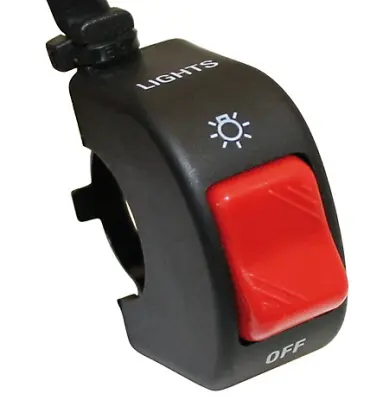

Přední světla DL 650 jsou 2×H4 60/55W, takže potkávací světla při zapnutí zapalování mají odběr 110W! Někdy by se hodilo mít možnost přední světla vypnout – typicky někde v offroadu, kdy člověk motorku položí, opakovaně startuje etc. 
Je několik možností, kam vypínač připojit – hledáme nejkratší a spolehlivé místo. Když stisknete tlačítko startéru, odpojí se přední světla, aby se snížil odběr. A právě sem připojíme vypínač. 
Kabel od startéru se dá rozpojit na odvrácené straně chladiče, pro vyjmutí konektoru je nutné z druhé strany stisknout plastový roztahovací nýt. Světla jsou kabely bílo-žlutý a oranžovo-červený, stačí rozpojovat jeden z nich. 



 



 

Vypínač světel na řídítka, katalogové číslo 240-044 [<a href="http://www.itronic.nl/contents/en-uk/d100.html" target="_blank">1</a>]. 

<i> </i>

<i>pozn.</i>

<i>na starších ročnících V-Stromů neodpojuje stisk startéru přední světla, tam je nutné připojit vypínač světel tak, aby rozpojoval pojistku alespoň potkávacích světel.</i>

