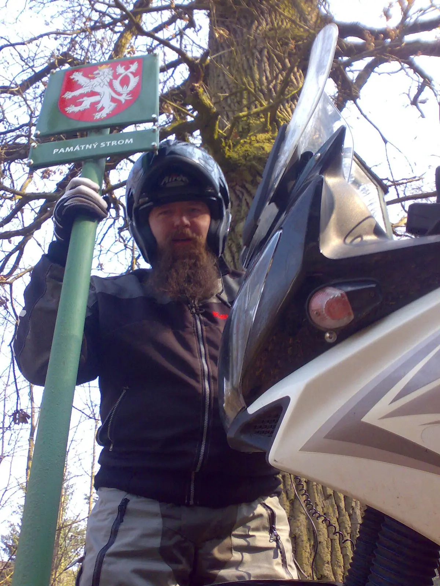



[<a href="http://mapy.cz/s/6UV6" target="_blank">mapa</a>]&nbsp;GPS:&nbsp;49°11'12.842"N, 17°44'15.424"E 
Tento památný strom – Vidovský dub – stojí před zákazem vjezdu do oblasti „Pasek.“



[<a href="http://mapy.cz/s/6UV6" target="_blank">mapa</a>]&nbsp;GPS:&nbsp;49°11'27.980"N, 17°44'3.956"E

Druhý památný strom v Želechovicích – Hašpicova lípa – stojí na oploceném dvorku, poblíž nebyl nikdo, kdo by umožnil vjezd. &nbsp;Zatím.

