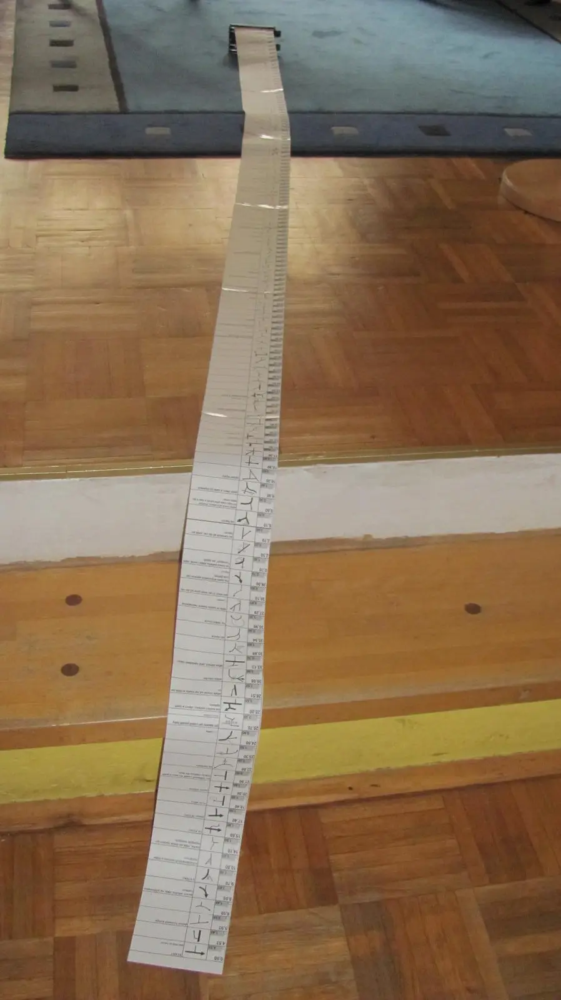

Do roadbooku „malý Čížek“[<a href="/posts/2013/03/roadbook-basic-cizek/" target="_blank">1</a>] se s rezervou vešlo sedm délek papíru A3, šířka 104mm. Reálná namotaná délka 257cm při gramáži papíru 90g/m². V případě použití kvalitního pauzovacího papíru o menší gramáži 75g/m², dalo by se namotat výrazně víc. Itinerář přišel jako 14×A4, proběhla konverze do PDF, převedení každé stránky do obrázku, ořez, seskládání na šířku 104mm a tisk na A3, aby bylo co nejméně spojů. Zpracování na pár minut. Pak nařezat pásky a slepit tenkou izolepou pouze z horní strany. To už tak rychle nešlo. 





Papír má své kouzlo. Je to jako číst knihu nebo číst ebook. Ano, napadlo mě, že bych mohl mít před sebou jakoukoli ebook čtečku vybavenou e-inkem. Něco jako Amazon Kindle, kde je klávesa na otáčení stran. Aby člověk nebyl odkázaný na dotykovou obrazovku v rukavicích. A po stránkách by se v tom bez problémů listovalo. Nebo existuje sofistikované řešení OffroadNAVI[<a href="http://www.offroadnavi.com/cz" target="_blank">2</a>], které řeší elektronický roadbook. 
Ale papír je papír. Je to jako opravdové rallye...