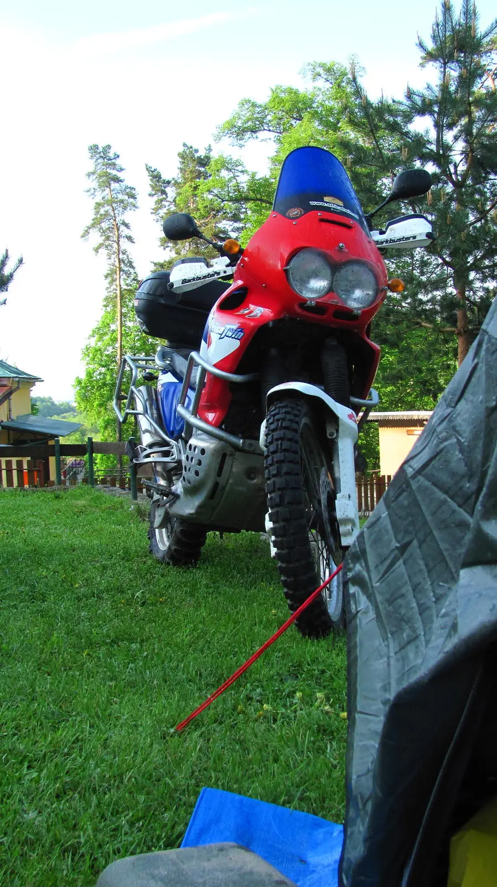



Setkání přátel českého a slovenského serveru Cenduro[<a href="http://www.cenduro.cz/" target="_blank">1</a>] ve Slovenském ráji. Předpovědi na ten víkend byly snad horší než špatné, déšť, chladno a znovu déšť – vyděsilo nás to natolik, že jsme i stan zabalili dovnitř do kufrů, aby nebyl mokrý dřív, než ho na místě postavíme.&nbsp;

[<a href="https://sites.google.com/view/tyfotoza/" target="_blank">fotky</a>] trasa tam [<a href="http://www.sports-tracker.com/#/workout/tyfoza/kpkmbot0k6ab2bp4" target="_blank">2</a>] vyjížďka [<a href="http://www.sports-tracker.com/#/workout/tyfoza/du9489obs70ujdfp" target="_blank">3</a>][<a href="http://www.sports-tracker.com/#/workout/tyfoza/48b08mpk50ir33ie" target="_blank">4</a>]&nbsp;

Možnosti kudy jet z Uherského Brodu do Levoče se různí. Den před odjezdem jsem si všiml na fóru příspěvku od uživatele KOV ze Zlína, že navrhl trasu[<a href="http://goo.gl/maps/qZlpo" target="_blank">5</a>] přes Oravu, kousek přes Polsko a přijet do Tater ze severu s Gerlachovským štítem po pravé ruce. Bylo inspirativní a krásné, zatáček nepočítaně a o to víc jsme si šestihodinou cestu užili, že poprvé od ledna máme Stroma obutého na silničních pneu. Do rekreačního zařízení Levočská Dolina[<a href="http://www.rzlevoca.sk/" target="_blank">6</a>] jsme dorazili s osmou hodinou večerní, místo pro stany rozlehlé, travička posečená na krátko jako vlasy rekruta Navy SEALs. Věru pěkné místo, které bych doporučil turistům všeho druhu. Kdo pohrdl pohodlným převalováním se pod stanem, mohl využit ubytování v chatkách nebo penzionu.&nbsp;

Setkání tohoto druhu je vždy příjemné – výměna zkušeností, přátelská družba v tomto případě mezinárodní, zajímavá večerní promítání s povídáním z cest (zkráceně zcestné řeči), prezentace jídla AdventureMenu[<a href="http://www.adventuremenu.cz/" target="_blank">7</a>] a zázračných nepromokavých a zároveň propustných ponožek Sealskinz[<a href="http://www.youtube.com/watch?v=QesGt8zCdFg&amp;feature=player_detailpage" target="_blank">8</a>].

Ranní probuzení bylo snad nejlepší vůbec, posadím se, rozepnu stan a první co vidím je, že Afrika není černá, ale červeno modrá. A je nádherná. Hned bylo jasné, že to bude pěkný den.



Na sobotní vyjížďku jsme měli vytvořit týmy po třech až pěti motorkách. Tak jsme pod pracovním názvem týmu „trhlí mopeďáci“ na počest filmu Freebird[<a href="http://www.youtube.com/watch?v=nsufuHL_Iyw" target="_blank">11</a>] vyrazili v počtu dvou motorek – my na Stromu a kolega John na Africe. Pro srovnání, ve vítězném slovenském týmu bylo motorek patnáct.

Byl to výlet navigačně orientační, itinerář podrobný, úkoly po cestě byly místy nelehké. Zjistit rozlohu Spišského hradu[<a href="http://www.spisskyhrad.sk/" target="_blank">9</a>] znamenalo na hrad vyjít, půjčit si audioprůvodce, projít hradem a u zastavení čtvrtého jsme se dozvěděli, že rozloha hradu je 4,16ha. Stejně jsme neodolali a prošli si hrad celý včetně vycházky na věž, kde jsou průchody úzké tak, že my se širokými rameny a útlými pasy musíme jít bokem a opravdu vnadné dámy nemají šanci projít vůbec. Stisknutí červeného tlačítka na audioprůvodci vždy způsobilo pověst nebo legendu a že jich tam mají. Zvlášť výživné bylo povídání o cikánském patentu.

Zajímavý byl úkol u pramene Sivá brada[<a href="http://sk.wikipedia.org/wiki/Siv%C3%A1_Brada" target="_blank">10</a>], kde jsme měli odpovědět na otázku, jaký plyn jest v pramenu rozpuštěn. Bohužel jsme zašli ke špatnému prameni, Sivá brada si pobublává v jezírku sycená přírodním oxidem uhličitým, je krásná, ale není pitná. Místo toho jsme zamířili k pramenu s nálevkou a frontou lidí s lahvemi, od Sivé brady snad jen sto metrů. Voda pitná, místní název „vajcovka“ a rozpuštěný plyn je sirovodík. Tak jsme ochutnali a zapsali špatnou odpověď. 
Velká část trasy vedla gotickou cestou[<a href="http://sk.wikipedia.org/wiki/Gotick%C3%A1_cesta" target="_blank">11</a>], takže kvalitní architektury jsme si užili dost a já to měl navíc s odborným komentářem v interkomu, heč.

Večerní vyhodnocení bylo zábavné. Lidé , kteří přijeli z největší dálky to měli 590, 800 a 2700 kilometrů! Všechny rozesmála cena pro „majitele méněcenných strojů,“ což byly silniční stroje Honda CBR RR a Yamaha Fazer, které celou vyjížďku po asfaltu bez problémů absolvovali. Však se také říká, že na Slovensku mají cesty na jedničku; nesmíte ale zařadit vyšší rychlostní stupeň. A že to byly po cestě díry, pro samé výtluky nezbylo místo pro silnici. Ocenění též dostaly dvě odvážné řidičky, které se zúčastnily a byly dokonce ve vítězném týmu.

<i><b>Díky organizátorům za kvalitně připravenou akci, výběr místa byl zvolený výborně, itinerář byl přesný a cesta vedla opravdu pěknými serpentinami, bylo kde zastavit i čím se kochat.&nbsp;</b></i>

Fotky a videa z jiných zdrojů viz.[<a href="http://www.cenduro.cz/forum/viewthread.php?thread_id=1300&amp;pid=42722#post_42722" target="_blank">12</a>]. 
Levoča je opravdu pěkné historické město. Socha Ľudovíta Štúra, který když opilý překládal z maďarštiny do češtiny vlastně omylem vynalezl slovenštinu je impozantní a bílá. Náměstí a spousta dalších míst názvem odkazuje na mistra Pavla[<a href="http://cs.wikipedia.org/wiki/Mistr_Pavel_z_Levo%C4%8De" target="_blank">13</a>], mistra levočského oltáře a Chrám Sv. Jakuba[<a href="http://www.chramsvjakuba.sk/#architektura" target="_blank">14</a>] stojí za zastavení i pro nevěřící, i když omša vo slovenčině bola krásna. 
Po cestě zpět jsme dostihli déšť u Litovského Mikuláša, navlékli nepromoky a v dešti zůstali až domů. Škoda, že jsem si nekoupil ony zázračné ponožky, které byly se slevou nabízeny na prezentaci, mohl jsem přijet s nohama v suchu.

