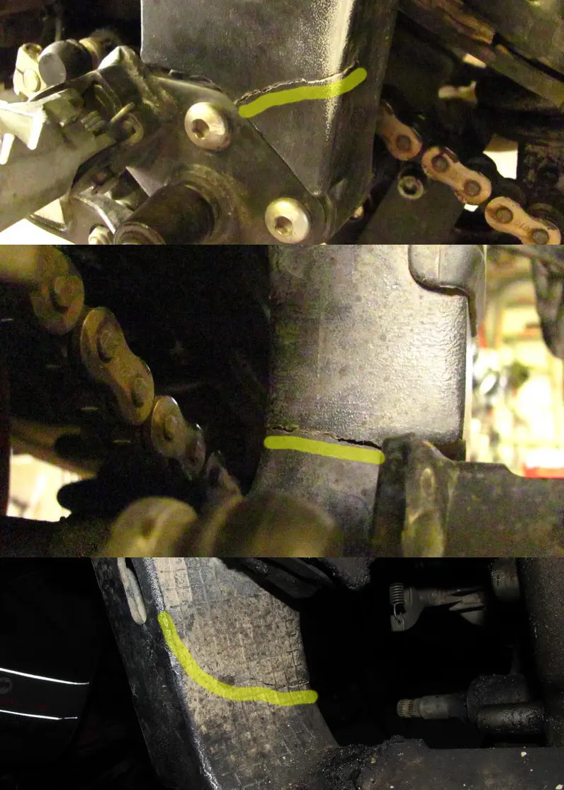
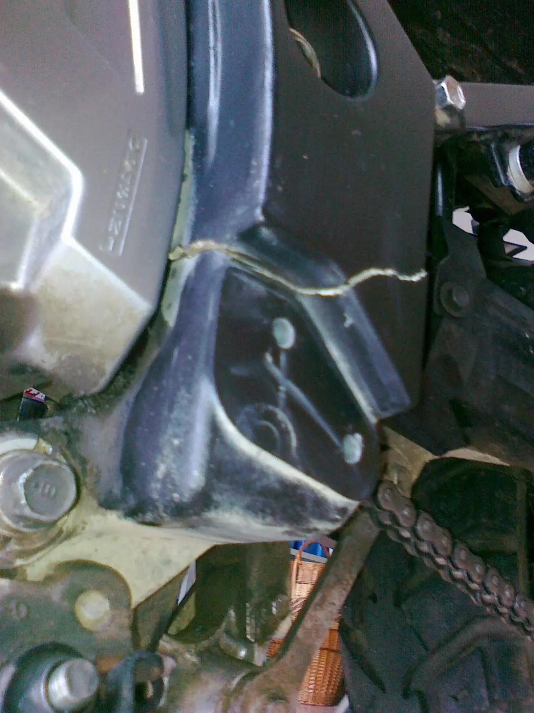
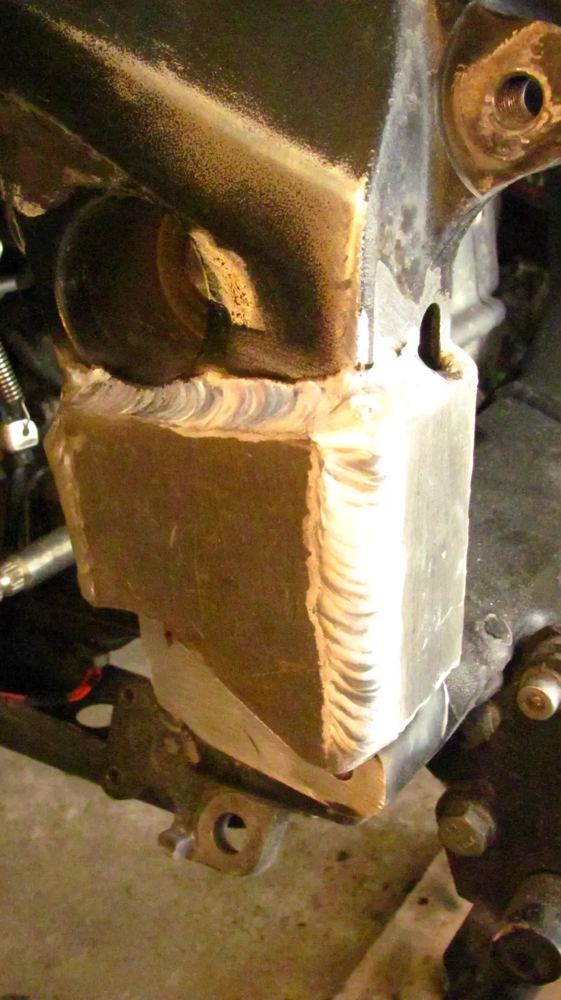
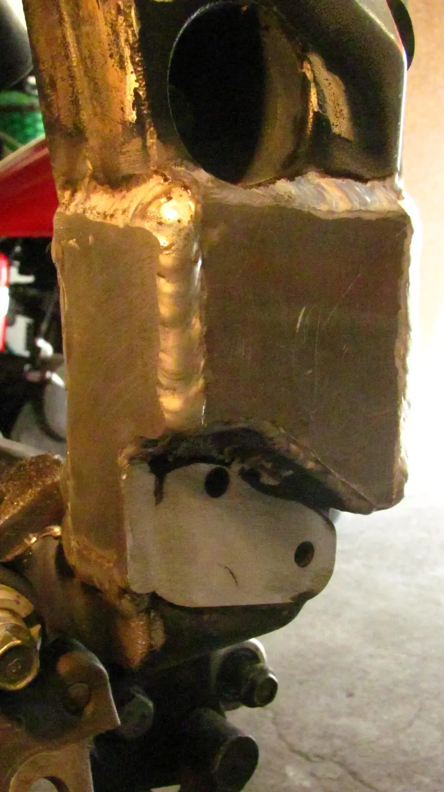
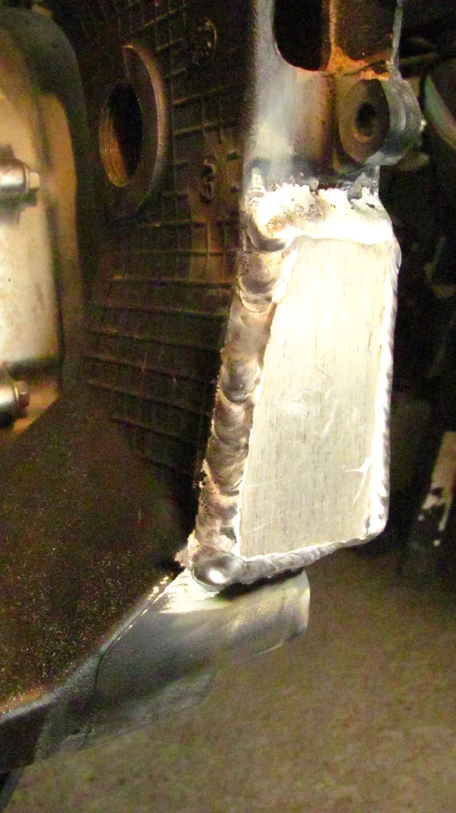
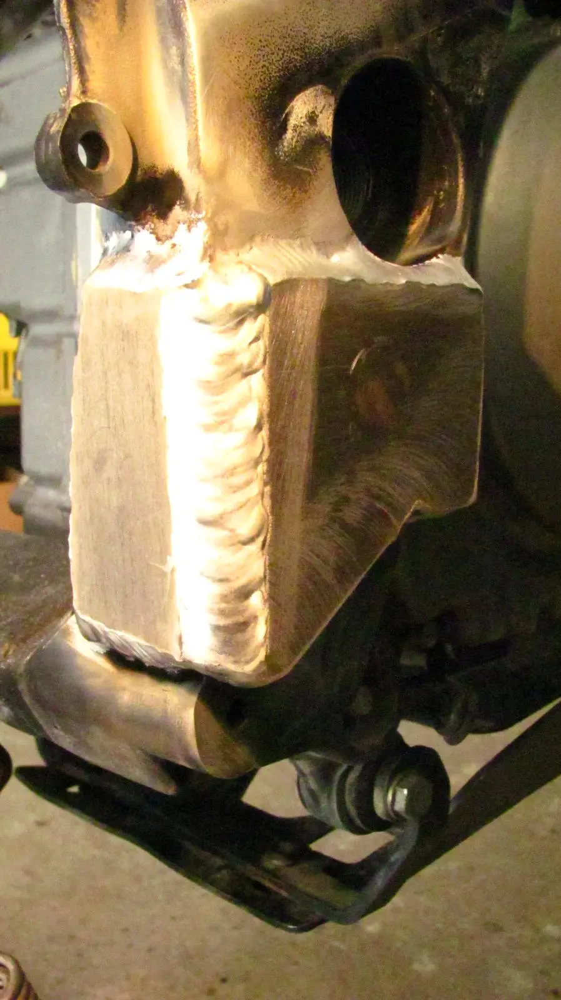

Před pár dny jsem našel na rámu na levé straně nad stupačkou prasklinu. Na internetu je k nalezení snímek stejné praskliny. Je zajímavé, že tato moje prasklina je naprosto identického tvaru a je ve stejném místě. Je možné, aby se něco takové stalo dvakrát stejně na dvou různých motorkách? Myslím, že je to nepravděpodobné, pokud tam nebyla nějaká vada. Takže asi byla. Škoda, že mému Stromu záruka skončila loni v dubnu.



pro srovnání stejné poškození na jiném motocyklu, taktéž K9

V tom místě je rám velmi velmi slabý, stěna vnější a vnitřní má sotva dva milimetry, stěny přední a zadní mají tloušťku asi tři milimetry. Nevím, jak k poškození došlo. Natvrdo mně motorka zatím nespadla. V podezření je centrální stojan. Je přišroubovaný dole přímo k rámu a nějaká ta rána na stojan určitě přišla. Představa, že dostane ránu na pravou stranu, tak ráz by se přenesl přesně do místa poškození. Mohlo to být přímo do stojanu nebo do jeho uložení. Také motor musí dávat do rámu pořádné rázy, akcelerace, brzdění motorem... 
<table class="tr-caption-container" style="margin-left: auto; margin-right: auto; text-align: center;"><tbody>
<tr><td style="text-align: center;"></td></tr>
<tr><td class="tr-caption" style="text-align: center;">nápad, jak mohlo k poškození dojít</td></tr>
</tbody></table>

Oprava byla nasnadě. Je to hliník, takže svařit a přeplátovat. Zhostili se toho profíci ve firmě Altech[<a href="http://www.altech-uh.cz/kooperace/" target="_blank">1</a>]. Nejtěžší a to doslova bylo dostat torzo motorky na svařovací stůl. Když se pokusili v místě praskliny nad stupačkou vybrousit véčko pro svár, ukázalo se, že v tom místě není tloušťka rámu ani dva milimetry. A přitom to zvenku vypadá tak bytelně. Zajímalo by mě jak jsou na tom různé ročníky V-Stromů.



Výsledek opravy je pěkný. Dlouho se řešilo, jestli přeplátování udělat šikmo nebo rovně. Nakonec bylo rozhodnuto, že s ohledem na tvar praskliny z vnitřní strany, která šla jednoznačně šikmo, tak je lépe mít přeplátování rovně. Kdyby byla prasklina rovná, bylo by lépe mít přeplátovaní šikmé.



K čemu je ta jemná mřížka z vnitřní strany? Svářeč si myslí, že je tady pro zpevnění! odlitku, aby tam bylo víc materiálu, proto nebylo možné zevnitř plátovat, mřížka by se musela odbrousit a tím by došlo ještě k většímu ztenčení. Vyjádření profesionála – ta mřížka na odlitku tam není kvůli zpevnění odlitku, ale má souvislost s eliminací vzniku bublin a kazů z vnitřní strany odlitku při lití.. Je to standardní postup při odlévání výrobků z hliníkových slitin...[<a href="http://www.cenduro.cz/forum/viewthread.php?thread_id=85&amp;pid=42820#post_42818">2</a>]

 

Když už je motorka rozebraná a na svařovacím stole, pro jistotu se udělalo zpevnění i na pravé, zatím nepoškozené straně. Nerad bych, za měsíc nebo za dva, akci zbytečně opakoval, kdyby rám povolil i na pravé straně. Alespoň to na STK bude vypadat symetricky a jako zámysl konstruktérů ze Suzuki.

Takže hotovo. Problém snad byl vyřešen. Mám si kontrolovat, zda při provozu nebude docházet k prasklinám nad sváry přeplátování. Nemělo by. Kéž by nedocházelo, spřádám větu přací; protože v místě uložení kyvné vidlice je už materiál rámu mocnější. Zbývá stříknout do černého matu a nikto nič nezpozná – jako při použití Servilu[<a href="http://www.youtube.com/watch?feature=player_detailpage&amp;v=MY_bvoN5HeI" target="_blank">3</a>].



Víc fotek viz.[<a href="https://photos.app.goo.gl/F24VjReqN5mqHnm28" target="_blank">4</a>].

 

<i>přidáno 7. 7. 2013:&nbsp;</i>

<i>Svařený rám funguje a drží. Zatím najeto 4000km. Motokrosové tratě, mikroskoky. Nešetřil jsem to. Jestli to má prasknout, tak čím dřív, tím lépe. Je to bez problémů. Nikde se nelíhne žádná prasklina. Minulý týden jsem špatně odhadl rychlost při nájezdu na lavici a byla to rána z výšky s tvrdým dopadem na obě oka, tlumiče na dorazy a já také. Ale svařenec drží. Uvidíme později.</i>

<i> </i>

<i>přidáno 22.7. 2013:</i>

<i>Opravdu považuji za úspěšnou. Najeto od opravy 6000km. I po náročném enduro tréninku[<a href="/posts/2013/07/et-v-olesnici/" target="_blank">4</a>] je vše bez jakýchkoli změn. A že těch skoků bylo nepočítaně.</i>

