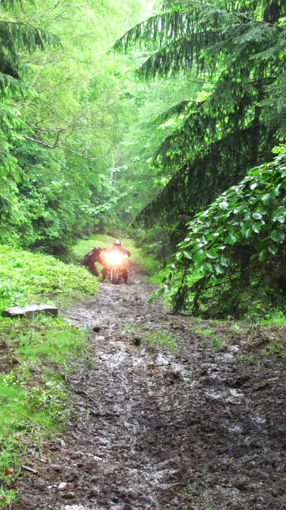
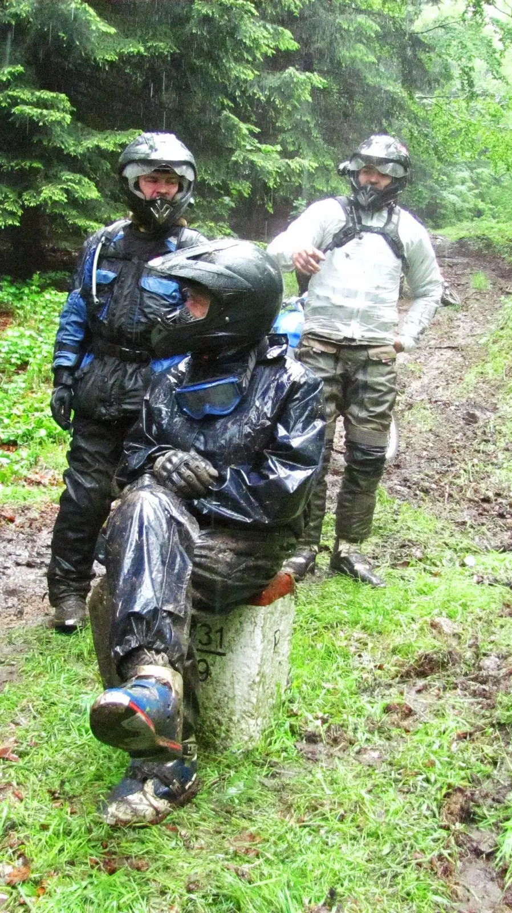
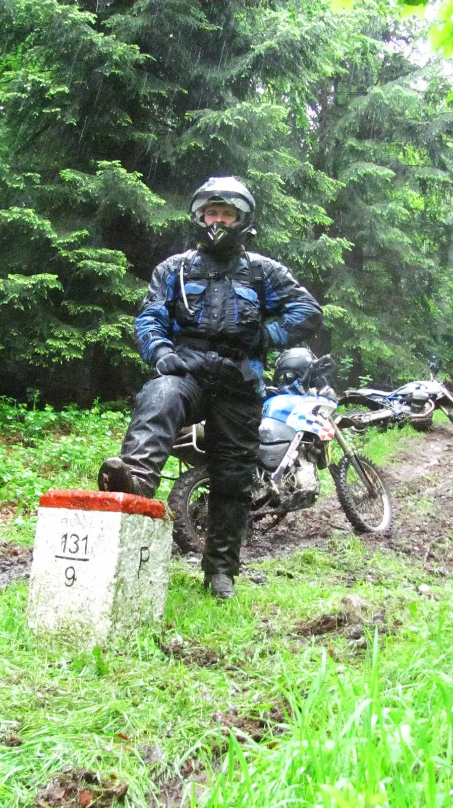

fotky [<a href="https://sites.google.com/view/tyfotoza/" target="_blank">1</a>] [<a href="http://cizak1.rajce.idnes.cz/KROCAN_jaro_31.5-_2.6.2013" target="_blank">2</a>] a videa &nbsp;[<a href="http://dan-africa.rajce.idnes.cz/Krocan_N.6/" target="_blank">3</a>] [<a href="http://www.youtube.com/watch?feature=player_detailpage&amp;v=tYO1_Skff30" target="_blank">4</a>] [<a href="http://www.youtube.com/watch?v=mUXMbuU9LrA" target="_blank">5</a>]

V pořadí šesté setkání přátel lehkého offroadu v Jizerských horách pod
taktovkou firmy Rockway[<a href="http://www.rockway-shop.eu/" target="_blank">6</a>] bylo letos vlhké, mokré, bahnité a úchvatné. Krásně by
se dalo charakterizovat scénou z filmu Forrest Gump viz.[<a href="http://www.youtube.com/watch?v=K2ihL_FrFPs" target="_blank">7</a>].<o:p></o:p>

Z necelé sedmdesátky přihlášených se v pátek sešla
silná pětačtyřicítka, která měla v plánu hrdinně vyrazit na sobotní vyjížďku.
Páteční večer byl místy monotónně vyplněn zoufalým funěním nad mobily s
předpověďmi počasí; každý používá jiný předpovědní server a přitom všichni
říkali totéž – déšť, celodenní, vytrvalý. Padl i zajímavý nápad – od druhé
hodiny&nbsp;&nbsp;noční, do sedmé hodiny ranní pršet nemá – tak jestli
by se nemělo vyrazit už v noci „na světla.“ Ne! Raději jsem zamířil
bydlet, ještě hodinu a stál bych s nastartovanou motorkou před vchodem...&nbsp;&nbsp;zbytek noci byl
vyplněn Barvajzových chrapotem – příště jdu opět bydlet s ním – připomíná mně
to léta strávená na koleji. Joj, to byly časy.<o:p></o:p>

Sobota ráno. Prší. Snídaně. Prší. První skupina vedená
Afrikou vyrazila na vyjížďku. Prší. Pardál popochází s deštníkem a s nadějí v hlase a mobilem v ruce sděluje, že posunuje odjezd o půlhodinu, že se blíží konec
přeháněk. Druhá skupina vyrazila. Prší. Uplynula hodina. Prší. První člen Pardálovy skupinky přichází
připraven k odjezdu – John, ztepilý Afričan, navlečený v elastickém modrém
nepromoku ladícím s barvou jeho přílby, motorky i očí. Přichází druhý, třetí.
Pardál popochází deštníkem. Vypadá to, že se opravdu vyrazí. Pardál přichází
oblečen na vyjížďku, v průsvitné pláštěnce se rýsuje opravdu všechno. Motorky
nastartovány. Barvajz se odchází navléct do chráničů a nepromoku. Pardál
odložil deštník. Je hodinu před polednem. Prší. Odjezd! Všichni odjeli a já a John jsme se za třemi zatáčkami ztratili. Prší. Volám o pomoc. Potkáváme se
na benzínce. Prší. Pardál odmítá nesmělý pokus o radostné objetí, raduji se ze
shledání. Pardálova skupinka se mísí s Čízákovou. Jedeme společně.<o:p></o:p>

Dlužno zmínit, že srovnatelné motorky by měly jezdit
spolu – Superenduro, V–Strom, BMW HP, Transalp. Síly jsou tedy vyrovnané a
vyjíždíme od benzínky. Prší. První&nbsp;&nbsp;mikroúsek je pár
set metrů po mokré louce prakticky po rovině. Kdo má ostře obuto ví, kdo má E–09
ví taky. Prší.<o:p></o:p>

Cestou, necestou, se spoustou přesunů po asfaltu. Kus
průsekem lesem kolem hraničních patníků, dlouhý svah dolů. Prší. Objevuji
možnost pomalého sjezdu s vypnutým motorem, zařazenou jedničkou. Kdy mohu
rukama brzdit přední i zadní kolo a přitom mít obě nohy na zemi. Nádhera. Prší. Někde po cestě se odpojuje Schimi na V-Stromu, který odjel třicet kilometrů na E-10. Respekt!

Je o čtyři hodiny později. Prší. Zastavujeme se u
vesnické hospody, kde vývěsní štít hlásá, že hospoda pomalu metamorfuje do
podoby čínského bistra. Kupodivu nevadí, že jsme zablácení od ventilků až po
přílby. Dáváme si nudle a odvážní řízek u něhož se nepodařilo identifikovat
druh masa – podle vůně prý možná nutrie.<o:p></o:p>

Pokračujeme. Prší. Zůstává nás sedm – rád bych napsal
statečných – ale statečných bylo šest, já byl outěžek. Jedu poslední, jedu
pořád. Prší. Výjimečně míjím zahozené hápéčko. Většinou na mě skupinka musela
čekat, alespoň si odpočinuli. Já odpočívat nepotřeboval, jedu pomalu. Jak
přibývá kilometrů, narůstá únava a skupina celkově malinko zpomaluje. Už je mám
na dohled. Je příjemné vědět, že támhle za tou mlhou je někdo, kdo by mně
pomohl, kdyby se něco stalo – ale nestalo – Strom jede pořád dál mezi stromy.
Díky nově instalovanému vodítku řetězu nevznikl žádný problém. Prší.<o:p></o:p>

Těžko popisovat náročný výjezd, který Pardál označil jako „malou louži“ a že výjezd je až dál, ale ten prý
nepojedeme. Z té louže jsme Stroma prakticky vynesli. Díky! Prší.&nbsp;&nbsp;Dalo by se říci, že celá trasy byla jízda v potoce,
jenom se měnil směr proudu, podle toho jestli to bylo z kopce nebo do kopce.

Venku se připozdívá. Přichází slavné krocaní místo –
přejezd železničních kolejí. Jedu je prvně a nic se nestalo. Jak radí moudřejší
– na koleje najížděj přes pražec, šrouby ti udělají schod a pak už je to jenom
mikroskok. Přijíždíme k potoku, který máme brodit. Dva zkoušíme vejít do proudu. Do promočených bot teče vrchem. Přestává pršet. Proud je silný, asi bych to nepřešel
ani pěšky. Později zjišťujeme, že tudy projelo celkem šest motorek, z toho se dvě vykoupaly. Otáčíme a jedeme přes koleje zpět. Prvotní úspěch jsem nezopakoval,
smýklo se zadní kolo a přeformátoval jsem kryt motoru.<o:p></o:p>

Se sedmou hodinou večerní přijíždíme do cíle. Podává
se večeře. Odcházím do sprchy. Odložil jsem pouze přilbu. Rukavice si nechávám.
Přes nepromok je horká voda opravdu příjemná. Bláto se odplavuje. Napouštím si
horkou vodu do bot, nádhera. Svlékám nepromok. Ve sprše to vypadá, jako by tam
bylo prase – ale čistotné! Čvachtajíce odcházím na večeři. Převleču se, až se
pocit tepla od nohou vytratí...<o:p></o:p>

Sobotní večer je společensky upřímný. S množstvím
vypité nálady vzrůstá hluk přes únosnou úroveň. Servíruje se krocan. Realita
byla úděsná – třicet tři kilogramů masa na čtyřicet pět lidí. 
Díky za skvělou akci. Počasí vyšlo, trať byla obtížná akorát – tak 30% jarního RBM[<a href="/posts/2013/04/rbm-2013/" style="font-family: 'Times New Roman', serif; font-size: 13.5pt;" target="_blank">8</a>].

Na shledanou na podzim, snad konečně někdo uvidí funkční a otestované AST[<a href="http://tripmasterast.blogspot.cz/" target="_blank">9</a>].&nbsp;

Sportu zdar, enduru zvláště! 

(autor tohoto videa: Čízák)

<object class="BLOGGER-youtube-video" classid="clsid:D27CDB6E-AE6D-11cf-96B8-444553540000" codebase="http://download.macromedia.com/pub/shockwave/cabs/flash/swflash.cab#version=6,0,40,0" data-thumbnail-src="http://i.ytimg.com/vi/tYO1_Skff30/0.webp" height="400" width="640"><param name="movie" value="http://www.youtube.com/v/tYO1_Skff30?version=3&f=user_uploads&c=google-webdrive-0&app=youtube_gdata" /><param name="bgcolor" value="#FFFFFF" /><param name="allowFullScreen" value="true" /><embed width="640" height="400"  src="http://www.youtube.com/v/tYO1_Skff30?version=3&f=user_uploads&c=google-webdrive-0&app=youtube_gdata" type="application/x-shockwave-flash" allowfullscreen="true"></embed></object>

Douška na závěr: Neděle. Prší. Jedu přes zatopený kus Polska do Rumburka a pak 370km domů. Prší.

