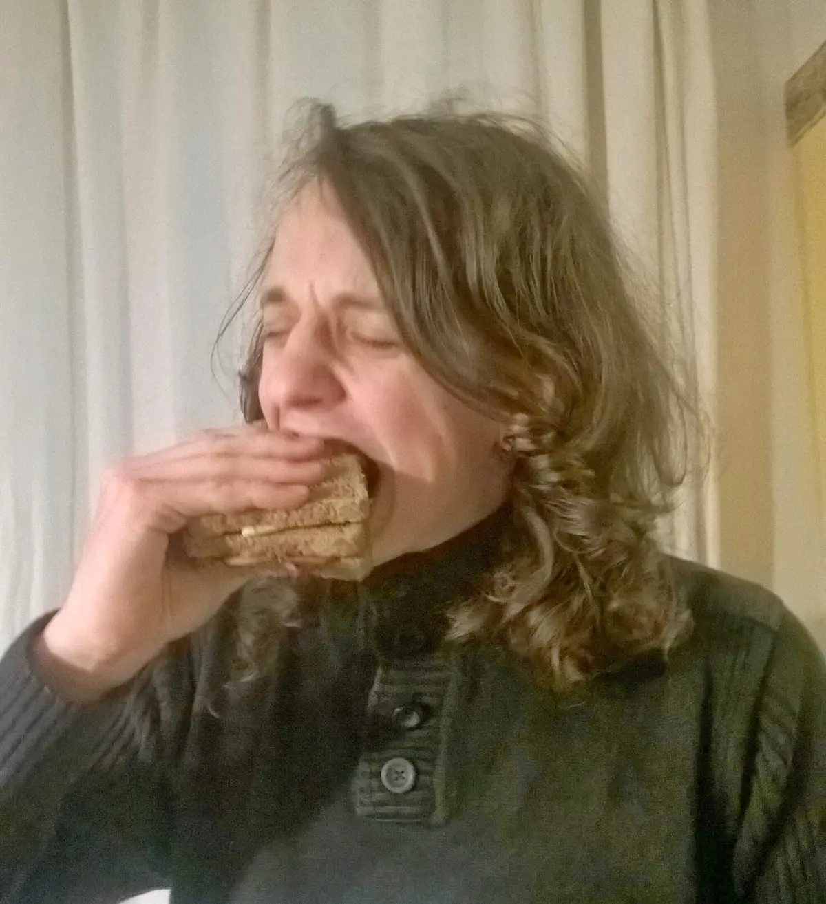



Zdroj inspirace: [<a href="http://reddwarf.wikia.com/wiki/Chilli_Chutney_Sandwich" target="_blank">1</a>][<a href="http://www.cervenytrpaslik.cz/scenare/CZ-09-2_Diky_za_tu_vzpominku.htm" target="_blank">2</a>].

Trojitý sendvič se smaženkou, chilli omáčkou a čatní[<a href="http://cs.wikipedia.org/wiki/%C4%8Catn%C3%AD" target="_blank">3</a>].

