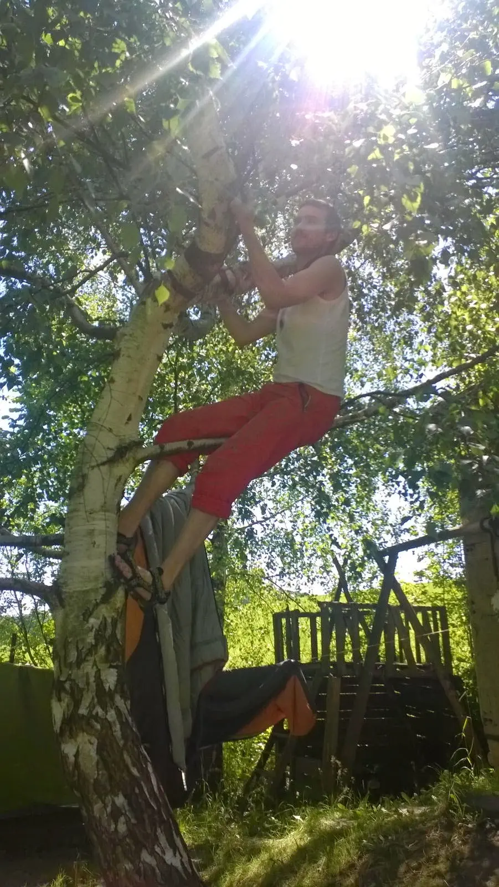



[<a href="https://sites.google.com/view/tyfotoza/" target="_blank">fotky</a>]

Bylo, nebylo v krajích kolem města Olešnice. Za potokem, který není vidět. Kousek od Rozseče nad Kunštátem, rodné to obci básníka Františka Halase, který lásku k těmto místům vyjádřil ve své básnické próze „Já se tam vrátím.“[<a href="http://bedrnika.cz/basnici/halas1.html" target="_blank">1</a>] (zvlášť ten poslední odstavec je výživný)&nbsp;

Tam všude je Lom, místo z těch nejvhodnějších k setkávání přátel a tmelení kolektivů.

Co to B.J. dělá? viz. [<a href="https://www.youtube.com/watch?v=2NAqL9-SA1Y" target="_blank">2</a>]

