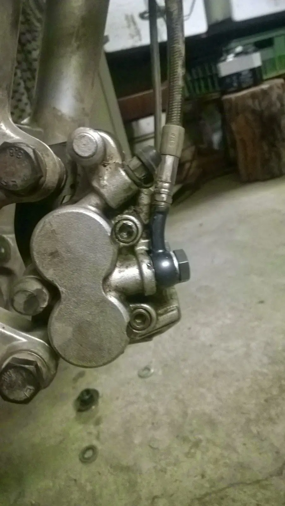
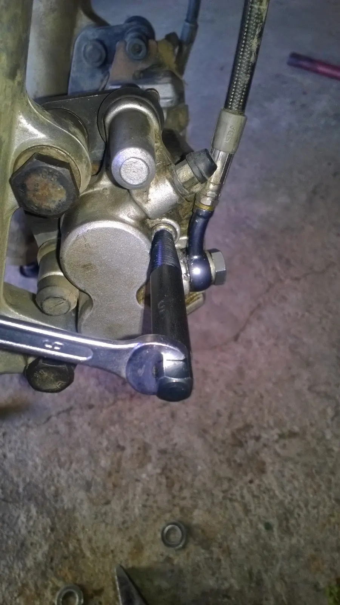

Malá noční můra způsobená nepozorností při povolování čepu brzdové destičky. Stačilo trochu bláta v inbusu, spěch a nepozornost a výsledkem byl zničený inbus, který nebylo možné už nijak povolit běžným způsobem.

Řešení je snazší, než na první pohled vypadá. Google poradí[<a href="http://howtodo.cz/jak-vytahnout-zalomeny-sroub/" target="_blank">1</a>]. Na pravotočivý zalomený šroub je třeba levotočivý vytahovák. S inbusem je to podobné. Základem je nastříkat sprej nazvaný „uvolňovač šroubů“ a nechat několik hodin působit. Ideálně přes noc. U inbusu se šestihran se odvrtá jak nejhlouběji to jde, pak lze použít levotočivý vytahovák, který se vrtačkou chytil a zašrouboval na doraz – pak už není vhodné používat pneumatické nebo elektrické nářadí, ale je lepší mít klasický klíč a prodloužení – bez něj by chyběl potřebný cit.

Několik hodin strachu, bezesná noc a úspěšná akce na čtvrt hodiny.



<i>přidáno 27. 5. 2015</i>

<i>opět se vytahovák hodil, tentokrát bylo potřeba do zalomeného šroubu opatrně odvrtat díru pro vytahovák</i>



 



 



<i> </i>

