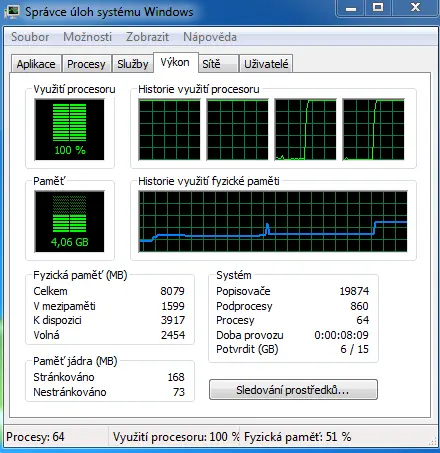

Určitě to děláte také, že procházíte testy, čtete recenze a snažíte se udržet „krok“ a sledovat trendy.&nbsp;

Máme tady procesor Intel Pentium G3258[<a href="http://www.ddworld.cz/pc-a-komponenty/procesory-a-pameti/test-odemcene-vyrocni-intel-pentium-g3258-v-testu-levnych-procesoru-do-2000-korun.html" target="_blank">1</a>], kterým přebírá Intel vedení na poli lowendových řešení, procesor za 1715 korun! Je na 27. místě v zátěžovém testu jednovláknových úloh. Neuvěřitelné.

Poměr cena výkon mimo představitelnou hranici. Je důležité zmínit, že přes deseti dny to bylo úplně jinak, viz. dole.

<i><b><u>Stav ke dni 23.8.2014</u></b></i> 



<i><b><u> </u></b></i>
<i><b><u> </u></b></i>
<i><b><u> </u></b></i>
 

<i><b><u>POZOR! Před týdnem to bylo jinak: Stav ke dni 12.8.2014</u></b></i>

Všiml jsem si zajímavé věci v testu výkonu procesorů – dvacátý v pořadí je procesor, který je stojí 50% ceny procesoru na devatenáctém místě.

Procesor Intel Core i3-4360<strike> je aktuálně </strike>&nbsp;byl&nbsp;velmi zajímavou volbou! V testu jednovláknové úlohy, což lze interpretovat jako test výkonu pro jedno jádro se drží opravdu na špici. Neuvěřitelné, za tu cenu.

Nezbývá než otestovat na vlastní kůži.

 





&nbsp;procesor má na dvě jádra čtyři vlákna[<a href="http://cs.wikipedia.org/wiki/Vl%C3%A1kno_(program)" target="_blank">2</a>][<a href="http://cs.wikipedia.org/wiki/Hyper-threading" target="_blank">3</a>]

 