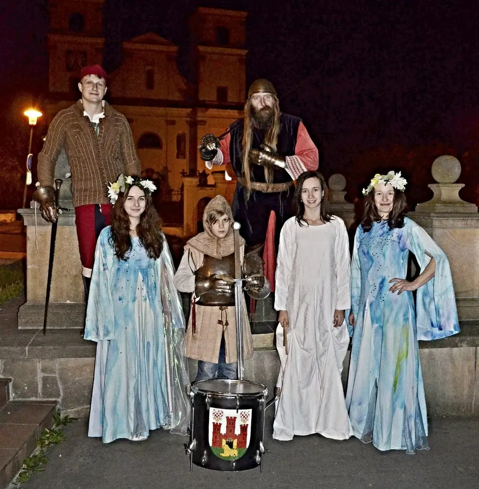



<i> </i>

<i>Beru si vodu z nebes; nejdříve tebe osvěžující dešti, který nám dáváš vláhu.</i>

<i>Také tebe vodo země, všechny tvé řeky, potoky, moře, kterými nás omýváš.</i>

<i>I tebe vodo z hlubin, jež nám dáváš pít.</i>

<i> </i>

<i>Sestřičky víly, počkejte!&nbsp;Chybí vám voda života, bez které vodu neuspíte.</i>

<i>Z člověka pochází, skrze slzy radosti a smutku.</i>

<i> </i>

<i>Svazuji vás vody v jeden mocný tok, jenž brzy promění se v tichý led.</i>

<i>Tak byla svázána veškerá voda světa se slzami člověka a vodě se dostalo pokoje, aby nabrala nové síly k jarnímu životu.</i>

<i> </i>

<object class="BLOGGER-youtube-video" classid="clsid:D27CDB6E-AE6D-11cf-96B8-444553540000" codebase="http://download.macromedia.com/pub/shockwave/cabs/flash/swflash.cab#version=6,0,40,0" data-thumbnail-src="https://i.ytimg.com/vi/yaPD0U2zpks/0.webp" height="400" width="640"><param name="movie" value="https://www.youtube.com/v/yaPD0U2zpks?version=3&amp;f=user_uploads&amp;c=google-webdrive-0&amp;app=youtube_gdata" /><param name="bgcolor" value="#FFFFFF" /><param name="allowFullScreen" value="true" /><embed allowfullscreen="true" height="400" src="https://www.youtube.com/v/yaPD0U2zpks?version=3&amp;f=user_uploads&amp;c=google-webdrive-0&amp;app=youtube_gdata" type="application/x-shockwave-flash" width="640"></embed></object>

[<a href="http://elenkas.rajce.idnes.cz/Uspavani_studanek_2014/" target="_blank">fotky</a>]



 
realizační tým: 
Knihovna Františka Kožíka Uherský Brod[<a href="http://knihovna.ub.cz/" target="_blank">1</a>] 
Divadlo Brod[<a href="http://divadlobrod.cz/" target="_blank">2</a>] - O víle Jeřabince[<a href="http://www.divadlobrod.cz/o-vile-jerabince.aspx" target="_blank">3</a>] 
Dům kultury Uherský Brod[<a href="http://dk.ub.cz/" target="_blank">4</a>] 
Mateřská škola Svatopluka Čecha[<a href="http://www.mscechaub.cz/" target="_blank">5</a>] 
Šermířský klub Uherský Brod[<a href="https://plus.google.com/b/111586636408513641930/111586636408513641930/about" target="_blank">6</a>]