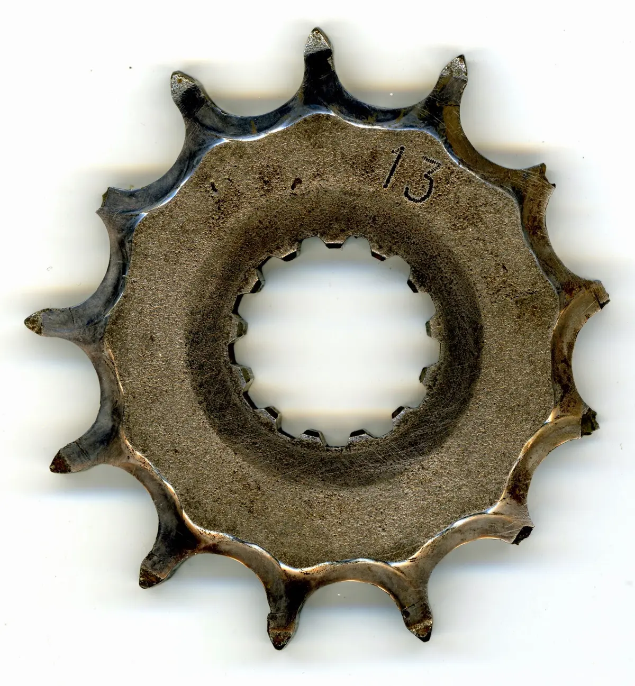

Nadpis by měl znít asi nějak takto: „Změna převodového poměru na sekundárním převodu motocyklu V-Strom.“ Pro ladění převodového poměru je výborný web gearingcommander[<a href="http://www.gearingcommander.com/" style="text-align: justify;" target="_blank">1</a>], kde vybereme značku, typ a ročník motocyklu; máme k dispozici informace o základním převodovém poměru, rozložení řazení rychlostí (zařazený rychlostní stupeň / otáčky / rychlost).

DL 650 V-Strom ročník 2009 má od výrobce převodový poměr 15/47. Na silnici super, do offroadu příliš rychlá jednička, příliš slabá dvojka atd. Jednoduchou výměnou řetězového kolečka dosáhneme poměru 13/47, který je pro offroadové ježdění ideální; výjezdy se dají jezdit na dvojku – na jedničku bez spojkování a bez plynu se motor nezastaví, ale jako traktůrek jede pořád.



Negativa jsou, že řetěz se příliš otírá o zadní kyvnou vidlici, je problém šponovat řetěz když na silnici dám převod 15/47 a pro offroad 13/47. Dvě &nbsp;sezóny jsem odjezdil na řetězovém kolečku se třinácti zuby[<a href="/posts/2012/04/retezove-kolecko-v-strom-13-zubu/" target="_blank">2</a>], ale kolečko je příliš malé, zabírá málo zuby, brzy se vyláme[<a href="/posts/2014/02/na-vymenu/" target="_blank">3</a>].



řetězové kolečko 13 zubů po cca 3000km

Druhá možnost je zvětšit rozetu. Pro stunt riding na GSX-R se používá rozeta 56 zubů a vnitřní uchycení je stejné jako na DL 650. Tedy dostupná a levná. Převodový poměr 15/56(3,73) vypadá ještě zajímavěji než 13/47(3,62) je to 20% síly nahoru oproti továrnímu nastavení. A když už na motorce velká rozeta bude, pro zábavu zkusím i poměr 13/47(4,31), což už je nesmysl.

<table class="tr-caption-container" style="margin-left: auto; margin-right: auto; text-align: center;"><tbody>
<tr><td style="text-align: center;"></td></tr>
<tr><td class="tr-caption" style="text-align: center;">nová rozeta 56 zubů je opravdu velká</td></tr>
</tbody></table>
Bylo potřeba upravit vodítko řetězu, aby se dalo měnit na obě rozety. Každá rozeta dostala svůj unašeč pro snadnou montáž. 

<table class="tr-caption-container" style="margin-left: auto; margin-right: auto; text-align: center;"><tbody>
<tr><td style="text-align: center;"></td></tr>
<tr><td class="tr-caption" style="text-align: center;">rozebíratelná spona řetězu D.I.D. 525VX FJ (MO 1-550-002)</td></tr>
</tbody></table>
Pro zajímavost se podívejte na pár výstupů z webu gearingcommander, ať je jasná, jak se změní rozložení rychlostních stupňů viz.[<a href="https://drive.google.com/file/d/0B-IBT7wOoyMAVnJhSlN6cXk2QjA/view?usp=sharing" target="_blank">4</a>] 
<table class="tr-caption-container" style="margin-left: auto; margin-right: auto; text-align: center;"><tbody>
<tr><td style="text-align: center;"></td></tr>
<tr><td class="tr-caption" style="text-align: center;">15/47, řetěz DID 124 článků</td></tr>
</tbody></table>
 

