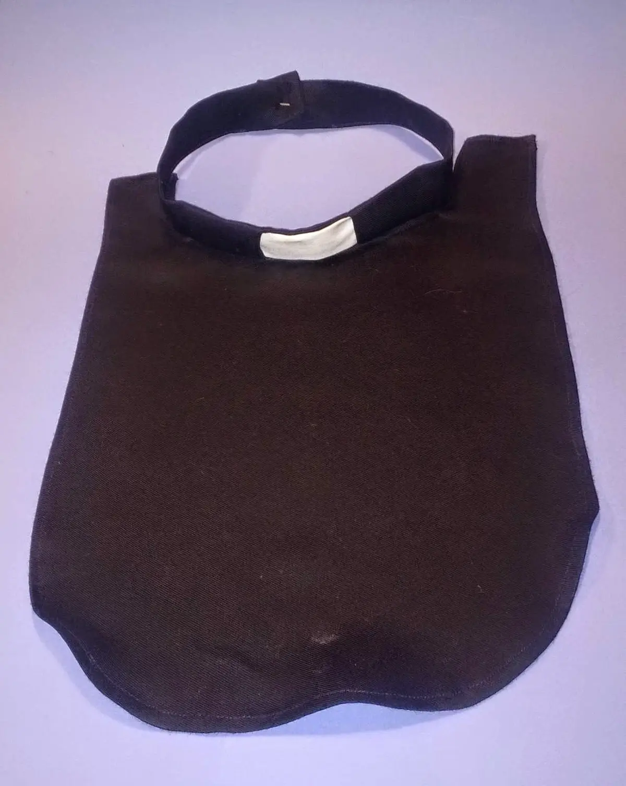

Velitel naší lousianské jednotky usoudil, že lépe se nám bude válčit, když s námi do pole vyrazí i pastor, aby mohl pečovat o naše duše přímo pod nepřátelskou palbou. Znakem pastora je kolárek a příkladný život. 



původní zadání toho, jak taková věc má vypadat

 

Po prostudování webu s tématem „Vše, co chcete vědět o kolárcích a báli jste se zeptat“ viz [<a href="https://leahmorrigan.wordpress.com/2013/11/07/the-clerical-collar/" target="_blank">1</a>] 



&nbsp;vlevo originál, tak se používá – vpravo výrobek Sášenčiny domácí manufaktury

Díky!