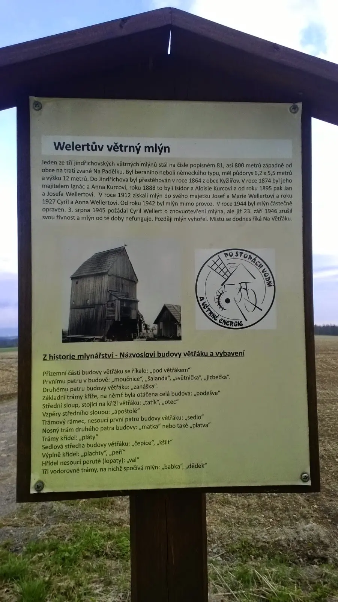



Větrný mlýn v Partutovicích [<a href="http://www.partutovice.cz/vetrny-mlyn/" target="_blank">1</a>], je jedním ze tří. Snažil jsem se najít další mlýn a hledal jsem ho až ve Stříteži nad Ludinou, ta obec je v údolí, sjezdil jsem okolní kopce a mlýn nenašel. Všude šipky – mlýn – a mlýn pořád nikde. Nakonec jsem se uprostřed dědiny vyptal místního domorodého strýce, kde že je ten mlýn. Ukázal přes potok a řekl: „Toť.“ [<a href="http://vodnimlyny.cz/mlyny/mlyn/1408-humplikuv-mlyn" target="_blank">2</a>]. On je totiž mlýn ve Střítěži mlýnem vodním a já marně hledal „větřák.“ 
 
<i>Protože můj Stromík je v servise, vypůjčil jsme si Ábin Freewind a trošku ho protáhl. Krásných 300km zvládl bez zadýchání.</i>