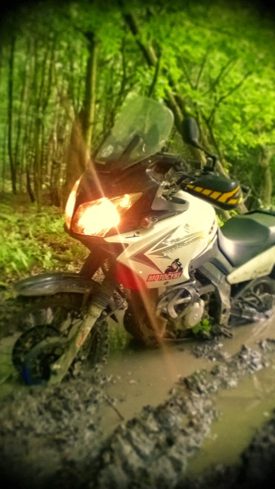
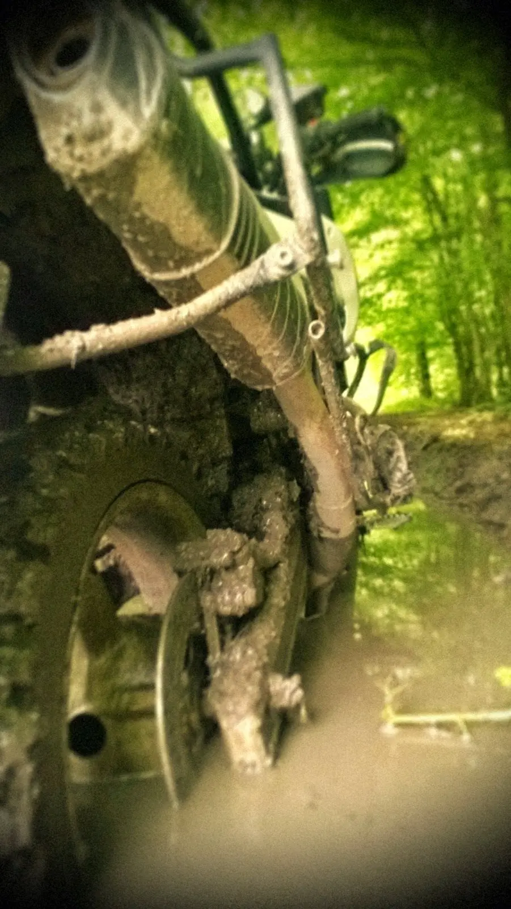

[<a href="https://sites.google.com/view/tyfotoza/" target="_blank">fotky</a>] 

Takové pěkné sobotní květnové dopoledne, kdy je venku pošmourno, lehce se ochladilo a místy začíná pršet. Ideální čas na výlet po turistických značkách. Pravděpodobnost potkat nějaké turisty, cyklisty nebo hřibů chtivé sběrače je minimální. Nakonec z toho vyšlo přes osmdesát kilometrů offroadu s několika pády, z nichž poslední byl asi v šedesátikilometrové rychlosti na polní cestě, kdy začínající déšť proměnil hlínu ve slizkou kluzkou vrstvu a trávou zarostlý střed mě nepodržel. Nestalo se nic, jenom jsem výrazně přeformátoval pravý padací rám. Stejně byl načatý z T.K.C.[<a href="/posts/2015/05/tkc-2015/" target="_blank">1</a>] a čekal na sundání a opravu.

