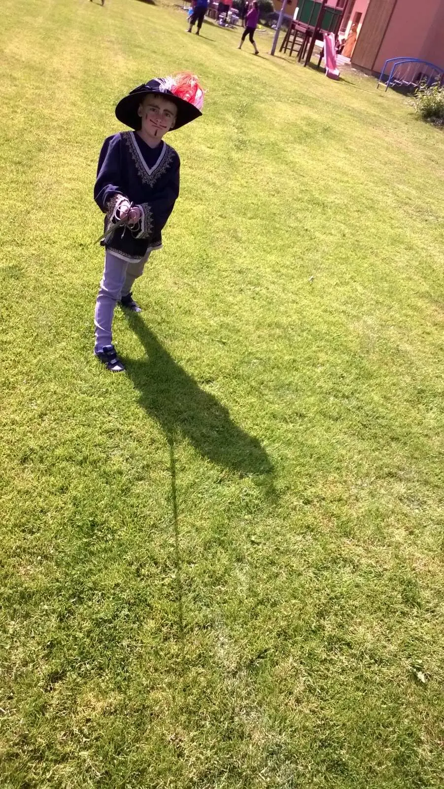



[<a href="https://photos.app.goo.gl/pJqsTqURNGUi5zWg6" target="_blank">fotky</a>] 

Dětský den v Křtěnově s názvem Řemesla. Mladí návštěvníci zkusili včelařství, keramiku, kominictví, šperkařství, truhlářství, bylinkářství a také pradleny a pradláci. Kdo se vyučil v řemesle, zamířil k nám, šermířům, kde se dětem i dospělým dostalo výuky boje a šermu a došlo i na historický tanec. Děkujeme!

