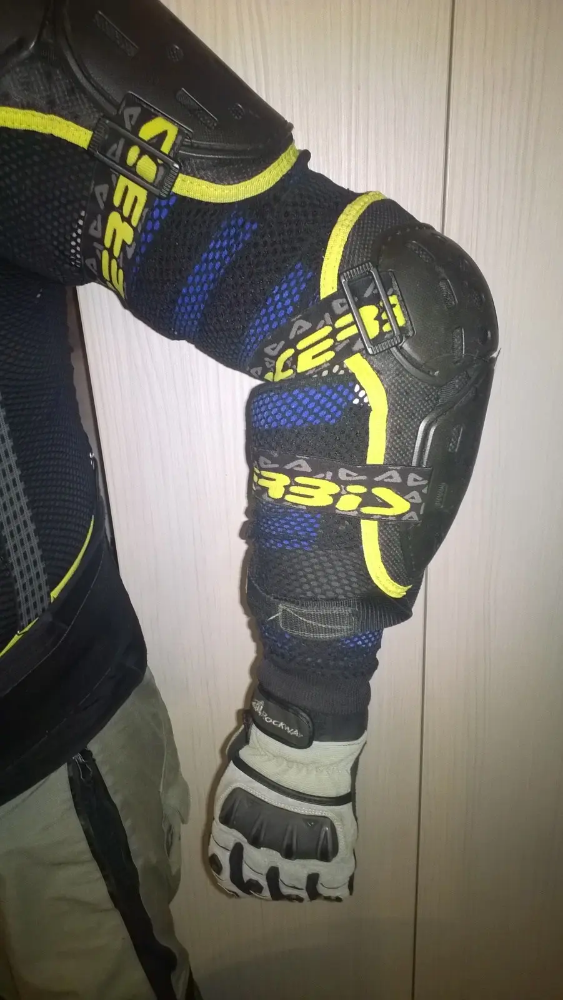
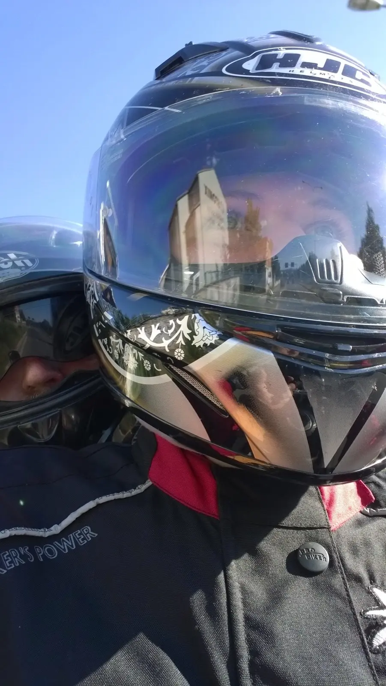



[<a href="https://sites.google.com/view/tyfotoza/" style="text-align: center;" target="_blank">fotky</a>]

Aneb pohádka o tom, kterak Ábinka vezla na motorce v tandemu přesmetrákového tučnáka a úspěšně ho dovezla až na Lom. Společně jsme pak vysvobodili mého Stromka, který čekal a čekal zamčený v garáži na zhojení tučňákova lokte. Zpátky už jsme jeli každý na svém stroji.



Je ku prospěchu pocitu bezpečí, že se do chráničů vejdu i s ortézou. Až do konce prázdnin mám jezdit takto a vypadá to, že raněný loket bude potřebovat ke zhojení vymáchat alespoň v Jadranu. I když ona i vycházka na Petřín udělá svoje.

Jet s Ábi v tandemu bylo zajímavé, říkala, že ve srovnání s Rebelem[<a href="/posts/2013/07/abi-je-rebel-jako-brno/" target="_blank">2</a>] o zátěži ani neví. Buchlovské hory se mnou projela 70km/h, což je pro řidiče pohoda, ale z pohledu tandemu, ech.

Jsme v čase 21 dnů od luxace[<a href="/posts/2015/07/vykloubeny-loket-pauza-na-zacatku-leta/" target="_blank">3</a>].

