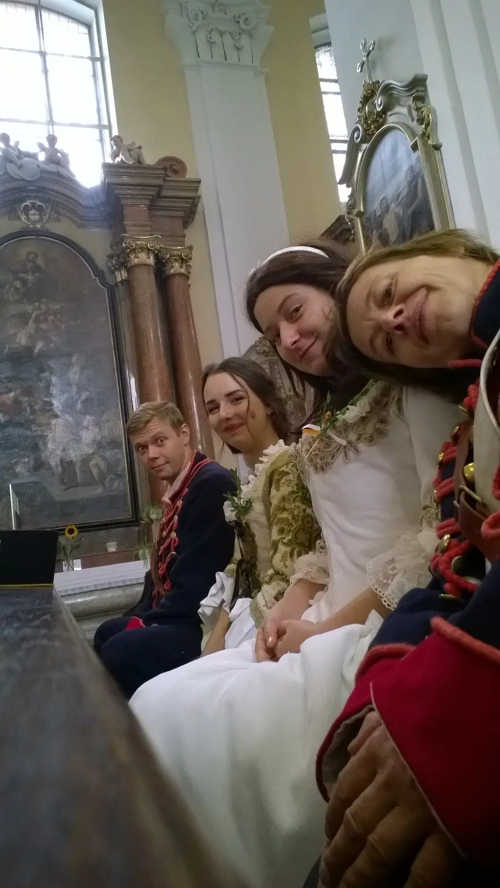
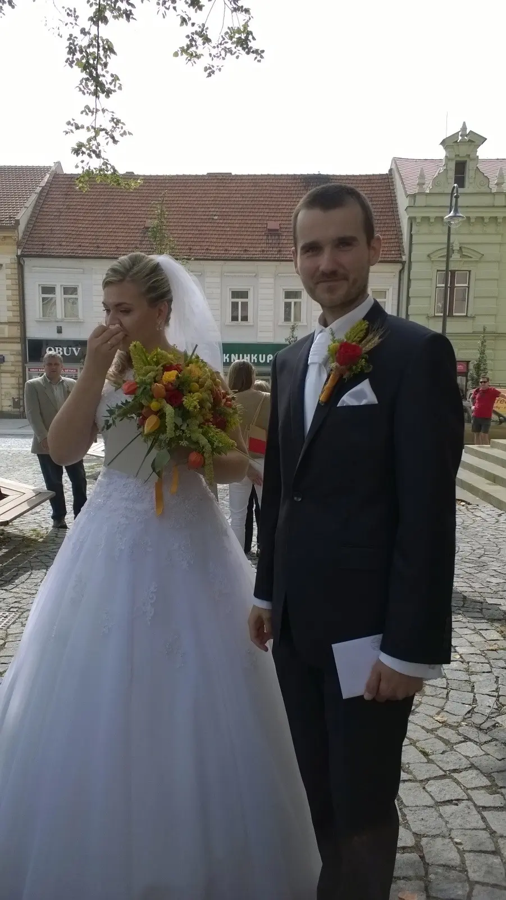

Všechno nejlepší, hodně štěstí do života!

[<a href="https://photos.app.goo.gl/UGzGSiqE1vXYfcsJ8" target="_blank">fotky</a>] 
Součástí večerního programu bylo i vystoupení hudební skupiny Thébští starci, kdo neviděl, neuvěří. 

<iframe allowfullscreen="" class="YOUTUBE-iframe-video" data-thumbnail-src="https://i.ytimg.com/vi/TKHZL5F5ezc/0.webp" frameborder="0" height="400" src="https://www.youtube.com/embed/TKHZL5F5ezc?feature=player_embedded" width="640"></iframe>

V sedmdesátých letech minulé století by se zařadili k fenoménům jako bylo DG307 a tahle slova pracovnice pražského kulturního střediska Alexandry Mládkové jsou stále živá viz [<a href="https://youtu.be/8yfn6qydO9Y?t=3m56s" target="_blank">1</a>].

