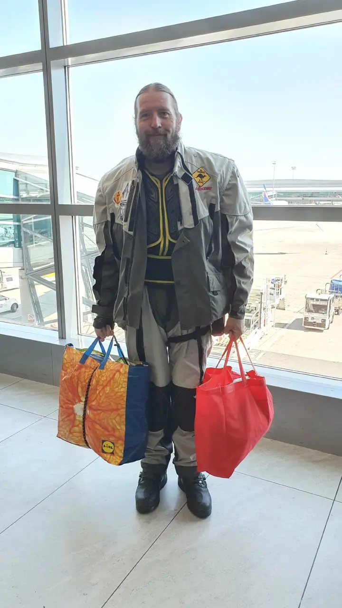

Tentokrát to bude moto výlet do Španělska s drobnou změnou, tedy letecky a motorku půjčit na místě od [<a href="https://www.wellcomebikersespana.com/">wellcomebikersespana.com</a>]. 
Na [<a href="http://kiwi.com/">kiwi.com</a>] jsme vybrali v lednu letenky do Madridu. Odlet v pátek 14.6. v 11:30 z Prahy. Vše vychází krásně i s časovou rezervou na vlakový spoj a s ním vždy spojená zpoždění. České aerolinie určitě ví, že jsme prokrastinauti, tedy lidé, kteří rádi odkládají věci na poslední chvíli, aby se svezli na vlně kreativního stresu, proto nám, s omluvou, dva dny před odletem oznámili, že se let přesunuje na 10:10, čímž nás dostali do zajímavého časové presu s rezervou 3min, kterou stejně ztratíme bezvýznamným blouděním. Tedy je nezbytné první plánování.  
Do motovaku balíme helmy, stan a nepromoky. Je zajímavé uvažovat tak, že zavazadlo, které mám musím po vybalení na motorku srulovat, smrsknou, komprimovat nebo vyhodit. Rozměrově jako příruční zavazadlo vítězí pevna taška Lidl a červená taška z netkané textilie Kaufland. Saša nezvládá nést hrdě logo K a tašku obrací naruby, takže je červená jako od Versaceho, chtěla si to nadepsat fixou. 
Na letišti jsem nikdy nebyl a jestli se nepočítá vyhlídkový let Turboletem z Kunovic, tak jsem ani letadlem neletěl. Naštěstí internet ví a web [<a href="http://jaletim.cz/co-vas-ceka-po-prijezdu-na-letiste/">jaletim.cz</a>] obsahuje dostatečně podrobný popis toho, jak se na letišti v Praze orientovat.  
Letištní kontrolou a rámem s detekcí kovů procházíme bosí. Moto boty jednou zvlášť a blokují ostatní věci na páse. Sleduju vyděšený pohled sličné slečny, jak se mé motoboty blíží k jejímu košíčku s kostýmkem a kabelkou a oddech, jak se předměty minuly, její košíčej vyjel a moje bota se zasekla tak, že ji musel letištní zřízenec vyprostit a použil k tomu nejdelší lžíci na boty, jakou jsem kdy viděl. Přemýšlím, jestli na zaseklou přesnídavku nebo nivnický řízek má obří jídelní lžíci. 
Již odbaveni táhneme na C3. ,,Jurášek na C3, Jurášek na C3!'' Vypadá, že smečka Japonců, kteří chtějí jinam a tlačíme je před sebou nakonec asi poletí s námi. 
Motoboty, kalhoty, chrániče hrudníku a rukou a motobunda. Jsem větší než kluci z ochranky a užívám si jejich obdivné pohledy. 
Jak čekáme, vidíme na letištní plochu, sledujeme vozík s odbavenými zavazadly a jasně identifikujeme náš žlutý motovak od firmy [<a href="http://www.motovaky.cz/">motovaky.cz</a>]. 

 

 



 



 

