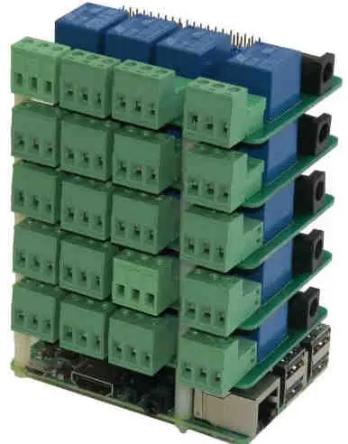
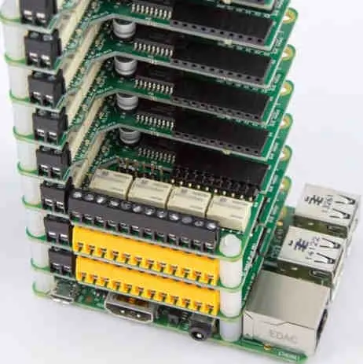



 

<b><i>Dá se použít Raspberry Pi 4B jako plnohodnotná náhrada stolního počítače, tedy desktopu?&nbsp;</i></b>

&nbsp;&nbsp; &nbsp;Raspberry Pi, dále třeba Rpíčko nebo RPi.&nbsp;

 

<i>Krátká a jasná odpověď </i>– po pár drobných nastaveních lze opravdu RPi použít jako zajímavou a plnohodnotnou náhradu stolního počítače Samotná deska počítače je „levná,“ ale nezapomeňme, že potřebujeme ještě zdroj, chladič [<a href="/posts/2021/02/chlazeni-raspberry-pi-4b/" target="_blank">1</a>] a nějaké úložiště připojené na USB3 , které bude rychlejší než SD karta, ze které obvykle na RPi běží systém.

 

A teď podrobněji. Jednodeskový počítač, který byl původně určen jako dostupný nástroj k výuce programování má zajímavou historii a od roku 2012 nám vyrostl a zesílil tak, že jej lze,&nbsp; s přimhouřením oka, použít jako náhradu stolního počítače.

 

Abychom našli přesnější odpověď budeme si muset odpovědět na jinou otázku: Co vlastně na počítači chcete dělat a jaké jsou vaše preference.&nbsp;

 

<i><b>Raspberry Pi není pro vás, pokud</b></i>
<blockquote style="border: none; margin: 0px 0px 0px 40px; padding: 0px; text-align: left;">
— potřebujete výkonný počítač = stříháte video nebo potřebujete zpracovat gigabajty RAW fotek

— chcete hrát hry třeba ze Steamu nebo podobné služby.

— vždycky potřebujete mít otevřených současně dvacet a víc oken v Google Chromu. Tohle jediné se možná dá rozumně a elegantně obejít.

— <strike>nezajímá vás spotřeba elektřiny</strike>&nbsp;(škrtám, tady to zmiňovat není fér a vlastně to nikdo při výběru počítače neřeší)

— potřebujete mít na počítači Microsoft Windows a potřebujete aplikace, které jinde než na Windows neběží.

— nenávidíte jakékoli čekání. Prostě kliknu a musím mít ihned výsledek, jinak šílím.

— opravdu neradi se učíte novým věcem.
</blockquote>

 

<b style="font-style: italic;">Proč vlastně uvažovat o Raspberry Pi</b> 
&nbsp;&nbsp; &nbsp;Představte si, že celý počítač stojí&nbsp; 2500 korun. Základ za 1600Kč a k tomu pár drobností jako chladič a zdroj. Někdo řekne: Tak málo? Ale většina lidí spíš odpoví: Pche, to je drahé! Vždyť pěkný repasovaný Dell Optiplex 790 SFF [<a href="https://www.pocitace24.cz/repasovane-stolni-pocitace/208-dell-optiplex-790-sff.html" target="_blank">tady</a>] stojí jen 1700 korun s daní, dvouletou zárukou a legální instalací Windows. Přijde nainstalovaný, zapnu a funguju. Když si připlatím 600 korun bude mít rychlý SSD disk. A jsme na stejné ceně jako kompletní RPi.

 

Je to Rpíčko aspoň výkonnější? Jak si stojí ve srovnání výkonu? Pro radost si udržuju [<a href="https://docs.google.com/spreadsheets/d/1bk_TolGpItmnp07Czt2TARnAdhmw5zx34RbrFnQQACY/edit?usp=sharing" target="_blank">tabulku</a>], kde srovnávám nesrovnatelné. A můžu zodpovědně říci, že výpočetní výkon Raspberry Pi 4B je nejvýše poloviční než tento starý Dell s procesorem Intel Core i3-2120. Ano, čtete správně <b>poloviční</b>.&nbsp;

 

Tak proč se s tím pořád zabývat, když výpočetní výkon je poloviční než starý Intel i3.

Co tedy získáme, když místo takového repasovaného desktopu pořídím Raspberry Pi?

Hodně záleží, co na počítači vlastně opravdu potřebujete dělat?&nbsp;

 

<b><i>Tohle Raspberry Pi zvládne jako desktop výborně</i></b>
<blockquote style="border: none; margin: 0px 0px 0px 40px; padding: 0px; text-align: left;">
— přehrávání filmů a hudby (audiofilové ocení, že existuje slušný výběr kvalitních zvukových karet = výběr přesných DAC případně i ADC převodníků)

— brouzdání po internetu

— kancelářské věci (lokálně LibreOffice nebo třeba Google dokumenty v prohlížeči)

— připojení na vzdálené plochy (pracujete–li vzdáleně, není problém, jako tenký klient funguje RPíčko dobře) Zmíním, že připojení k Windows Remote Desktop funguje. Aplikace Remmina je naprosto bezproblémová. Pokud děláte vzdáleně něco graficky náročného – 3D modelování nebo střih videa, tak je použitelné rozlišení pro připojení maximálně FullHD. Ač sedím před WQHD monitorem, na vzdálené plochy jsem připojen pouze ve FullHD, pak není problém. A nikterak to neomezuje.

— zpracování obrázků – běží tu Gimp i XnView

— umí vás naučit něco nového
</blockquote>
 

<b><i>Jak je s těmi mnoha otevřenými kartami ve webovém prohlížeči. Jde to?&nbsp;</i></b>

&nbsp;&nbsp; &nbsp;Jde, i v Chrome, ale raději doporučím prohlížeč Vivaldi, který pro Raspberry Pi existuje a funguje. Umí vše potřebné včetně rozšíření pro Chrome, ale je méně náročný na systémové prostředky a je možné si v něm na RPíčku otevřít velké množství karet najednou a nevadí to.

 

<b><i>A co spotřeba?</i></b>

&nbsp;&nbsp; &nbsp;Podívejme se na spotřebu elektřiny. Monitor započteme vždycky. Je zapnutý a nějakou spotřebu má. Ten můj si vezme 31W (AOC 32" IPS 1440p = QHD = WQHD = rozlišení 2560×1440 pixelů = 2K)

Běžný 24" monitor bude mít spotřebu kolem 25W.

&nbsp;&nbsp; &nbsp;A teď co počítač? Slušný, rozumně výkonný počítač si vezme 180W bez zátěže a s výkonnou grafickou kartou v zátěži i 400W). Ryzen 5 nebo Ryzen 9 s herní grafikou.

&nbsp;&nbsp; &nbsp;Jen pro zajímavost – výše zmíněný a srovnávaný Dell Optiplex 790 SFF si v plné zátěži vezme 51W. S Raspberry Pi je možné mít desktop, který samotný má odběr jen pět Wattů. [<a href="http://www.elektrorevue.cz/cz/clanky/ostatni-1/0/spotreba-jednodeskovych-pocitacu-raspberry-pi-pro-bateriove-napajeni--power-consumption-of-one-board-computers-raspberry-pi-for-battery-powering-/" target="_blank">článek</a>]

 

<i><b>Podpora a komunita kolem</b></i>

&nbsp;&nbsp; &nbsp;Všechno kolem Raspberry Pi je výborně zdokumentované a dostupné. Velké množství oficiálních knih zdarma ke stažení, něco už&nbsp; vyšlo i česky.&nbsp;

<i> </i>

<b style="text-align: justify;"><i>Opravdu tohle někdo reálně používá?</i></b>

&nbsp;&nbsp; &nbsp;Ano. S Raspberry Pi žiju už skoro rok a můžu říct, funguje to.

Přikládám kopii aktuální obrazovky na mém Raspberry Pi 4B.



Co vidíte spuštěné, po sloupcích zleva doprava. Abych nezapomněl, pes na pozadí se jmenuje Aki.
<blockquote style="border: none; margin: 0px 0px 0px 40px; padding: 0px; text-align: left;">
— monitoring systému, od zapnutí běží přes dvě hodiny, využití paměti zatím nepřesáhlo 3GB

— historie vytížení procesoru a teploty - maximální teplota procesoru do 70°C&nbsp;

— VLC player hraje muziku z flac souborů

— druhý VLC player sleduje kameru z 3D tiskárny (zrovinka se to dotisklo)
— webový prohlížeč Epiphany – mám otevřené jen tři karty
— prohlížeč Vivaldi, kde píšu tento text; mám otevřených víc jak dvacet karet a&nbsp; další tisíc kvůli přehlednosti parkuju v seznamu pod sebou pomocí rozšíření OneTab[<a href="https://chrome.google.com/webstore/detail/onetab/chphlpgkkbolifaimnlloiipkdnihall" target="_blank">3</a>] – je to použitelnější než nekonečné třídění záložek.&nbsp;

— běží správce souborů Double Commander (opensourcová dokonalá kopie Total Commanderu, roky jsem žil s Windows a tohle jeden z návyků z té doby)

— běží XnView na úpravu obrázků a dělám s tím výřezy obrazovky (taktéž můj pozůstatek z používaní Windows)

a pořád zbývá dostatečná výkonový rezerva.

</blockquote>

 

<b><i>Kterou verzi Rpi vybrat aneb 4GB RAM stačí</i></b>

&nbsp;&nbsp; &nbsp;Raspberry Pi 4B se prodává v několika verzích a liší se velikostí paměti RAM a cenou. Pro naše desktopové využití je verze se 4GB RAM naprosto dostačující. Existuje dektopová verze vestavěná do klávesnice.&nbsp;

<iframe allowfullscreen="" class="BLOG_video_class" height="400" src="https://www.youtube.com/embed/ZSvHJ97d8n8" width="640" youtube-src-id="ZSvHJ97d8n8"></iframe>

Raspberry Pi 400 – dektopový počítač v klávesnici

 

Nevím, jestli by mě ta klávesnice vyhovovala a to numerickou klávesnici prakticky nepotřebuju. Než benefity, vidím v tom spíše omezení, klávesnici bych si rád vybral. Navíc nemá vyvedené některé konektory a tady může vzniknout problém, jak k počítači v klávesnici připojit rozšiřující HAT. Možná přes prodlužku by to šlo.

 

<b><i>Rozšíření HAT </i></b>(Hardware Attached on Top = Nahoru připojený hardware)

&nbsp;&nbsp; &nbsp;Tohle dělá Rpi velmi silným. Existuje obrovské množství rozšiřujících karet pro zvuk, dekódování pozemního televizního vysílání, ale i průmyslové řízení a automatizaci, digitalizaci signálu etc. [<a href="https://rpishop.cz/148-hat-gpio-moduly" target="_blank">4</a>]



Rpi se zvukovou a zesilovačem od Hifiberry.
  

 

Pro zajímavost, jak mohou rozšířená Raspberry Pi vypadat. Nemusí to být přímo dektopové využití, ale ukáže to možnosti, kam je možné tento jednodeskový počítač posunout.

 




&nbsp;

 

Verze se 2GB je nejlevnější a dobře poslouží jako samostatný multimediální přehrávač nebo jako nějaký vestavěný počítač na řízení něčeho (u mě 2GB Rpi řídí 3D tiskárnu) nebo další 2GB Raspberry Pi slouží jako velmi úsporný domáci NAS s obřími disky. Zvládne i webový server[<a href="http://tyfoza.sytes.net/" target="_blank">5</a>].



Pro síťové datové úložiště NAS používám stohovatelná připojení SATA disků přes USB3.

 

Ale zpět k deskopovému využití Rapsberry Pi.&nbsp;

 

<i><b>Jaké jsou „drobné úpravy</b><b>“&nbsp;k použitelnému desktopu</b></i>

&nbsp;&nbsp; &nbsp;Nezbytné úpravy jsou dvě, třetí je volitelná, ale doporučená&nbsp;
<blockquote style="border: none; margin: 0px 0px 0px 40px; padding: 0px; text-align: left;">
1/ Úložiště&nbsp;

2/ Úložiště&nbsp;&nbsp;
</blockquote><blockquote style="border: none; margin: 0px 0px 0px 40px; padding: 0px; text-align: left;">
3/ Přetaktování
</blockquote>
 

<b><i>1 + 2/ Úložiště</i></b>

&nbsp;&nbsp; &nbsp;Standardně běží operační systém z micro SD karty. Ta je pro naše desktopové použití zoufale pomalá. Slovo<b><u> zoufale </u></b>zdůrazňuji.



Levné řešení je rychlá USB3 flash. Z tabulky měření je jasné, že díky pomalejšímu zápisu patří mezi úložiště pomalejší. Pomalejší zápis vadí hlavně u brouzdání po internetu, kdy si prohlížeč neustále ukládá data do vyrovnávací paměti. Řešení je přesměrovat ukládání dočasných souborů do paměti RAM místo na disk. Paměti to ukousne jen tolik, kolik dat se reálně uloží. Nastavená velikost říká, kolik se může uložit maximálně, nikoli kolik paměti to pořád žere.

 

V mém&nbsp;/etc/fstab&nbsp;jsou přidány tyto řádky pro uložení cache prohlížečů a dočasných souborů a logů a i bez SSD disku je počítač svižný a použitelný



 

<b><i>3/ Přetaktování</i></b>

Malou změnou jednoho konfiguračního souboru se dá posunout takt procesoru z původních 1500MHz až na 2147MHz. To je prosím posun na 143% ! a funguje to naprosto bezpečně. Víc viz [<a href="/posts/2021/02/pretaktovani-raspberry-pi-4b/" style="outline-width: 0px; user-select: auto;">6</a>].

