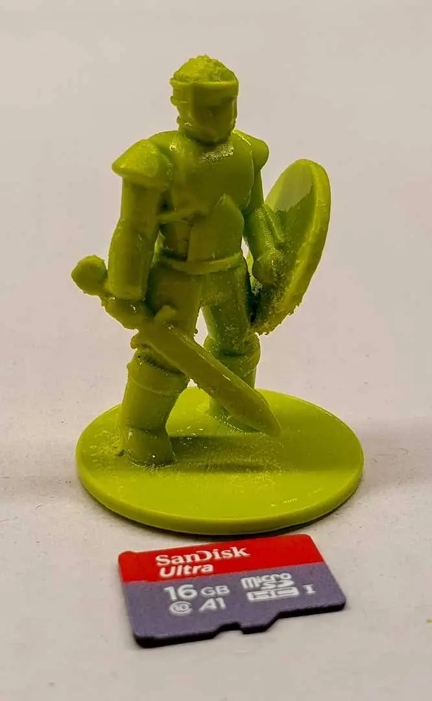



model na [<a href="https://www.thingiverse.com/thing:2115690" target="_blank">thingiverse</a>]

 

Z tiskárny MP Mini Delta [<a href="/posts/2021/03/mp-mini-delta/" target="_blank">1</a>]. Tryska 0.2mm pro detail i v ose X/Y. Celková výška 35mm. Materiál ABS, výška vrstvy 0.15mm lehce vyhlazeno acetonem. Možná by se to nechalo víc brousit. Zkusil jsem i výšku vrstvy 0.10mm, ale projevilo se to pouze prodloužení doby tisku.

 



viz [<a href="https://photos.app.goo.gl/Ky7q5gMRR3DiMHHD6" target="_blank">fotky</a>] další tisky minis a moje pokusy o tisk malinkých věcí.

 

Tiskárna MP Mini Delta. Šroubek M5: materiál ABS, výška vrsty 0.15mm, tištěno na výšku (vrstvy jsou po závitech).
 


Tryska 0.4mm, tiskárna Ender 5 Plus, materiál ASA, výška vrstvy 0.08mm.&nbsp; Hlazení pět minut v acetoných výparech.

Pro kolegu na výrobu formy na lití knoflíků. Ten obří kužel je vtok a dvě 0.8mm široké tyčky na bocích&nbsp;

zase odfuk. Moc si nedokážu představit, jak ten knoflík pak odlije, ale tisk a následné vyhlazení se povedlo.&nbsp;

 



Tryska 0.4mm, Ender 5 Plus, ASA. S takto obří tryskou je detail pouze v ose Z.

 

Další čtení

&nbsp;&nbsp; &nbsp;Nic nového jsem neobjevil, vše potřebné k tisku miniatur už někdo napsal a stačí to najít.

&nbsp;&nbsp; &nbsp;&nbsp;&nbsp; &nbsp;[<a href="https://all3dp.com/2/3d-printed-miniatures-tips-tricks/" target="_blank">1</a>] [<a href="https://pick3dprinter.com/3d-printing-miniatures/" target="_blank">2</a>] tipy jak tisknout malé věci

&nbsp;&nbsp; &nbsp;&nbsp;&nbsp; &nbsp;[<a href="https://forum.prusaprinters.org/forum/original-prusa-i3-mk3s-mk3-how-do-i-print-this-printing-help/settings-for-printing-miniatures/" target="_blank">3</a>] diskusní forum, že tiskl malých věcí nemusí být vždy snadný

&nbsp;&nbsp; &nbsp;&nbsp; &nbsp; [<a href="https://forum.prusaprinters.org/forum/original-prusa-i3-mk3s-mk3-how-do-i-print-this-printing-help/trouble-with-dd-miniatures/" target="_blank">4</a>] povedená sbírka tipů, jak naklonit model, aby byl detail, co nejlepší 

 
