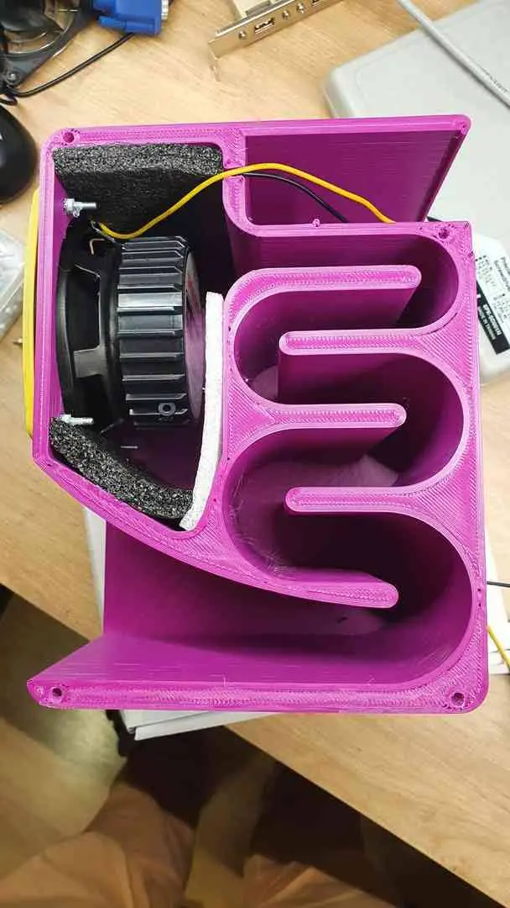
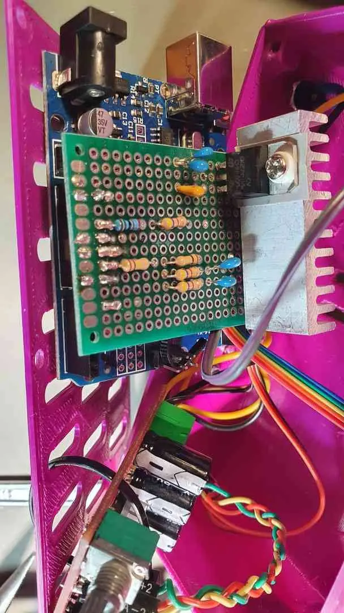
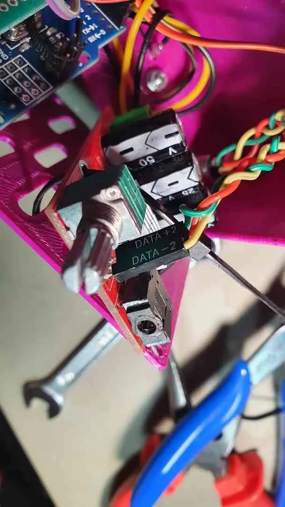

<iframe allowfullscreen="" class="BLOG_video_class" height="480" src="https://www.youtube.com/embed/Cb8VmlW09-o" width="640" youtube-src-id="Cb8VmlW09-o"></iframe>
[<a href="https://youtu.be/Cb8VmlW09-o" target="_blank">youtube</a>] video

 

Na záznamu zobrazuje sinusový signal 200Hz–18,5kHz; potom obdelníkový signál a nakonec sinus s bílým šumem.

 

Jednoduchý spektrální analyzátor s Arduinem a FFT. Zapojení a kód je k dispozici viz [<a href="https://create.arduino.cc/projecthub/shajeeb/32-band-audio-spectrum-visualizer-analyzer-902f51" target="_blank">1</a>]. Stačilo nakreslit a vytisknout krabičku. Model pro tisk dostupný ke stažení viz [<a href="https://www.thingiverse.com/thing:4887291" target="_blank">2</a>].

 



celé fialová retro sestava

 

Použitelný generátor funkcí pro mobily Android [<a href="https://play.google.com/store/apps/details?id=com.keuwl.functiongenerator" target="_blank">3</a>] a spektrální analyzátor taktéž pro mobily Android [<a href="https://play.google.com/store/apps/details?id=org.intoorbit.spectrum" target="_blank">4</a>]. Záznam je přímo z obrazovky telefonu.

<iframe allowfullscreen="" class="BLOG_video_class" height="480" src="https://www.youtube.com/embed/Nfhy4txM5xs" width="640" youtube-src-id="Nfhy4txM5xs"></iframe>

[<a href="https://youtu.be/Nfhy4txM5xs" target="_blank">youtube</a>] video

 

Reproduktory uvnitř – model ke stažení viz [<a href="https://www.thingiverse.com/thing:4750820" target="_blank">5</a>].

 

  
  
  


krabička zesilovače a analyzátoru
 

  
  
  
  

Použitý lineární regulátor na 6-7V topí asi 1.8W, proto ten chladič. Ale pořád topí výrazně méně, než regulátor v nejlevnějším čínském klonu Arduino Uno připojený přímo na 12V přes souosý konektor.&nbsp; Použitý modul zesilovače&nbsp;Yamaha YDA138-E 2x12W.

