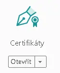

Navazuji na téma mého příspěvku z ledna 2014, který se v poslední době stal velmi navštěvovaným viz odkaz [<a href="/posts/2014/01/jak-podepsat-dokument-jak-pouzit-casove/" target="_blank">Jak podepsat dokument a jak používat časové razítko</a>].&nbsp; 

 

<i>Pár důležitých drobností k elektronickému podpisu</i>

– elektronický podpis neslouží k identifikaci osoby, slouží k projevu vůle a je právně zcela rovnocenný vlastnoručnímu podpisu

– kvalifikovaný elektronický podpis = vlastnoruční podpis musí být uložen na bezpečném prostředku - token nebo čipová karta. Před vložením podpisu je nutné zadávat pin/kód.

– posláním „datovkou“ není brán dokument jako elektronicky podepsaný; datová zpráva je pouze systém doručení/potrubní pošta, kterou je dokument doručen a vůbec nesouvisí s doručovaným obsahem

– kromě kvalifikované elektronického podpisu potřebujeme také časové razítko (TSA).

 

K podpisu PDF dokumentu stačí běžný volně dostupný&nbsp; [<a href="https://get.adobe.com/cz/reader/" target="_blank">Adobe Acrobat Reader DC</a>]. Otevřu PDF soubor, vpravo je seznam nástrojů a poslední je&nbsp;

více nástrojů

vyberu

a nad dokumentem je pak vidět podepisovací panel



 

Pokud mám v počítači k dispozici elektronický podpis, mohu „Digitálně podepsat.“

 

&nbsp;&nbsp; &nbsp;Aby byl podpis opravdu platný, dokument vyžaduje ještě „Časové razítko.“ Jedná se o zpoplatněnou službu certifikační autority; opět k ní musí existovat smlouva a na základě ní vydané přihlašovací údaje.

V Adobe Acrobat Readeru v Úpravy – Předvolby – Podpisy


  

<i>Mám podpis uložený v počítači a nikoli na tokenu? Můžu ho použít?</i>

&nbsp;&nbsp; &nbsp;Ano, ale takový podpis nikdy nebude mít právní váhu&nbsp; EU 910/2014. Některými úřady je akceptován a některé naše úřady dokonce mohou vyžadovat informace uložené v certifikátu sloužící k hlubší identifikaci.

 

<i>Jak poznám, že je dokument podepsán správně mnou, či např. smluvní protistranou.</i>

&nbsp;&nbsp; &nbsp;V panelu podpisu podepsaného dokumentu je vše potřebné

 

&nbsp;&nbsp; &nbsp;Nejprve dokument podepsaný „špatně,“ tedy ne podle EU 910/2014.

Kdy kvalifikovaný elektronický podpis není uložený na tokenu/bezpečném prostředku.



všechno vypadá správně, ale podpis není podle EU 910/2014

 

&nbsp;&nbsp; &nbsp;Správně podepsaný dokument má tento panel podpisu. Je to u podpisu přímo napsané a je z toho jasné, že podpis byl uložen na bezpečném prostředku/tokenu a právně je podpis rovnocenný vlastnoručnímu podpisu – proto EU 910/2014 vzniklo.



takto má vypadat správně podepsaný dokument včetně časového razítka

 

&nbsp;&nbsp; &nbsp;Problém, který se aktuálně stále děje, že některá ze stran, která podpisuje smlouvu stále nemá svůj podpis na tokenu a pak vznikne něco, co je vlastně neplatné a je na nás o jak důležitou smlouvu jde a zda ji budeme akceptovat – obě/všechny podpisující strany mají správně použít podpis podle EU 910/2014 a všichni zúčastnění mají dokument orazítkovat časovým razítkem. Teoreticky by stačilo, kdyby časové razítko umístil poslední podepisující; když podepisuju poslední, tak si to pohlídám, pokud podepisuju jako první, tak navrhuji vždy dokument vrátit s tím, že není právně v pořádku!



Typicky jedna strana podepsala správně, druhá strana nesprávně.

 

<i>Proč je vyžadováno časové razítko (TSA) a co vlastně umí?&nbsp;</i>

&nbsp;&nbsp; &nbsp;Zmrazí dokument v čase.&nbsp; Běžná životnost kvalifikovaného elektronického podpisu, tedy samotného certifikátu je jeden, myslím, že maximálně dva roky, když je povoleno žádání dlouhodobých certifikátů. Tedy obvykle jeden rok. Uzavírám elektronicky smlouvu - já podepíšu PDF soubor, druhá strana také. Když dokument otevřu, vidím v panelu podpisu, že oba podpisy jsou platné. Protože právě teď jsou. Smlouvu si uložím. Je platná elektronicky, její vytištění je pouze kopie, která nemá žádnou právní váhu. Co když PDF soubor otevřu za několik měsíců, když už některý z certifikátů, která byly k podpisu použity, pozbyl platnosti. V panelu podpisu vidím, že některé nebo oba certifikáty jsou neplatné. Protože již vypršely.&nbsp;

&nbsp;&nbsp; &nbsp;Řešení je časové razítko. Je to další certifikát, který je obvykle zpoplatněn od kusu – třeba jedno časové razítko za dvě koruny. Prodávají se v balíčkách, něco jako kredit do telefonu. Umístění časového razítka udělá to, že ověří všechny použité podpisy - zda jsou platné a přidá informaci, že v čase umístění časového razítka byly všechny podpisy platné.

&nbsp;&nbsp; &nbsp;Časové razítko je jen další certifikát/podpis, který má výrazně delší životnost než certifikáty elektronických podpisů. Obvykle tři až pět let. Podrobněji na [<a href="https://www.elektronickypodpis.cz/kvalifikovana-casova-razitka/" target="_blank">webu</a>] vydavatele TSA.

&nbsp;&nbsp; &nbsp;Ano, po vypršení životnosti časového razítka bude opět dokument neplatný, takže pokud ho archivujeme v rámci elektronické spisové služby, můžeme se dostat do stavu, kdy bude nezbytné všechny dokumenty, které potřebujeme mít platné znovu přerazítkovat. Tady doporučím jednoduché třídění elektronicky podepsaných dokumentů na ty, které opravdu potřebujeme udržet při životě desítky let. Tohle je jeden z důvodů, proč komerčně nabízená datová úložiště elektronicky podepsaných dokumentů nejsou levná.&nbsp;

 

<i>Jak získat takový kvalifikovaný elektronický podpis?</i>

&nbsp;&nbsp; &nbsp;Podpis vydává certifikační autorita viz [<a href="https://www.mvcr.cz/clanek/prehled-kvalifikovanych-poskytovatelu-certifikacnich-sluzeb-a-jejich-kvalifikovanych-sluzeb.aspx" target="_blank">1</a>]. Mám zkušenost pouze s [<a href="https://www.postsignum.cz/" target="_blank">Postsignum</a>] provozovaným Českou poštou. Již<b><i>&nbsp;při generování první žádosti o certifikát musí být v počítači přítomen bezpečný prostředek</i></b> k uložení žádosti – typicky token [<a href="https://www.postsignum.cz/kvalifikovane_prostredky.html" target="_blank">2</a>]. Nabízí se možnost použít úložiště na moderním občanskému průkazu, který ho možná právě pro tyto případy má; ale stejně musíte pořídit k počítači čtečku a řekl bych, že podpisový token je lepší/bezpečnější, protože jej na rozdíl od občanky můžete nechat v kanceláři v trezoru.

&nbsp;&nbsp; &nbsp;Je potřeba uzavřít smlouvu s certifikační autoritou a vyplnit tedy nějaké formuláře – jiné pro organizaci, jiné pro OSVČ etc. Systém C.K. Pošty je naprosto netransparentní, takže není vůbec na škodu zavolat na telefonickou podporu 800 104 410 a nechat si celý postup podrobně vysvětlit; je to určitě lepší než opakovaně čekat ve frontě a řešit věci na pobočce Czech POINTu na poště, kde v malých městech většinou poradit opravdu nedokážou.

&nbsp;&nbsp; &nbsp;Existuje zajímavá možnost, vyřizovat s Postsignum všechno elektronicky - tedy že nemusí statutár organizace, či pověřená osoba na pobočku pošty nosit formuláře se žádostí o změny nebo o zavedení nového zaměstnance aj. A všechno se dá vyřídit přes velmi strohé až spartánské webové rozhraní, ověření je dvoufázové a systém je po pár lekcích s telefonickou podporou použitelný a funkční.

 

<i>Vím, že podpisy v dokumentu jsou platné a stejně se neověří správně</i>

&nbsp;&nbsp; &nbsp;Do počítače, kde chci podpisovat a kde chci ověřovat elektronicky podepsané dokumenty musím &nbsp;&nbsp; nainstalovat kořenové certifikáty všechny certifikačních autorit, jejichž podpisy chci ověřovat. Postsignum to má jako instalaci [<a href="https://www.postsignum.cz/certifikaty_a_crl_autorit.html" target="_blank">3</a>]. Při prvotní komunikaci se zahraničními partnery může dojít k tomu, že kořenové certifikáty jejich autorit v počítači nainstalované nemám.

 

<i>Post scriptum</i>

&nbsp;&nbsp; &nbsp;Jestli vám přijde systém elektronických podpisů a časových razítek poněkud nepřehledný až zmatečný, tak nevím, jak nazvat legislativní kolotoč, který vás čeká, až budete chtít pořídit pro firmu „šifrovací službu“ nabízenou Českou poštou. Mně se to úspěšně povedlo, ale o tom příště.
