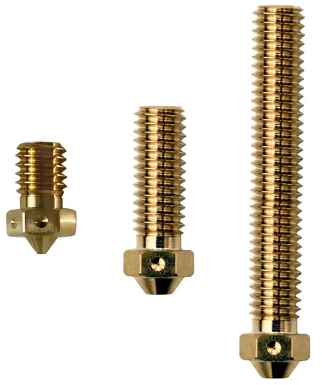

<i>Problematika rychlosti 3D tisku.</i>

&nbsp;&nbsp; &nbsp;Pro přílišnou roztříštěnost informací, kterými jsem se prokousával na internetových diskusních fórech zkusím popsat svoji zkušenost. Koupil jsem si 3D tiskárnu, která má v popisu od výrobce uvedenu maximální rychlost tisku 180-200mm/s s poznámkou, že maximální rychlost posunu může být 300mm/s. Jenom zapomněli napsat, že uvedené rychlosti jsou reálně dosažitelné, pouze vyžadují pár drobných úprav a více než homeopatickou trošku studia.

<i> </i>

<i>Maximální rychlost tisku je určena pouze dvěmi parametry:</i> &nbsp; &nbsp; ad 1) množstvím plastu, který dokážeme v reálném čase roztavit a přesně dávkovat k tisku &nbsp; &nbsp; ad 2) limitem maximální rychlosti, kterou jsme schopni ještě tiskárnu přesně řídit

 <i>Krátce</i> Rychlejší 3D tisk. Také se ptáte, zda je možné tisknout rychleji? Ano je. &nbsp; &nbsp; – větší kostka a delší tryska taví plast rychleji – E3D V6 volcano je ideální volba &nbsp;&nbsp; &nbsp;– rychlejší tisk klade vyšší nároky na pevnost kostrukce tiskárny &nbsp;&nbsp; &nbsp;– na otázku Jak řídit rychle a přesně motory tiskrány? – odpoví firmware Klipper

&nbsp; &nbsp; – ano, dá se tisknout rychlostí 200mm/s 

 

<i>Dlouze </i><h2 style="text-align: left;"><i>ad 1) množství roztaveného plastu, které je k dispozici pro tisk</i></h2>

&nbsp; &nbsp; &nbsp;Rychlejší tisk znamená vyšší průtok tištěného plastu, to znamená, že musíme vyřešit způsob jak tavit plast rychleji a v dostatečném množství.

&nbsp; &nbsp;&nbsp;Nejprve pár základních věcí, které jsou 3D tiskařům všeobecně známé. Tryska obsahuje roztavený plast. Její průměr určuje maximální výšku i šířku vrstvy, kterou lze tisknout. A množství plastu, který tavíme souvisí s rychlostí, přesněji s průtokovou rychlostí tryskou – některé slicery/programy připravující data pro tiskárnu definují rychlost tisku jako MVS maximální objemovou rychlostí, tedy součin výška vrstvy × šířka tištěné stopy × rychlost. Z výše uvedeného MVS je naprosto jasná vzájemná propojenost jednolivých parametrů.

&nbsp; &nbsp; Proto dokážeme horkou část tiskárny tvořenou vyhřívanou kostkou a tryskou popsat jediným číslem – maximální objemovou rychlostí, kterou dokáže protlačit.



<i>tavící kostka&nbsp;</i>

základ – volcano – supervolcano

<b>MVS: 14 – 19,5 – 24 mm3/s</b>

 

<i>tryska</i>

základ – volcano – supervolcano

<i>ve verzi [<a href="/posts/2023/02/vliv-trysky-na-rychlost-tisku/">CHT trysk</a>y] pro rychlejší tavení plastu</i>

 

<i>Pozor!</i>&nbsp;Je zde možnost, že nastavíme vyšší teplotu trysky a pak budeme tisknout rychleji a budeme počítat s tím, že při vyšší teplotě prostě taje plast rychleji. Tohle řešení použít lze, ale je potřeba brát ohledy na to, co se tiskne. Takž pokud běžně tisknu PETG při 240°C, tak zvednutí teploty třeba o čtyřicet stupňů by mělo umožnit výrazně navýšit průtok plastu tryskou. Tak snadné to ale není.

&nbsp;&nbsp; &nbsp;Rychlost tisku není všechno, zároveň potřebujeme, aby aktuálně tisknutá vrstva stihla vychladnout, než se na ni bude zase tisknout... 

<iframe allowfullscreen="" class="BLOG_video_class" height="480" src="https://www.youtube.com/embed/pMVCJGqLcwg" width="640" youtube-src-id="pMVCJGqLcwg"></iframe>

[<a href="https://youtu.be/pMVCJGqLcwg" target="_blank">youtube</a>]

 

&nbsp; &nbsp; Testuji tisk při běžné teplotě doporučené pro tisk filamentu tak, aby bylo možné tisk dobře chladit a dalo se dobře a hezky vytisknout všechno, čeho je tiskárna schopná. 



[<a href="https://www.thingiverse.com/thing:3578202">zdroj</a>]

kostku supervolcano si můžu snadno vytořit sám, ze dvou volcano kostek a dvou vyhřívacích těles

 

&nbsp;&nbsp; &nbsp;Pozor! Pokud běžně používáme 40W vyhřívací těleso, tak navýšení na dvojnásobek může teoriticky způsobit problém, pokud přesně neznáme na jaký výkon je dimenzován náš zdroj; přesněji jaký je spínací mosfet pro vyhřívání hotendu, pokud je vůbec použit (u levných tiskáren bývá spínací mosfet pouze pro vyhřívání podložky, a vyhřívání hotendu spíná přímo deska). Obvykle výměna 40W tělesa za 50W problém není. U dvojnásobku vyřešme řízení vyhřívání raději jinak.

<i> </i>

<i>Se supervolcanem jsem neuspěl</i>&nbsp; &nbsp;

&nbsp;&nbsp; &nbsp;S original volcano obří kostkou a tryskou supervolcano jsem hodně experimentoval a bohužel musím říci, že odpor, který klade dlouhá tryska roztavenému materiálu je tak obrovský, že se nedalo rychle tisknout větší vrstvou než 0.20mm. Zkusil jsem zpřevodovaný extruder 3:1 s plnou sílou motoru a nefungovalo mně to. V různých diskusích bylo zmiňováno, že větší tryska; 0.8mm klade menší odpor a půjde tisknout rychleji; asi mám smůlu, ale nefunguje mně to.

&nbsp; &nbsp; Podle rady zkušeného kolegy, by supervolcano mělo dobře tisknout s filamentem 3mm tlačeném dvoumotorým zpřevodovaným extruderem. Vlákno 1.75mm takovou sílu prostě přenést nedokáže. A i tak je problém s přesným dávkováním.

&nbsp; &nbsp; <i>Do budoucna nechávám možnost, kdy dvě kostky volcano budou spojeny pomocí hotbreaku a každá kostky bude vyhřívána jinak. Něco jako předehřev a natavení a samotné travení plastu. Časem to řešení otestuju.</i> 

 

&nbsp; &nbsp; Jestli nějaké kostka funguje, je to zlatá střední cesta – volcano. Tryska není tak dlouhá, aby kladla nějaký extrémní odpor při tisku. Zde je jedno starší video, tiskárna Ender 5 Plus má ještě originální pojezdy s gumovými kolečky, i tak se dá řídit velmi rychle.

 

Tisk z materiálu ASA, volcano tryska 0.4mm, vrstva 0.20mm, rychlost 200mm/s

<iframe allowfullscreen="" class="BLOG_video_class" height="400" src="https://www.youtube.com/embed/JeuxJLOlmJo" width="640" youtube-src-id="JeuxJLOlmJo"></iframe>

[<a href="https://www.youtube.com/watch?v=JeuxJLOlmJo" target="_blank">youtube</a>]

 

Tisk z materiálu PETG, volcano tryska 0.6mm, vrsta 0.20mm, šířka 0.60mm, rychlost 200mm/s

<iframe allowfullscreen="" class="BLOG_video_class" height="400" src="https://www.youtube.com/embed/icf3OeONVf4" width="640" youtube-src-id="icf3OeONVf4"></iframe>

[<a href="https://www.youtube.com/watch?v=icf3OeONVf4" target="_blank">youtube</a>]
 
&nbsp;&nbsp; &nbsp;Hledáme ideální nastavení, aby se dalo tisknou všechno a nemuseli bychom řešit, zda tisk obsahuje nějaké náročnejší části jako třeba převisy.&nbsp;



[<a href="https://www.selfcad.com/blog/what-are-overhangs-in-3d-printing" target="_blank">zdroj</a>]

Nelze tisknou do vzduchu – proto pímesno T,&nbsp; vlevo, nelze tisknout. Y je typické pro převisy, kdy každá vrstva malinko přesahuje vrstvu přechozí. Tiskárna by měla být schopná tisknout převisy do úhlu 45°. Aby toho byla schopná, musí být předchozí tištěná vrstva dostatečně pevná, aby se dala tisknout další vrstva. Pokud je nedostatečné chlazení, bude se okraj tištěné vrstvy zvedat směrem nahoru. U tisku malých věcí jde požadavek dobrého chlazení a rychlého tisku proti sobě. Pokud se tiskne něco náročnějšího, tak zpomalit bude ta správná cesta.

&nbsp; &nbsp; Chlazení řeší ventilátory, které foukají pod trysku. Teplota vzduchu, který mají k dispozici je teplota vzduchu v tiskovém prostoru. <i>Zajímavý pokus by bylo vzít kompresor a hnát studený vzduch přímo. Časem otestuju.</i> 

 

Tiskněme [<a href="https://cs.wikipedia.org/wiki/3DBenchy" target="_blank">lodičku</a>] – 3DBenchy je testovací model, který ukáže, zda máme všechno nastavené správně.

 

<i>Závěr tématu ad 1)</i><i style="text-align: left;">&nbsp;množství roztaveného plastu, které je k dispozici pro tisk</i>

&nbsp;&nbsp; &nbsp;E3D V6 volcano je ideální velikost kostky a trysky, která umožní rychlejší tisk. Zcela jistě umožní dvojnásobek rychlosti tisku téměř s jakýmkoli firmwarem. 

 
<h2 style="clear: both; text-align: justify;"><i>ad 2) Přesné řízení 3D tiskárny vyšší rychlostí</i></h2>
&nbsp;&nbsp; &nbsp;Je potřeba vyřešit pár drobností, aby bylo možné tisknotu rychleji. Pokud nastavíme rychlejší běh krokových motorků, pokud nastavíme větší akceleraci, celá věc se začne hýbat rychleji. Limity se najdou snadno, nesmí přeskakovat ozubený řemen. Určitě pomůžou dobrá lineární vedení jednotlivých os.&nbsp;

&nbsp; &nbsp; V běžné levné 3D tiskárně je nějaký osmibitový procesor, který čte a dekóduje vygenerovaná data pro tisk z SD karty, uložená v textovém formátu (.gcode). Zároveň musí přesně regulovat teplotu hotendu a podložky a ještě k tomu řídí motory. To může být pro jeden osmibitový procesor slušná nálož. A nezapomeňme, že ještě na displeji zobrazuje nějaké infomace, které by uživatel chtěl ideálně barevné a plynule animované. 

&nbsp; &nbsp; Možná zkusíme nahrát nějakou aktualizaci firmware a třeba to bude lepší, ale pořád jsme limitování procesorem na základní desce tiskárny. Nabízí se různé upgrade, investovat do lepší 32bitové desky s nějakým svižným armovým procesorem. Taková deska může stát klidně dalších patnáct stovek...

 

<i>Řešení out of the box Klipper[<a href="https://www.klipper3d.org/" target="_blank">1</a>].</i>

&nbsp; &nbsp; A co když by celou kinematiku tiskárny počítalo nějaké výkonnější zařízení a po slabém procesoru na základní desce tiskárny budeme chtít jen řízení motorů a uděláme z ní jen hloupého XYZ robota, kterému budeme posílat úsporné příkazy, které má udělat. Výkon nám dodá Rapsberry Pi Zero 2 W (nebo lepší). Pozor, musí to být nové Zero 2 W, které má asi pětkrát větší výkon než původní Zero. Nezaměnit, obě se prodávají kolem čtyř set korun, jen původní koncept Zero je z roku 2015/2017 a nová verze Zero 2 W vyšla na podzim 2021. Já měl navíc jeden kousek Raspberry Pi 4B.

&nbsp;&nbsp; &nbsp;Na [<a href="https://www.klipper3d.org/" target="_blank">webu</a>] je popsán podrobný postup instalace a opravdu to tak funguje. Instalace linuxu do Raspberry Pi, zprovoznění přístupu po síti, instalace systému Octoprint (nebo jiného), instalace systému Klipper do Raspberry Pi, kompilace firmware přímo pro procesor vaší tiskárny. Zapsání zkompilovaného firmware do procesoru. Tohle je pořád dobře zdokumentováno.&nbsp; Pokud vám nic neříká systém linux nebo příkazový řádek terminálu, naučíte se spoustu nových a zajímavých věcí.

&nbsp; &nbsp; Další krok je podobné studium konfiguračního souboru, kde je každá část tiskárny přesně definována a musí být bezchybnatě nastaveno, jaký pin procesoru v tiskárně se vzahuje k jaké části samotného hardware. Pokud máte tiskárnu v základním nastavení, najdete již hotový konfigurační soubor pro Klipper.

&nbsp; &nbsp; Velmi zajímavé mně přišlo, že nejsme omezování pouze jednou deskou tiskárny, ale sekcí [mcu]&nbsp;může být v konfiguračním souboru několik. Kdy se to hodí? Potřebuju řídit další tři extrudery třeba pro [<a href="https://reprap.org/wiki/Diamond_Hotend" target="_blank">barevný tisk</a>] nebo chci zkusit tisk dvěmi hotendy, či jen chc řídit více vyhřívacích těles... 

 

&nbsp; &nbsp; Když se to celé začne správně hýbat, zkusím tisknout, tak následuje zklamání, protože výtisk není hezký a jsou na něm podivné artefakty.



[<a href="https://all3dp.com/2/3d-printer-ringing-3d-print-ghosting/" style="text-align: justify;" target="_blank">zdroj</a>]

&nbsp;&nbsp; &nbsp;Duchové a rezonance viz [<a href="https://all3dp.com/2/3d-printer-ringing-3d-print-ghosting/" target="_blank">1</a>].&nbsp;

&nbsp; &nbsp; Celková kostrukce tiskárny není dost pevná na to, aby nedocházelo k rezonancím, které se přenáší do tisku. Doporučené řešení je zpomalit tisk. Ale co když se to dá vyřešit jinak. 

 

<i>Řešení rezonancí při 3D tisku [<a href="https://photos.app.goo.gl/tXADMyE5R7UotdWo8" target="_blank">fotky</a>]</i>

&nbsp; &nbsp; Pokud mám na mostovém jeřábu zavěšené břemeno a potřebuju s tím někam najet, tak si dokážete představit, jak se to celé chová a jak se motor přetahuje s houpajícím se břemenem... nebo máme obrovský obráběcí stroj, velké hmoty se pohybují velkou rychlostí a přesně.

&nbsp; &nbsp; Tedy řešení v průmyslovém světě existuje a&nbsp;jmenuje řízení tvarováním signálu (input shaping)&nbsp;[<a href="https://wiki.control.fel.cvut.cz/mediawiki/images/f/f3/Bp_2010_verner_michal.pdf" target="_blank">2</a>][<a href="https://dspace.cvut.cz/bitstream/handle/10467/66465/F2-BP-2016-Petrivy-Zdenek-BP_Z.%20Petrivy.pdf" target="_blank">3</a>].

&nbsp;&nbsp; &nbsp;Při řízení 3D tiskárny poprvé použito někdy v čevnu 2020 a co se objevilo, tak jsem toto řešení implementoval a mohu jen doporučit.

&nbsp;&nbsp; &nbsp;Na hotend umístíme akcelerometr[<a href="https://www.klipper3d.org/Measuring_Resonances.html" target="_blank">4</a>], změříme rezonanční frekvence. Při tisku pak řídíme tiskárnu tak, aby se rezonance odečetly. Po změření a nastavení můžeme akcelerometr sundat. Pokud výrazně změním váhu hotendu, má smysl měření opakovat. 

&nbsp; &nbsp; Nastavit kompenazaci lze i bez akcelerometru, pouhým tiskem testovacího modelu a ručním měřením[<a href="https://www.klipper3d.org/Resonance_Compensation.html" target="_blank">5</a>].

 

<i>Měření s akcelerometrem</i>

&nbsp;&nbsp; &nbsp;Srovnání Ender 5 plus, osa X (ta nejkřehčí, co nese hotend)



tovární nastavení s pojezdy řešenými gumovými kolečky

 



totéž měření, ale s lineární pojezdy

 

&nbsp;&nbsp; &nbsp;Pro mě je to zároveň odpověď na to, zda mají lineární vedení u tiskáren vůbec smysl a není to plýtvání prostředky. Pokud stačí tisk rychlostí 50mm/s není důvod cokoli měnit. Pokud chci přesně tisknout dvojnásobnou a vyšší rychlostí, lineární vedení pomohou.

 

<i>Předstih tlaku[<a href="https://www.klipper3d.org/Pressure_Advance.html" target="_blank">6</a>]</i>

<i>&nbsp; &nbsp; </i>Další důležitá věc, kterou je třeba řešit při tisku vyšší rychlostí. Ostré rohy. Klipper s tím počítá a má připravené řešení. Ověřeno.



v Simplify3D nesmí být použito, pokud je nastaveno Pressure advance v Klipperu

 
 