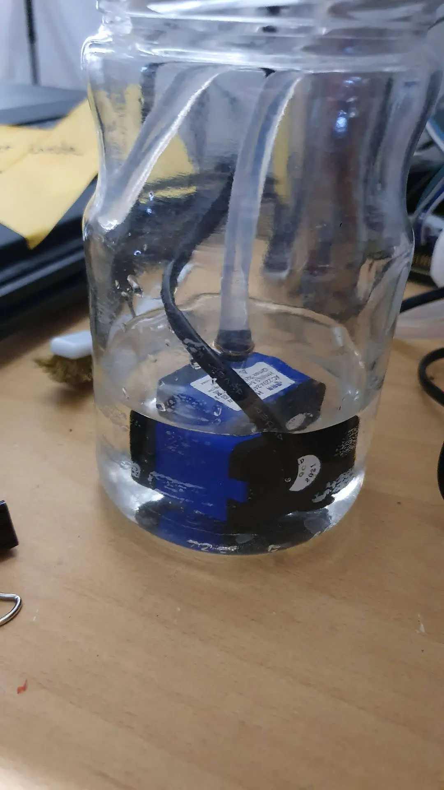
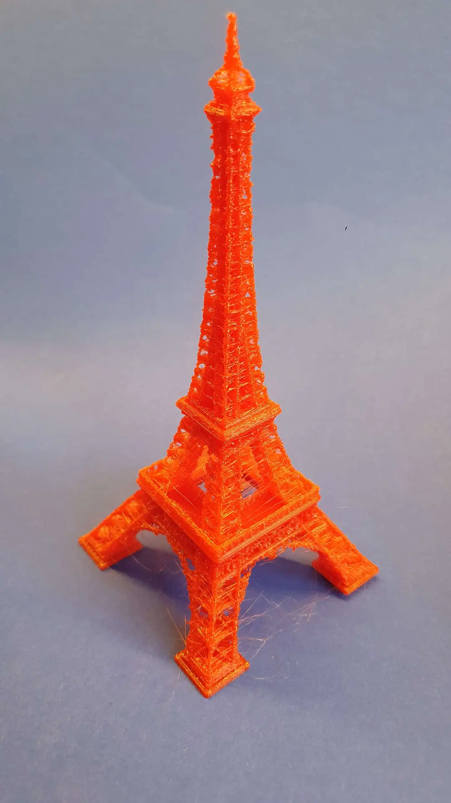



&nbsp;&nbsp; &nbsp;Moje řešení vodního chlazení E3D V6 hotendu, které je tak subtilní, aby se nechalo namontovat místo klasického chladiče bez nutnosti měnit cokoli dalšího na tiskové hlavě.&nbsp;

[<a href="https://photos.app.goo.gl/1CLwiB4EadNCCii2A" target="_blank">fotky</a>] [<a href="https://www.thingiverse.com/thing:5436652" target="_blank">thingiverse</a>]

 

Inspirováno tímto chlazením



&nbsp;[<a href="https://www.thingiverse.com/thing:3697905" style="text-align: left;" target="_blank">thingiverse</a>]

 

&nbsp; &nbsp; Proč se tím vůbec zabývat? Pokud chci tisknout filament při vysoké teplotě, velmi pomalu a se spoustou retrakcí/zatažení při přesunu tiskové hlavy; často se stane, že vlákno změkne již v dolní části chladiče, nedokáže přenást tlačnou sílu motoru extruderu, hotend se ucpe a tisk selže. A že se mně to stalo mockrát.

 

&nbsp; &nbsp; Zahřátý hotend tiskárny vypadá nějak takto. Problém je, že chladič musí být opravdu dobře ochlazený zvláště ve spodní části blízko horké kostky. Když bude mít podložka má 110°C, tisková teplota bude 290°C; tak uvnitř tiskového boxu je 60°C. Touhle teplotou má ventilátor dlouhodobě uchladit chladič? 



Podrobná tepelná analýza hotendu viz [<a href="https://thomasannet.wixsite.com/portfolio/thermal-analysis-hotend" style="text-align: left;" target="_blank">1</a>].

 
&nbsp;&nbsp; &nbsp;Jednoduché řešení je například použití heatbreaku s kouskem teflonové trubičky, není to řešení dokonalé, ale přenos tepla na filament je omezen a funguje to.


 

&nbsp; &nbsp; Vodotěsný tisk, který projde i tlakovou zkouškou. Kompresorem natlakuju a pod vodou nesmí ucházet jediná bublinka. Tisku z CPE HT, tryskou 0.6mm se stopou 0.70mm, extruze 120%, na každém švu se tryska otře zpátky 5mm (wipe distance). Pak expoxid universal, natřu vnitřní i vnější stranu. Stejně tak byl expoxidem vlepen chladič dovnitř. Tlaková zkouška byla úspěšná, tak by to němělo protéct.



&nbsp;&nbsp; &nbsp;První test chlazení – pokus o nahřátí chladiče plamenem. Voda bezproblémů stíhá odvádět teplo tak, že část chladiče, která byla v kontaktu s plamenem zůstala na dotek pouze „teplá.“





 

&nbsp;&nbsp; &nbsp;Běžná teplota při které tisku PLA je 190°C.&nbsp;Zkušební osmihodinový tisk, materiál PLA, zatažení 1.75mm, minimální posun materiálu, pomalý tisk a teplota 290°C – tedy o sto víc, než je běžné. Tisknul jsem oblíbenou eiffelovku. V celém chladícím okruhu bylo maximálně čtyři deci vody a miniaturní akvarijní čerpadýlko tlačí pouze deset litrů za hodinu.

&nbsp; &nbsp; Předpoklad byl, že kdyby filament změknul již v chladiči, došlo by okamžitě k zaseknutí a ucpání.&nbsp; 





&nbsp; &nbsp; Pokud celý tisk proběhne a chlazení opravdu funguje, tak výsledkem bude opravdu hnusně vytištěná<b> </b>věžička, protože teplota tisku PLA byla záměrně zvolena o 50% vyšší než je běžné. Pokus byl úspěšný; tedy dáme malinko větší čerpadlo, víc vody do okruhu.

&nbsp; &nbsp; Aby bylo možné hotend rozebrat, je nutné chladičem otáčet a vyšroubovat heatbrake. Přibyly dvě spojky v horní části.


 

&nbsp; &nbsp; Finální řešení zavařovačky s vodou a průchodkami.&nbsp;Ta věc, co trčí dole je místo pro teploměr odchozí vody. Záměr je změřit teplotní rozdíl vstupu a výstupu.



 

<iframe allowfullscreen="" class="BLOG_video_class" height="400" src="https://www.youtube.com/embed/icf3OeONVf4" width="640" youtube-src-id="icf3OeONVf4"></iframe>

[<a href="https://www.youtube.com/watch?v=icf3OeONVf4" target="_blank">youtube</a>]
 
<i>Veškerá problematika je již objevená a dokonale popsána:</i>

– Vodou chlazené DIY hotendy [<a href="https://steemit.com/printing3d/@boucaron/3dprinter-water-cooled-hotends-a-quick-overview" target="_blank">2</a>][<a href="https://forum.e3d-online.com/threads/e3d-water-cooled-mod.53/" target="_blank">3</a>][<a href="https://www.instructables.com/Water-Cool-Your-3D-Printer-Nozzle-the-Cheap-and-Ea/" target="_blank">4</a>][<a href="https://reprap.org/forum/read.php?424,878305" target="_blank">5</a>][<a href="https://well-engineered.net/index.php/en/86-community-water-cooling" target="_blank">6</a>]

– Teplotní analýza hotendu [<a href="https://thomasannet.wixsite.com/portfolio/thermal-analysis-hotend" target="_blank">7</a>]

– Optimalizace chlazení 3D tiskárny [<a href="https://drive.google.com/drive/folders/1Lbg27puIivSUkGSkOmYa3LmWBFLqLCBs?usp=sharing" target="_blank">8</a>]

 
