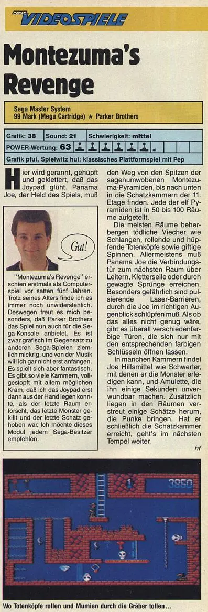

<table class="tr-caption-container" style="margin-left: auto; margin-right: auto;"><tbody><tr><td style="text-align: center;"></td></tr><tr><td class="tr-caption" style="text-align: center;">Obrazovka ze hry Montezuma's Revenge – Director's Cut, která vyšla na Steamu 18. února 2025</td></tr></tbody></table>
 
<table class="tr-caption-container" style="margin-left: auto; margin-right: auto;"><tbody><tr><td style="text-align: center;"></td></tr><tr><td class="tr-caption" style="text-align: center;">Pro srovnání stejná místnost z původní hry pro ATARI (1984) </td></tr></tbody></table> <table class="tr-caption-container" style="margin-left: auto; margin-right: auto;"><tbody><tr><td style="text-align: center;"></td></tr><tr><td class="tr-caption" style="text-align: center;">Tatáž komnata z verze pro SEGA Master System z roku 1989</td></tr></tbody></table>
 

Hra Montezuma's Revenge představená v roce 1983, a která pro Atari 800 vyšla o rok později, se během pár dalších let dočkala mnoha portů na ostatní platformy. V roce 2025 je 40. výročí masivního rozšíření této hry.

 

[<a href="https://eahumada.github.io/AtariOnline/games/games-mame.html?cart=montezuma.rom" target="_blank">spustit</a>] a hrát hru pro Atari 800

[<a href="https://c64online.com/c64-games/montezumas-revenge/" target="_blank">spustit</a>] a hrát port hry pro Commodore 64

[<a href="https://torinak.com/qaop/play/panamajoe" target="_blank">spustit</a>] a hrát port hry pro ZX Spectrum – zde se hra jmenuje Panama Joe podle hlavního hrdiny

[<a href="https://thekingofgrabs.com/2023/09/21/montezumas-revenge-colecovision/" target="_blank">web</a>] info o portu pro herní konzoli [<a href="https://en.wikipedia.org/wiki/ColecoVision" target="_blank">Coleco Vision</a>]

[<a href="https://www.youtube.com/watch?v=nyEyoSX3JzE" target="_blank">gameplay</a>] ukazuje, jak jsou jednotlivé levely rozsáhlé

&nbsp;

Celý popis hry najdeme na [<a href="https://en.wikipedia.org/wiki/Montezuma%27s_Revenge_(video_game)" target="_blank">wiki</a>] včetně odkazů na manuály [<a href="https://www.atarimania.com/game-atari-400-800-xl-xe-montezuma-s-revenge_6824.html" target="_blank">1</a>] aj.

 

<table class="tr-caption-container" style="margin-left: auto; margin-right: auto;"><tbody><tr><td style="text-align: center;"></td></tr><tr><td class="tr-caption" style="text-align: center;">z představení hry viz [<a href="https://www.youtube.com/watch?v=ptwfJZf5djE" target="_blank">zdroj</a>] obsahující i rozhovory kolem portů pro NES a SEGA</td></tr></tbody></table>

 

<b><i>Inspirace na znovuzrození přišla z Jižní Ameriky</i></b>

&nbsp;&nbsp; &nbsp;Parta Atari nadšenců z Chile, provozující web [<a href="https://www.atariware.cl/wiki/Programas/PreliminaryMonty" target="_blank">atariware</a>] analyzovala původní hru, aplikovala některá vylepšení a vytvořila novou hratelnější verzi. V rámci konzultací kontaktovali původního vývojáře hry. Jejich snaha přinesla jeden zásadní a neočekáváný výsledek. Kromě toho, že vytvořili graficky vylepšenou a odladěnou verzi hry pro původní Atari, tak se jim podařilo vzbudit zájem Roberta Jaegera, původního autora hry. <strike>V rámci webu zmiňují, že když si psali s Robertem, tak ten jim řekl, že už původní zdrojáky ke hře nemá. A oni na to – to není problém, my je máme!</strike>&nbsp;Opravuji urban legend na základě informací z peruánské webu [<a href="https://www.atariteca.net.pe/2020/09/jaeger-tengo-un-lugar-especial-en-mi.html" target="_blank">atariteca</a>], ve skutečnosti zdrojové kódy má někde na půdě svých rodičů a kvůli velikosti musel použít pouze dvoupísmenné názvy proměnných a zcela vypustit komentáře; což opravdu ztížilo čtení kódu.&nbsp;

&nbsp;&nbsp; &nbsp;Později se chilským projektem inspiroval Konstantinos TIX Giamalidis, který za vydatné spolupráce s Paulem Layem, vypustil verzi hry Montezuma's Redux. Tento grafický hack se původnímu autorovi příliš nelíbí, protože vyšel bez jeho vědomí. Ale nový rozruch kolem staré hry stačil k tomu, aby se původní vývojář hry Rober Jaeger nadchnul natolik, že ve stejném roce vydal port této hry na Steamu[<a href="https://store.steampowered.com/app/1421120/Montezumas_Revenge/" target="_blank">2</a>] (vyšlo 13. října 2020).&nbsp;&nbsp;

 

&nbsp; &nbsp; Zvýšený zájem atarikomunity o tuto hru přinesl pro starý osmibit konečně i druhý díl plný nových výzev.<table><tbody><tr></tr></tbody></table><table class="tr-caption-container" style="margin-left: auto; margin-right: auto;"><tbody><tr><td style="text-align: center;"></td></tr><tr><td class="tr-caption" style="text-align: center;">tahle hra pro 8bit Atari je už pro hráče slušně náročná</td></tr></tbody></table>

 

&nbsp; &nbsp; Po vydání nové hry na Steamu zahájil Robert Jaeger na kick starteru kampaň na port a tvorbu cartrige pro platformu NES, což se mu opravdu povedlo v prosinci 2022 úspěšně dokončit. Pro NES hru naprogramoval Felipe Reinaud. Vytvořil k tomu [<a href="https://github.com/DarkKodKod/NESTool" target="_blank">nástroj</a>] na tvorbu tohoto typu her pro NES. Tento port má stejné místnosti jako původní verze 1984 a přibyla velmi slušná hudba, jak se na NES hru sluší a patří.

&nbsp; &nbsp; Pro NES vyšel i graficky velmi povedený manuál v&nbsp;[<a href="https://normaldistribution.com/NES/Instructions/20pages.pdf" target="_blank">pdf</a>] obsahující i mapu pyramidy.
<table class="tr-caption-container" style="margin-left: auto; margin-right: auto;"><tbody><tr><td style="text-align: center;"></td></tr><tr><td class="tr-caption" style="text-align: center;">další [<a href="https://normaldistribution.com/retro-cartridges/" target="_blank">info</a>] o úspěšné tvorbě NES cartridge  </td></tr></tbody></table><b><i>Horká novinka na Steamu</i></b>

&nbsp; &nbsp; Zatím poslední verze vyšla&nbsp;18. ledna 2025 na Steamu[<a href="https://store.steampowered.com/app/3101230/Montezumas_Revenge__The_40th_Anniversary_Edition/" target="_blank">4</a>]; ke 40. výročí hry.&nbsp; Asi o měsíc později byl také uvolněn&nbsp;<b>Montezuma's Revenge – Director's Cut</b>[<a href="https://store.steampowered.com/app/2803590/Montezumas_Revenge__Directors_Cut/" target="_blank">5</a>], což je rozšířená verze původní hry a v pixel stylu přesně tak, jak to hráči, znalí původní předlohy, potřebují.

 
<table class="tr-caption-container" style="margin-left: auto; margin-right: auto;"><tbody><tr><td style="text-align: center;"></td></tr><tr><td class="tr-caption" style="text-align: center;">můj první boss fight</td></tr></tbody></table><table><tbody><tr><td> <table class="tr-caption-container" style="margin-left: auto; margin-right: auto;"><tbody><tr><td style="text-align: center;"></td></tr><tr><td class="tr-caption" style="text-align: center;">očekávaný výsledek prvního boss fightu</td></tr></tbody></table> </td></tr></tbody></table><table><tbody><tr></tr></tbody></table><table class="tr-caption-container" style="margin-left: auto; margin-right: auto;"><tbody><tr><td style="text-align: center;"></td></tr><tr><td class="tr-caption" style="text-align: center;">úvodní obrazovka</td></tr></tbody></table> 
[<a href="https://www.youtube.com/watch?v=VIzwK5TSixA" target="_blank">gameplay</a>] Director's Cut, té verze, která přímo navazuje na původní hru a to i graficky

[<a href="https://www.youtube.com/watch?v=it2Z3TJyN-k" target="_blank">gameplay</a>] nové moderní verze ke 40. výročí, pouze pro srovnání. Rázem je z původní předlohy instantní běžná moderní skákačka a prizmatem 8 bitových her ji považuji na nepřehlednou.

 

<b><i>Autor hry Robert Jaeger</i></b>

[<a href="https://normaldistribution.com/biography/" target="_blank">rozhovory</a>] a biografie

 

<b><i>Port pro SEGA Master System</i></b>

&nbsp;&nbsp; &nbsp;Rozložení místností v pyramidě je stejné, ale přibývá jedna zajímavá drobnost v podobě „žezla“, které v původní verzi hry poskytne dočasnou ochranu před všemi monstry ihned a v SEGA verzi se dá aktivovat až v nouzi nejvyšší.
<table class="tr-caption-container" style="margin-left: auto; margin-right: auto;"><tbody><tr><td style="text-align: center;"></td></tr><tr><td class="tr-caption" style="text-align: center;">Pochodeň potřebujeme pro pohyb v temných částech pyramidy. Jde to i v úplné tmě, ale je to, hm, řádově těžší.</td></tr></tbody></table>
 

<b><table class="tr-caption-container" style="margin-left: auto; margin-right: auto;"><tbody><tr><td style="text-align: center;"></td></tr><tr><td class="tr-caption" style="text-align: center;">německý časopis PowerPlay [<a href="https://retrocdn.net/images/e/eb/PowerPlay_DE_1989-11.pdf" style="text-align: left;" target="_blank">11/1989</a>] str. 68</td></tr></tbody></table> </b><table class="tr-caption-container" style="margin-left: auto; margin-right: auto;"><tbody><tr><td style="text-align: center;"></td></tr><tr><td class="tr-caption" style="text-align: center;">obligátní konec levelu</td></tr></tbody></table>

 

<b><i>Pár poznámek na závěr</i></b>

– V [<a href="https://www.atariteca.net.pe/2020/07/tix-my-goal-is-to-produce-best-version.html" target="_blank">rozhovoru</a>] z roku 2020 TIX říká, že je třeba pracovat na Prince of Persia pro osmibitové Atari ... aby o rok později port opravdu dokončil a zveřejnil[<a href="https://atari8bit.net/db/?d=d&amp;f=prince-of-persia&amp;g=Games">6</a>]. Ale o tom třeba někdy příště.

– Paul Lay je považován za velmi talentovaného a píše skvělé hry pro Atari doposud – podívejte se na jeho seznam vydaných her[<a href="https://www.atarimania.com/list_games_atari-400-800-xl-xe-lay-paul_team_3519_8_G.html" target="_blank">7</a>].&nbsp;

– [<a href="https://www.youtube.com/watch?v=_MtBIAtb9zA" target="_blank">gameplay</a>] TIXovy verze Montezuma's Redux vydanou v roce 2020&nbsp;

– [<a href="https://forums.atariage.com/topic/308584-montezumas-redux/" target="_blank">stažení</a>]&nbsp;spustitelného souboru Montezuma's Redux pro Atari emulátory nebo [<a href="/posts/2025/04/lepsi-cartridge-pro-atari/" target="_blank">moderní cartridge</a>].

 

<b><i>Update 4. 5. 2025</i></b>

&nbsp;&nbsp; &nbsp;Zahrál jsem tři a půl levelu najednou a zatím to stačí na páté místo. Uvidíme, zda se to někam posune za pár měsíců.

<b>

</b>

 
<b><i>Update 30. 7. 2026</i></b>
&nbsp; &nbsp; Vyšel port této hry pro počítač TRS-80 CoCo3 viz [<a href="/posts/2026/07/montezumova-pomsta-na-coco3/" target="_blank">blog</a>]   
