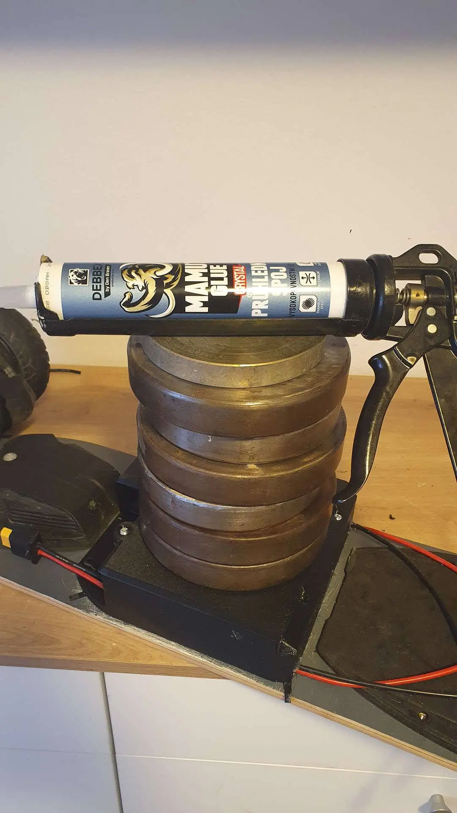

&nbsp;

&nbsp; &nbsp; Ctihodný pan&nbsp;Ježek, přišel s nápadem, že by na svůj elektrický longboard potřeboval přidat další baterii. Mechanický přepínač by byl příliš velký, elektronický přepínač zase v případě selhání fatálně rizikový.&nbsp;
<table class="tr-caption-container" style="margin-left: auto; margin-right: auto;"><tbody><tr><td style="text-align: center;"></td></tr><tr><td class="tr-caption" style="text-align: center;">antispark konektory XT90</td></tr></tbody></table>
 

Volíme sedláckou cestu – konektory XT90, které si jezdec ručně přepojí. Zastaví, sundá krytku, přecvakne konektor, vrátí krytku a pokračuje v cestě.

&nbsp; &nbsp; Longboard má baterii 13S2P, plně nabito 54,6V; pro připojování baterie vyžaduje antispark konektory, aby se předešlo jiskření a vypalování kontaktů.

&nbsp; &nbsp; Nakonec to bylo to docela snadné, stačilo vymodelovat a vytisknout krabičku a celé to propojit silikonovými kabely AWG12.&nbsp;

&nbsp; &nbsp; Baterie je v boxu vlepená na neutrální silikon. 


 

Každý pájený spoj je třeba změřit, protože při stálém proudu 25A a špičkovém proudu 50A je každá desetina miliohmu znát. Spoj se považuje za skvělý, když má odpor menší než 0,3mΩ.

 
<table class="tr-caption-container" style="margin-left: auto; margin-right: auto;"><tbody><tr><td style="text-align: center;"></td></tr><tr><td class="tr-caption" style="text-align: center;">celý box je nalepený Mamutem</td></tr></tbody></table> <table class="tr-caption-container" style="margin-left: auto; margin-right: auto;"><tbody><tr><td style="text-align: center;"></td></tr><tr><td class="tr-caption" style="text-align: center;">tloušťka lepidla je vymezena na 2mm</td></tr></tbody></table>
 

<table class="tr-caption-container" style="margin-left: auto; margin-right: auto;"><tbody><tr><td style="text-align: center;"></td></tr><tr><td class="tr-caption" style="text-align: center;">zaslepený konektor jako ochrana proti prachu </td></tr></tbody></table>

 

<table class="tr-caption-container" style="margin-left: auto; margin-right: auto;"><tbody><tr><td style="text-align: center;"></td></tr><tr><td class="tr-caption" style="text-align: center;">celé řešení</td></tr></tbody></table> <table class="tr-caption-container" style="margin-left: auto; margin-right: auto;"><tbody><tr><td style="text-align: center;"></td></tr><tr><td class="tr-caption" style="text-align: center;">tisknuto tak, aby mechanické namáhání nešlo po vrstvách</td></tr></tbody></table>

 

Další [<a href="https://photos.app.goo.gl/DVSB9uvxbcfMGWsq9" target="_blank">fotky</a>]. 

Krabička k tisku [<a href="https://www.thingiverse.com/thing:7380079" target="_blank">thingiverse</a>].
