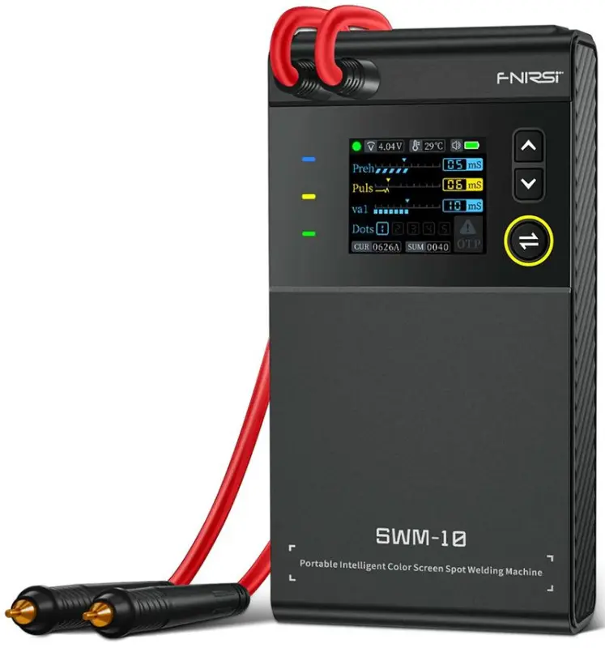

<table><tbody><tr><td></td></tr><tr><td>nově vyměněné články 18650/3500mAh</td></tr></tbody></table> 
Lenovo Thinkpad L470, prastarý notebook. Baterie z druhovýroby AVACOM ve velmi špatném stavu.
<h2>V jakém stavu je baterie?</h2>
&nbsp;&nbsp; &nbsp;Jak zjistím v jakém stavu mám baterii v notebooku?&nbsp;

Spustím v teminálu: powercfg /batteryreport&nbsp;a dostanu podrobný výstup ve kterém je o baterii všechno.

 
<h2>Jak vyměnit články?</h2>
<i>&nbsp; &nbsp; Servisní návod výrobce praví (strojově přeloženo)</i>

&nbsp;&nbsp; &nbsp;Mikrokontrolér na desce neustále monitoruje napětí na jednotlivých skupinách článků pomocí sítě analogově-digitálních převodníků (ADC). U nejběžnější tříčlánkové topologie (3S1P nebo 3S2P) existují uzly B-, B1, B2 a B+. Při odpojování degradovaných článků musí technik postupovat od nejvyššího napěťového potenciálu k nejnižšímu, tedy odstřihnout spojení B+, následně B2, B1 a nakonec záporný pól B-. Při zapojování nových, kapacitně a napěťově spárovaných buněk se postup striktně obrací. První musí být připojen referenční bod B- (zem ochranného obvodu). Teprve poté smí být připojeny středové odbočky B1 a B2, a absolutně jako poslední se svaří hlavní kladný pól B+. Pokud by technik připojil jako první B+, nebo zapojil středové svorky bez přítomnosti B-, logické obvody ADC vstupů integrovaného čipu by se ocitly v plovoucím stavu nebo by čelily nečekaným napěťovým gradientům, což okamžitě vede k softwarovému uzamčení z důvodu podezření na fatální defekt buněk.
<table><tbody><tr><td></td></tr><tr><td>zapojení baterie</td></tr></tbody></table> <h2>Bodové svařování článků</h2>
&nbsp; &nbsp; Na tyto drobnosti používám bateriovou bodovu svářečku FNIRSI&nbsp; SWM-10; podle [<a href="https://www.youtube.com/watch?v=aKbuGY9dMfg" target="_blank">recenze</a>] pana Bekra je použitelná s čímž plně souhlasím.

<h2 style="text-align: left;">Nastavení baterie</h2>
&nbsp;&nbsp; &nbsp;I když články vyměním, tak řídící logika baterie (BMS) má v sobě pořád zapsánu poslední známou kapacitu a nedovolí nové články využít víc, než byly ty staré. Musím se k BMS připojit a provést potřebná nastavení.

<table><tbody><tr><td></td></tr><tr><td>jaký čip je na desce BMS </td></tr></tbody></table>

<table><tbody><tr><td></td></tr><tr><td>pinout baterie Lenovo Thinkpad L470</td></tr></tbody></table><h2>SMBus/I²C na USB (CP2112)</h2>

&nbsp; &nbsp; Naštěstí nemusím komunikaci bastlit, ale existuje sofistikované instatní řešení, kdy použiju převodník CP2112 [<a href="https://www.laskakit.cz/prevodnik-usb-na-smbus-i2c--cp2112/" target="_blank">1</a>] pro připojení k baterii. Stačí tři vodiče.

<table><tbody><tr><td></td></tr><tr><td>CP2112 v akci</td></tr></tbody></table>&nbsp;&nbsp; &nbsp;Na čínské baterie se používá nástroj SH366000, existuje komunitní kopie postavená právě na výše zmíněném převodníku viz [<a href="https://github.com/lmdpua/CP2112_SH366000_Flasher" target="_blank">github</a>].

&nbsp; &nbsp; Postup je odemčení čipu (Unseal); nastavení Flash Data - Write Flash; uzamčení (Seal).

 

&nbsp; &nbsp; Seznam nastavitelných parametrů viz [<a href="https://docs.google.com/spreadsheets/d/1OxP7QU-9ddVoOevmHR6dAAGHSKkcq7PL5QHovrqniYM/edit?usp=sharing" target="_blank">tabulka</a>]. 

 

 
<table><tbody><tr><td></td></tr><tr><td>počet cyklů, celková kapacita... všechno lze nastavit   </td></tr></tbody></table><table><tbody><tr><td></td></tr><tr><td>změna sériového čísla znamená, že baterie bude v notebooku vnímána odlišně / jako nová</td></tr></tbody></table> <h2 style="text-align: left;">Vybrané 18650&nbsp;</h2>
Li-Ion 3500mAh 10,2A 3,6V EVE INR18650-35 viz [<a href="https://www.mivvyenergy.cz/cs/bateriove-clanky/valcove-clanky/clanek-li-ion-3500mah-102a-36v-eve-inr18650-35v.html" target="_blank">3</a>] mivyenergy.cz je měli loni v akci za 40 korun

<h2 style="text-align: left;">Co se měnilo v paměti BMS&nbsp;</h2>
&nbsp;&nbsp; &nbsp;0x0010 DesignCapacity: 7000

&nbsp;&nbsp; &nbsp;0x0006 FullChargeCapacity: 7000

&nbsp;&nbsp; &nbsp;0x000C CycleThreshold: 5600 (počítání cyklů od 80 %)

<i>nabíjecí proudy:</i>

<i>&nbsp; &nbsp;&nbsp;</i>0x0028 NormalChargeCurrent: 3500 (mA)

&nbsp; &nbsp;&nbsp;0x0070 ChargeOverCurrentThresh 4800 (mA)

&nbsp; &nbsp;&nbsp;0x0074 ChargeOverCurrentReset 3800 (mA)&nbsp;

<i>registry zbytkového napětí (EDV - End of Discharge Voltage):</i>

&nbsp; &nbsp;&nbsp;0x00B6 FEDV2 (Skoro vybito): 8700 (mV)

&nbsp;&nbsp; &nbsp;0x00B8 FEDV1 (Kriticky vybito): 8400 (mV)

&nbsp;&nbsp; &nbsp;0x00BA FEDV0 (Absolutní nula 0 %): 8100 (mV)

<i>aby systém viděl baterii jako novou</i>

&nbsp;&nbsp; &nbsp;0x0004	CycleCount	0 (počet cyklů)

&nbsp;&nbsp; &nbsp;0x00FD	Serial Number (jakákoli odlišná hodnota)&nbsp;
<h2>Neustále parkuju notebook na nabíječce!</h2>
&nbsp; &nbsp; Neustálé udržování na 100% baterii chemicky zabíjí. Řešení je nechat baterii nabíjet jen na 80% a volitelně, když bych potřeboval, snadno nechám notebook dobít do 100%. 

 

&nbsp; Moderní notebooky mají bypass charging, který tento problém řeší. Ale většinou je to třeba nastavit příslušném power management programu.

 

&nbsp; &nbsp; Gazda se super jménem MatijaKlobasa má na githubu řešení [<a href="https://github.com/MatijaKlobasa/ThinkPad-Battery-Chrage-threshold-without-admin-vantage" target="_blank">2</a>], kde odkazuje ke stažení utilitu od Lenovo [<a href="https://download.lenovo.com/pccbbs//thinkvantage_en/metroapps/Vantage/ChargeThreshold/ChargeThreshold.exe" target="_blank">ChargeThreshold</a>].

 

<b><i>Použití je snadné</i></b>

– omezení maximálního nabití na 80% a začne se nabíjet, když klesne pod 75%

ChargeThreshold.exe 80 75

– vypnutí omezení, bude se nabíjet naplno a udržovat na 100%

ChargeThreshold.exe off

– jaké je aktuální nastavení zjistím

ChargeThreshold.exe status
